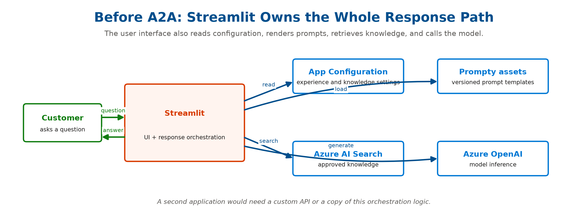
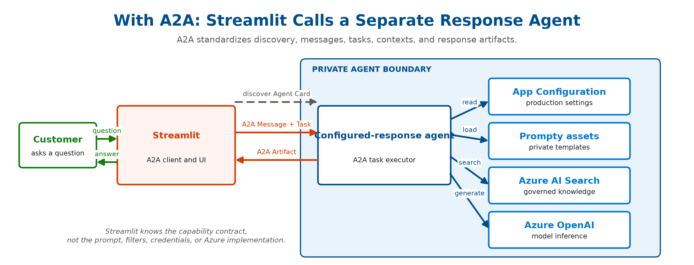
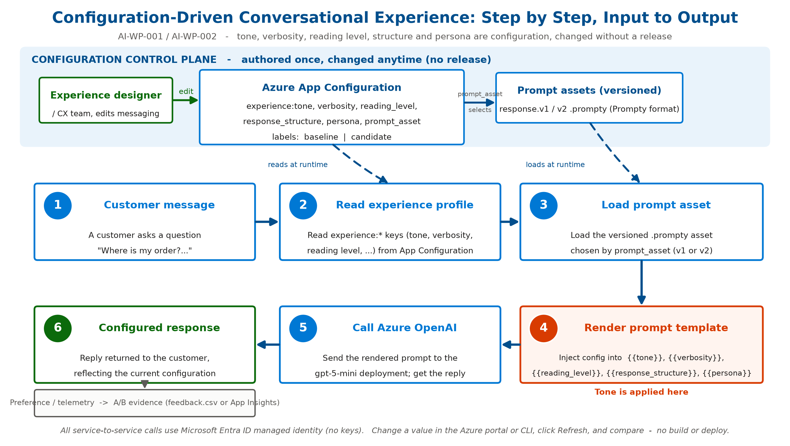
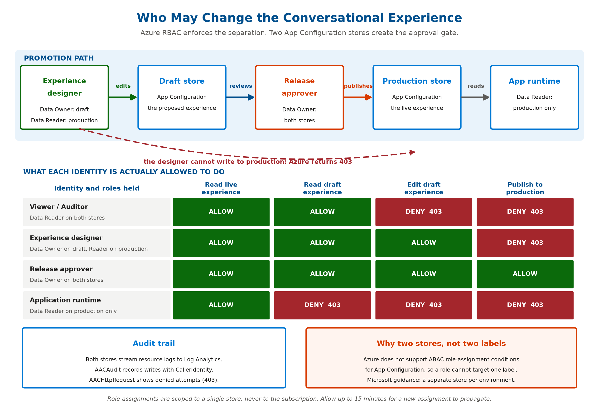
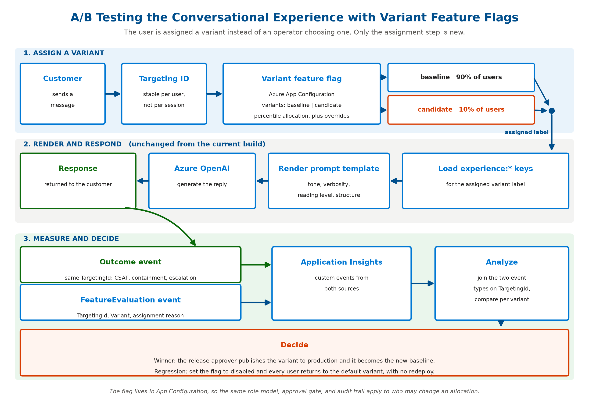
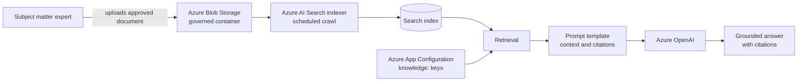
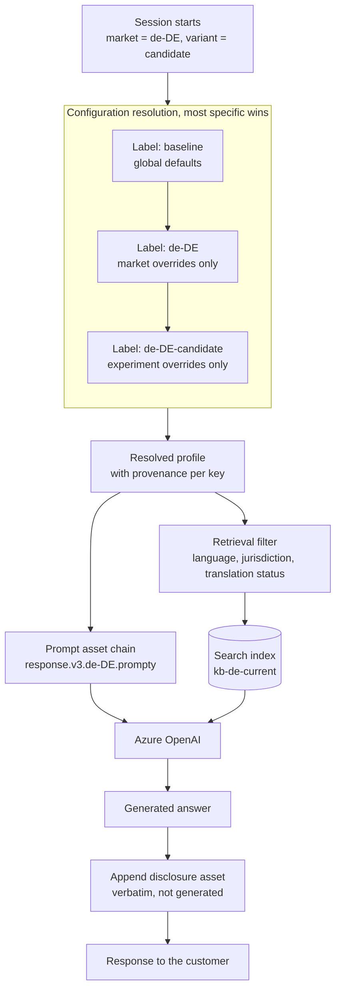

# Configurable Conversational Experience

*New draft for whitepaper sections 1.1, 1.2, and 1.3, grounded in a working proof of concept.*

**Covers:** AI-WP-001 (externalizing conversational personas), AI-WP-002 (managing tone, verbosity, and reading level through configuration), and the customer note on regionality and language barriers.

This draft replaces the placeholder sections with narrative, an architecture, a step-by-step workflow diagram, a walkthrough of how the configuration is changed, generally available Azure alternatives, and a pros and cons assessment. Sections 1.1 and 1.2 are backed by a runnable proof of concept in [`pocs/001-config-driven-responses`](../pocs/001-config-driven-responses/README.md).

**A note on evidence.** Sections 1.1 and 1.2 describe a system that exists and has been run. Section 1.3, and the regional and multilingual section that develops it, describe a design that has been specified but not yet built; that specification is [`specs/002-regional-multilingual-experience`](../specs/002-regional-multilingual-experience/spec.md). Those parts are marked **specified, not yet demonstrated** so that a reader never mistakes a design intention for a result. Every mechanism they depend on is already proven in the proof of concept. What has not yet been proven is the combination.

---

## 1.1 Externalizing Conversational Personas from Application Code

**User Story (AI-WP-001):** *As an enterprise architect, I want to understand how conversational personas can be externalized from application code so that messaging can evolve independently of software releases.*

**Goal:** explain persona architecture, persona inheritance, audience-specific personas, persona governance, and configurable persona management.

A persona is the voice the assistant adopts: who it is, how it speaks, and how it structures an answer. When that voice is written into source code, every wording change becomes a code change, a build, a review, and a deployment. The persona then belongs to engineering rather than to the people who own the customer relationship.

The proof of concept externalizes the persona into two governed, versioned artifacts that live outside the application binary:

- **A persona parameter set in Azure App Configuration.** The persona is expressed as a small group of keys (for example `experience:persona`, `experience:tone`, `experience:response_structure`) rather than as embedded strings. The application reads these values at request time.
- **A versioned prompt asset (a Prompty file).** The system instructions that frame the persona are stored as `response.v1.prompty` and `response.v2.prompty`. The asset that a given audience receives is selected by the `experience:prompt_asset` key, so a template change is a governed content change with a clean rollback path.

This structure maps directly onto the four capabilities the section must explain:

- **Persona architecture:** the persona is a named set of configuration values plus a referenced prompt asset. The application is a thin renderer; it holds no messaging of its own.
- **Persona inheritance:** App Configuration labels provide a natural inheritance and override model. A `baseline` label holds the default persona; a `candidate` (or a market label such as `en-GB`) supplies only the keys that differ, and the reader resolves the most specific value. Inheritance therefore becomes label precedence rather than class hierarchy in code.
- **Audience-specific personas:** because selection is a configuration lookup, different audiences, markets, or segments can be pointed at different persona values or different prompt-asset versions without a branch in the code.
- **Persona governance:** App Configuration provides role-based access control, an audit trail of changes, point-in-time snapshots for versioned rollouts, soft delete and restore, and change events. Persona ownership can be delegated to a business team while engineering retains the platform.

The result is that messaging evolves on its own cadence. The wording, the persona, and the template version all change through configuration, and the application is never rebuilt.

---

## 1.2 Managing Tone, Verbosity, and Reading Level through Configuration

**User Story (AI-WP-002):** *As an experience designer, I want to understand how tone, wording, verbosity, and reading level can be managed through configuration so that messaging can be continuously refined based on user feedback.*

**Goal:** explain tone controls, verbosity controls, reading-level adaptation, messaging frameworks, and business-managed configuration patterns.

Tone, verbosity, and reading level are the dials an experience designer wants to turn most often, and they are exactly the dials that are most expensive to turn when they live in code. In the proof of concept each dial is a single configuration key:

| Dial | Configuration key | Example baseline value | Example candidate value |
|---|---|---|---|
| Tone | `experience:tone` | `neutral and professional` | `warm, friendly, and empathetic` |
| Verbosity | `experience:verbosity` | `brief` | `concise but complete` |
| Reading level | `experience:reading_level` | `grade 9` | `grade 6` |
| Structure | `experience:response_structure` | `a single short paragraph` | `a one-sentence acknowledgement, then 2 to 3 short bullet points, then a next step` |
| Persona | `experience:persona` | `a Contoso customer support agent` | `a caring Contoso customer support specialist` |
| Template version | `experience:prompt_asset` | `response:v1` | `response:v2` |

These keys are not sent to the model as raw settings. They are injected into a **prompt template** (the messaging framework), which turns each dial into an instruction the model can follow. The template is the frame; the configuration values fill the blanks:

```text
You are {{persona}}.
Tone: {{tone}}. Verbosity: {{verbosity}}. Reading level: {{reading_level}}.
Structure the reply as {{response_structure}}.
```

Because the template variables come from configuration, the messaging framework itself is adjustable without code. An experience designer can lower the reading level from grade 9 to grade 6, soften the tone, or switch the structure to bullet points, then compare the new response against the current one before promoting it. This is the business-managed configuration pattern: the person who owns the customer experience owns the dials, the changes are governed and reversible, and continuous refinement is driven by feedback rather than by release schedules.

---

## 1.3 Adapting the Experience to Market, Language, and Jurisdiction

**User Story (customer note on regionality and language barriers):** *As a global experience owner, I want to understand how market, language, and jurisdiction are managed through the same configuration model, so that serving a new market does not require a branch in the code and no customer receives content that has not been reviewed for their language and their regulator.*

**Goal:** explain the locale dimension, localized prompt assets, certified knowledge, jurisdictional disclosures, and how experimentation and approval extend across markets.

> **Specified, not yet demonstrated.** This section and the regional and multilingual section that follows describe a design recorded in [`specs/002-regional-multilingual-experience`](../specs/002-regional-multilingual-experience/spec.md). No screenshots or measured results accompany them yet.

Regionality is usually presented as a translation problem. It is three problems that happen to arrive together, and they have different owners, different review cycles, and different consequences when they are wrong.

| Problem | The question it answers | Who owns it | Consequence of getting it wrong |
|---|---|---|---|
| **Language** | Can the customer read the answer, in a register that suits the relationship? | In-market experience owner | The answer is understood but feels foreign, or is not understood at all |
| **Market rules** | Is the substance of the answer correct here? | Policy or product owner for the market | The answer is fluent, confident, and wrong |
| **Jurisdiction** | Does the answer carry what the regulator requires? | Legal or compliance reviewer | A compliant process produces a non-compliant response |

Collapsing the three into "translate the bot" is what produces the most expensive failure mode, which is a fluent answer that states another market's policy. A German customer asking about returns does not need the English answer in German. They need the German answer, because the statutory withdrawal right that applies to them is not the commercial return window that applies in the United States. Translation would have carried the wrong fact across the border in perfect grammar.

The architectural move is the same one made in sections 1.1 and 1.2. Market, language, and jurisdiction become configuration values and content metadata rather than branches in code. Concretely:

- **Locale is a second axis, not a second application.** The `baseline` and `candidate` labels of section 1.2 are one axis. Market labels such as `de-DE` are a second, and they carry only the keys that differ. Section 1.1 already named this: a market label "supplies only the keys that differ, and the reader resolves the most specific value." Adding a market is adding a sparse set of overrides, not forking a persona.
- **Localized prompt assets extend the versioning already in place.** `response.v3.de-DE.prompty` sits alongside `response.v3.prompty`, and the asset lookup the application already performs gains a fallback step rather than a new mechanism. A market asset exists only where the market must differ.
- **Knowledge is filtered by language and jurisdiction, not only by approval status.** The `knowledge:filter` key that today expresses `status eq 'approved'` expresses language, jurisdiction, and translation status the same way. Nothing new is introduced; one filter gains more predicates.
- **Certification is a gate, not a label.** A document becomes answerable in a market only when its translation status satisfies that market's required standard. The standard is itself a configuration value, so a regulated market can demand certified content while a low-risk market accepts reviewed content, without a code path for either.
- **Disclosures are appended, not generated.** Text that a regulator requires must appear exactly as legal approved it. Configuration names the disclosure asset; the application concatenates it. A model is never asked to reproduce wording it might improve.
- **Governance gains market owners without gaining a new mechanism.** The two-store approval gate, the role model, and the audit trail all carry over. What changes is who signs off, and on which subset of labels.

The result is that entering a market is a content and configuration exercise with a named reviewer at each step, rather than an engineering project. The section on regional and multilingual experience below sets out the mechanism, the measurement, and the limits.

---

## What the proof of concept demonstrates

The proof of concept is a small application that renders the same customer message twice, once with the current (`baseline`) experience profile and once with a proposed (`candidate`) profile, and shows them side by side. Nothing about the wording lives in the application. The customer-response path is exposed through the open Agent2Agent (A2A) 1.0 protocol: Streamlit is the A2A client, and a separate configured-response agent owns the three internal layers the whitepaper earmarked:

1. **Azure App Configuration** is the control plane. It holds the experience dials under two labels and the pointer to the prompt-asset version. Editing a value changes behavior on the next refresh, with no redeploy.
2. **Prompt templates** turn the configuration values into model instructions. Tone, verbosity, reading level, structure, and persona are template variables.
3. **Prompt assets** are the versioned template files. Selecting a version gives audience targeting and one-click rollback.

Azure OpenAI performs the inference, and Microsoft Entra ID secures the agent's Azure service calls, so no keys are stored in code or configuration. A2A does not replace any of those technologies. It provides the interoperable boundary through which another application or agent can invoke the capability without learning the prompt, retrieval filter, credential, or configuration-store layout.

### The A2A data plane

Before A2A was added, Streamlit was both the screen and the response engine. It read App Configuration, loaded prompt assets, queried Azure AI Search, called Azure OpenAI, and rendered the result. That was sufficient for one proof-of-concept application, but any second application would have needed a custom API or a copy of the same orchestration code.



With A2A, Streamlit remains the screen but no longer owns customer-response execution. It sends a standard A2A request to a separate configured-response agent. That agent owns the Azure configuration, prompt, retrieval, and model calls, then returns a standard A2A result. Streamlit is one client of the capability rather than the place where the capability lives.



The practical difference is ownership. Previously, Streamlit had to know how a response was produced. Now it needs to know only where the agent is, what skill it offers, and how to send and receive A2A messages. Another A2A-compatible client can use the same agent without copying its Azure or prompt logic.

#### How one request moves through the system

1. **Discover the agent.** Streamlit reads `/.well-known/agent-card.json`. The Agent Card says that the service accepts text, exposes a configured customer-response skill, uses the A2A 1.0 HTTP+JSON binding, and returns text plus structured provenance.
2. **Send the customer message.** Streamlit creates an A2A `Message`. For the side-by-side demonstration, an optional extension selects only `baseline` or `candidate`; it cannot send arbitrary configuration.
3. **Create a task and context.** The server creates a `Task` for this unit of work and a `contextId` for the conversation. The task can be tracked independently from the UI request.
4. **Resolve configuration privately.** For a new context, the agent reads the selected profile and knowledge settings from the production App Configuration store using the application-runtime identity. It hashes the resolved values into an opaque revision and pins them to the context.
5. **Generate the answer.** The agent loads the configured prompt asset, optionally retrieves approved knowledge, renders the prompt, and calls Azure OpenAI. These are the same operations the original PoC performed, moved behind the A2A boundary rather than rewritten.
6. **Return an artifact.** The completed task contains an `Artifact` with the customer-facing text and a structured part containing safe provenance: task ID, context ID, profile slot, opaque configuration revision, prompt-asset identifier, citations, latency, and token counts.
7. **Render the comparison.** Streamlit creates one task for `baseline` and one for `candidate`, then displays the two returned artifacts side by side.

#### What crosses the boundary

| Crosses the A2A boundary | Stays private inside the agent |
|---|---|
| Customer message | Azure credentials and endpoints |
| Allowlisted `baseline` or `candidate` slot for this PoC | Raw tone, verbosity, reading-level, and structure values |
| Task and context identifiers | App Configuration store and label selection logic |
| Generated answer | Rendered system and user prompts |
| Opaque configuration revision | Raw Azure AI Search filter |
| Safe metrics and citations | Model-client and retrieval implementation details |

This separation matters because the caller can ask the agent to perform a capability but cannot rewrite the policy under which that capability runs. Request metadata named `tone`, `prompt_asset`, `filter`, `store`, or `label` is rejected. The runtime also accepts only text parts and limits message size.

#### Implementation map

| Component | Responsibility |
|---|---|
| [`app.py`](../pocs/001-config-driven-responses/app.py) | Streamlit UI and A2A client call sites. It renders returned artifacts and keeps governance controls outside the runtime protocol. |
| [`a2a_client.py`](../pocs/001-config-driven-responses/a2a_client.py) | Discovers the Agent Card, sends messages, carries context IDs, waits for completed tasks, and parses response artifacts. |
| [`a2a_server.py`](../pocs/001-config-driven-responses/a2a_server.py) | Hosts the A2A 1.0 HTTP+JSON routes, Agent Card, and health endpoint. |
| [`a2a_agent.py`](../pocs/001-config-driven-responses/a2a_agent.py) | Defines the Agent Card, allowlisted extension, request validation, task lifecycle, and safe artifact contract. |
| [`experience_runtime.py`](../pocs/001-config-driven-responses/experience_runtime.py) | Resolves and pins production configuration, then coordinates prompt generation and optional knowledge retrieval. |
| [`config.py`](../pocs/001-config-driven-responses/config.py), [`knowledge.py`](../pocs/001-config-driven-responses/knowledge.py), and [`prompt.py`](../pocs/001-config-driven-responses/prompt.py) | Existing Azure configuration, retrieval, prompt-rendering, and model-call implementation reused by the remote agent. |

The A2A Agent Card advertises one stable skill: produce a governed customer response from text. Mutable tone, verbosity, prompt versions, and Search scopes do not appear in the card, because they describe how the agent currently performs the skill rather than what capability it offers. The card changes when the protocol, endpoint, security requirements, skill, or supported media types change; a tone edit does not invalidate discovery caches.

Each comparison column is a separate A2A task. The customer text is a `Message`; the generated answer is a text `Artifact`; and a second structured part carries safe provenance such as the profile slot, an opaque configuration revision, prompt-asset identifier, citations, latency, and token counts. Rendered prompts and raw configuration values do not cross the boundary.

The proof of concept uses a versioned optional A2A extension for its side-by-side review surface. That extension accepts only the semantic slots `baseline` and `candidate`. It cannot select a store, send a prompt asset, widen a knowledge filter, or override tone. Ordinary production assignment belongs on the server side rather than in caller-controlled metadata.

The `contextId` becomes the conversational configuration boundary. The first task in a context resolves the selected production profile and pins an opaque revision. Later tasks in that context reuse the same resolved values even if an approver publishes a change. Starting a new context is the explicit refresh operation. This maps the protocol's conversation primitive directly onto the coherence guarantee described later in this document.

The governance interface remains outside A2A. Designers still edit the draft store, approvers still publish to production, and Azure still returns the authorization decisions. The runtime agent uses the `app` identity, which can read production and cannot read draft. Consequently, the Knowledge tab's proposed-draft comparison remains an administrative demonstration rather than a runtime-agent skill.

#### Local PoC topology and current limits

The proof of concept runs as two local processes:

| Process | Local address | Purpose |
|---|---|---|
| Streamlit | `http://localhost:8501` | Human-facing comparison, governance, knowledge, and audit UI |
| A2A server | `http://127.0.0.1:9999` | Customer-response runtime and Agent Card |

The implementation uses the official `a2a-sdk[http-server]` Python package. The installed SDK is 1.1-compatible while the advertised protocol contract is A2A 1.0. It currently uses the HTTP+JSON binding and blocking task completion; streaming and push notifications are deliberately not advertised.

This local split proves the protocol and trust boundary, not a production hosting design. The A2A endpoint is bound to loopback and currently has no inbound authentication. A production deployment must use HTTPS and validate an Entra OAuth/OIDC token on every A2A operation. Its task and context store must also move from process memory to durable, caller-scoped storage. Distributed tracing, rate limiting, durable cancellation, streaming, push notifications, and deployment infrastructure remain later hardening work.

These limits do not weaken the Azure data-plane boundary already demonstrated. The agent still accesses App Configuration, Search, and Azure OpenAI using the application-runtime identity, and that identity still cannot read or write the draft store. Inbound A2A authorization and outbound Azure authorization are separate controls and both are required in production.

### Workflow: from input to configured output

The diagram below traces the work inside the A2A remote agent for a single task. Steps 1 through 3 run left to right, the flow turns down, and steps 4 through 6 complete the response artifact. Step 4 is the moment the tone is identified and applied: the App Configuration values are injected into the prompt-template variables.



| Step | What happens | Where the experience is decided |
|---|---|---|
| 1. Customer message | A customer asks a question. | Input only. |
| 2. Read experience profile | The remote agent reads the `experience:*` keys from Azure App Configuration for the relevant production label when it creates a context binding. | The dials (tone, verbosity, reading level, structure, persona) are selected here. |
| 3. Load prompt asset | The remote agent loads the versioned `.prompty` chosen by `experience:prompt_asset`. | The messaging framework version is selected here. |
| 4. Render prompt template | Configuration values are injected into `{{tone}}`, `{{verbosity}}`, `{{reading_level}}`, `{{response_structure}}`, and `{{persona}}`. | **Tone is applied here.** It is configuration, not code. |
| 5. Call Azure OpenAI | The rendered prompt is sent to the model deployment; the completion returns. | Model execution. |
| 6. Configured response | The reply and safe provenance are returned as an A2A artifact, reflecting the context's pinned configuration. | Output; optional preference capture feeds A/B evidence. |

---

## How Azure App Configuration handles this

Azure App Configuration is the piece that makes "change without a release" real. The capabilities used, and the ones available for the next stage, are:

- **Keys and labels.** Each dial is a key such as `experience:tone`. A label (`baseline`, `candidate`, or a market code) scopes a complete or partial profile. The application reads a label to assemble a profile, and labels give the inheritance and override behavior described in section 1.1.
- **Dynamic refresh, no redeploy.** The application re-reads configuration on demand (in the proof of concept, a Refresh action; in production, a sentinel key or a poll interval). A value edited in the portal is reflected on the next refresh with no build and no restart. When that refresh happens, and how a session avoids reading a half-updated profile, are covered in the section on configuration freshness and session boundaries.
- **Snapshots for versioned rollouts.** A snapshot is an immutable, point-in-time set of key-values. A persona or messaging framework can be promoted as a named, versioned bundle and rolled back to a previous snapshot if a change underperforms.
- **Role-based access control and managed identity.** Access is granted through Entra ID roles (App Configuration Data Reader for the app, Data Owner for authors) and the application authenticates with a managed identity. No connection strings or keys are stored.
- **Audit, soft delete, restore, and change events.** Changes are attributable and reversible, and App Configuration can raise Event Grid events when a value changes, which is the hook for an approval or promotion pipeline.
- **Variant feature flags and targeting (for true A/B).** App Configuration includes variant feature flags with a targeting filter, purpose-built to serve different variants to different user segments and to emit experiment telemetry. The proof of concept uses a manual side-by-side comparison; variant feature flags are the generally available path to a percentage-based, audience-assigned A/B test.

---

## How the configuration is changed

There are three ways to change the experience, and none of them touches application code.

### In the Azure portal

Open the App Configuration store and use **Configuration explorer**. Each dial appears as a key with a `baseline` and a `candidate` value, so the current experience and the proposed experience sit side by side.


Select a key to open the **Edit value** pane, change the value (for example set `experience:tone` for the `candidate` label to a warmer voice), and apply. This is the business-managed path: an experience designer never leaves the portal.


### With the Azure CLI

The same change is scriptable, which is what a governed pipeline would run after approval:

```powershell
az appconfig kv set --name <appconfig-name> --key experience:tone `
  --value "warm, friendly, and empathetic" --label candidate --auth-mode login --yes
```

Switching the whole messaging framework is a one-line rollback or promotion:

```powershell
az appconfig kv set --name <appconfig-name> --key experience:prompt_asset `
  --value "response:v1" --label candidate --auth-mode login --yes
```

### In the application

The application reads the current values and compares variants. In the proof of concept the left column is the `baseline` experience and the right column is the `candidate`. After an edit, the designer selects **Refresh configuration from Azure** and regenerates, and only the changed side moves. The comparison is what supports a confident promotion decision.


---

## Configuration freshness and session boundaries

The previous section covered how a value is changed. This one covers when that change reaches a customer, which is a separate design decision with its own tradeoffs. It is what decides whether "no redeploy" means seconds or means whenever somebody remembers to restart something.

### Freshness and coherence are two different guarantees

Two properties are usually discussed as one, and they pull in different directions.

**Freshness** is the elapsed time between an author saving a value and a running instance observing it. **Coherence** is whether a single conversation sees one internally consistent profile. A persona is not one key. It is tone, verbosity, reading level, structure, and a prompt asset version that were authored to work together. Reading half of an old profile and half of a new one produces a voice that nobody wrote and nobody reviewed.

Given a choice, coherence wins. A conversation running a minute behind an edit is invisible to the customer. A conversation that opens formally and signs off casually, because two values were read either side of a save, is a defect that is very hard to reproduce and even harder to explain.

### The session is the boundary that matters

Configuration is cached in the process that reads it, so a horizontally scaled deployment has one cache per instance and those caches drift apart. A customer starting a session lands on whichever instance the load balancer chooses, and nothing guarantees that instance has seen the most recent edit. Two customers can receive two different personas at the same moment, and from the application's point of view neither is wrong.

This makes the start of a session the natural synchronization point. It is the one moment when refreshing costs nothing in experience terms, because there is no conversation in progress to disturb. Refreshing mid-conversation is the opposite: the assistant's voice changes between one turn and the next, which reads as instability rather than as an improvement.

### Resolving configuration once per session

The pattern that follows is to resolve the profile once, when the session is created, and hold it for the life of the conversation.

The App Configuration providers are built for this shape. Rather than polling on a background thread, the provider exposes a refresh call that the application makes wherever its own activity occurs, an approach Microsoft calls **activity-driven configuration refresh**. The call returns immediately until the configured interval has elapsed, so placing it at session creation is inexpensive even under load. A session started after the interval picks up current values; a session started before it continues with what the instance already holds.

Two practices make this auditable rather than merely functional:

- **Carry a version identifier in session state** alongside the resolved values, so every turn in the conversation is attributable to one configuration version.
- **Record that identifier with each logged interaction**, so a complaint about a specific answer can be traced to the configuration that actually produced it. This complements the change record described in the next section, which captures who changed a value and when. Together they close the loop between an edit and its effect on a real conversation.

### The sentinel key, and why write order matters

Watching every key is wasteful, and it is also what causes torn reads. The established alternative is a **sentinel key**: a single key the application monitors, updated only after every other key in the change has been written. When the sentinel moves, the application reloads the whole profile.

The ordering is the entire point, and it is the detail most often lost. Writing the sentinel first, or partway through a batch, guarantees the failure it exists to prevent. A publication step should treat the sentinel as a commit marker: write the profile, verify it, then move the sentinel.

In the Python provider this is not merely the recommended approach, it is the only one available. The provider does not support monitoring all selected key-values for changes, so a watched key must be nominated explicitly through `refresh_on`, with `refresh_interval` governing how often the check may happen. The default interval is thirty seconds.

### Snapshots and snapshot references

A sentinel makes a reload atomic in practice. A **snapshot** makes it atomic by construction. A snapshot is a named, immutable subset of a store's key-values, selected by key and label filters when it is created. It cannot afterwards be edited, deleted, or purged; it can only be archived. An application that loads a snapshot by name is reading a set that is guaranteed not to shift underneath it.

That immutability is also what makes a snapshot awkward to change, which is the purpose of a **snapshot reference**. A snapshot reference is an ordinary key-value whose value is the name of a snapshot. Providers resolve it automatically on load, and repointing it at a newer snapshot causes the next refresh to pick up the new set. This is the configuration equivalent of the index alias used for knowledge publication later in this document: an immutable artifact behind a stable name, promoted and rolled back by moving a pointer rather than by editing anything.

For a conversational experience this gives a clean model. A persona is published as a snapshot, a reference names the current one, a session binds to whatever the reference resolved to when it started, and rollback is a single pointer move that new sessions adopt without disturbing conversations already in flight.

One operational caveat belongs here. Retention is fixed when the snapshot is created and cannot be changed afterwards, and the default differs by tier: thirty days on Standard and Premium, seven days on Free and Developer. A rollback target that has aged out is not a rollback target.

### Reacting to change instead of polling for it

Polling sets a floor on how stale a new session can be. Where that floor is too high, App Configuration publishes change events to Event Grid and a subscriber can invalidate caches across every instance at once, rather than waiting for each to notice independently. The event types are `Microsoft.AppConfiguration.KeyValueModified`, `KeyValueDeleted`, `SnapshotCreated`, and `SnapshotModified`, which covers both value-level and snapshot-level workflows.

The tradeoff is that a push model needs something able to receive the event, so it suits a deployed service rather than a process running on a designer's laptop. It is the same hook used for the approval and promotion workflow described later, so the two uses share one subscription instead of competing for it.

### When the control plane is unreachable

A configuration store that cannot be reached at session start should not end the conversation. The providers already behave this way: a failed refresh leaves the last successfully loaded values in place, and another attempt is made once the interval has passed. The application degrades to slightly stale rather than to broken.

Two decisions still belong to the application. The first is startup, where there is no last known good to fall back on. The provider allows a bounded window for that initial load and retries within it, one hundred seconds by default in the Python provider. Whether to start at all if that window expires is a judgment call, and refusing is usually correct, because an assistant running on hard-coded defaults is an ungoverned assistant. The second is the staleness budget: how long the application may keep serving cached values before somebody is told. Silence is the failure mode to avoid, because a store that has been unreachable for a day looks exactly like a store that nobody has edited for a day.

### Choosing a mechanism

| Mechanism | Time for a new session to see a change | Added complexity | Where it fits |
|---|---|---|---|
| Manual refresh action | Until somebody selects it | None | Demonstrations, where visible cause and effect is the point |
| Fixed expiry on the cache | Up to the expiry | Very low | A single instance, a low rate of change, no coherence requirement |
| Sentinel key with an interval | Up to the interval | Low | The default choice for most deployments |
| Snapshot reference | Up to the interval, and the set is atomic | Moderate | Where a persona is promoted and rolled back as one versioned unit |
| Event Grid subscription | Seconds | Higher, and it needs a receiver | Multiple instances, or where a bad change must be withdrawn quickly |

The consideration that is easy to miss is in the second column. A refresh interval is not only a performance setting. It is also the worst case time to withdraw a persona that is saying something it should not, which makes it a governance parameter. Where that matters more than the cost of the mechanism, a feature flag used as a kill switch withdraws faster than a value edit propagates, because turning a variant off is a smaller and better understood operation than reasoning about which instances have refreshed.

### What the proof of concept does, and what it does not

The proof of concept now applies two related caches. The Streamlit governance surface caches profiles by label, store, and acting identity. The A2A runtime binds a resolved production profile to each `contextId`. Selecting **Refresh configuration from Azure** clears the Streamlit cache and its baseline and candidate context IDs. The next comparison creates new A2A contexts and therefore resolves current production configuration; existing contexts remain coherent.

This is deliberate, and it is not a production posture. The demonstration exists to show that a configuration edit changes behavior with no redeploy, and an automatic refresh would blur the very causality being demonstrated. A reviewer could not tell whether new wording appeared because of the edit or because a timer happened to fire. Making the refresh explicit makes the mechanism visible.

Production replaces it with the pattern above: resolve at session start, watch a sentinel key or a snapshot reference, and choose the interval against how quickly a bad change has to be withdrawable.

---

## Governance and security

Making the experience easy to change raises the obvious question: who is allowed to change it? Section 1.1 lists persona governance as a requirement, and the proof of concept answers it with Azure role-based access control, so the boundary is enforced by the platform rather than by application code or by team convention. The application contains no permission logic at all. It attempts the operation, and Azure allows it or returns 403.

That distinction matters for a whitepaper claim. An application-side check is a promise; a platform-side check is a control. Anyone who bypasses the application, by calling the REST API, running the CLI, or opening the portal, meets the same boundary.



### Why two stores rather than two labels

The instinctive design is one store with a `draft` label and a `production` label, granting the experience designer write access to the draft label only. **Azure cannot express that.** Role-assignment conditions (ABAC) are supported for Azure Blob Storage and Azure Queue Storage data actions, not for App Configuration, so a data-plane role cannot be narrowed to a key prefix or a label. The built-in roles are store-wide:

| Role | Grants | Plane |
|---|---|---|
| App Configuration Data Reader | Read key-values | Data |
| App Configuration Data Owner | Read, write, and delete key-values | Data |
| App Configuration Contributor | Manage the resource and its access keys, but no Entra ID data access | Control |
| Reader, Contributor, Owner | Manage the resource alongside other Azure resources | Control |

This is not a workaround; it is Microsoft's documented guidance. The App Configuration FAQ states: "Use a separate store for each environment that requires different permissions. This approach provides the best security isolation. If you don't need security isolation between environments, you can use labels."

The practical rule for the paper is therefore: **labels organize configuration, stores isolate it.** Labels remain the right tool for market or audience variants inside one environment, because those variants share a trust boundary. The moment two sets of values need different permissions, they need different stores.

A useful corollary is that the control plane and the data plane are separate. Granting someone Contributor on the App Configuration resource does not grant them Entra ID access to the values inside it, so resource administrators and experience authors can be genuinely different people. The reverse is also true and less obvious: control-plane roles such as Contributor do grant access to the store's **access keys**, and an access key bypasses Entra ID entirely. Any organization relying on this model should disable access-key authentication on the store so that Entra ID is the only way in, otherwise the RBAC boundary has a documented side door.

### Working around the granularity limit

Store-level granularity is the central constraint, so it is worth setting out the options rather than presenting the two-store design as the only answer. These are complementary, not exclusive.

| Approach | What it achieves | Cost and tradeoff |
|---|---|---|
| **Separate stores per trust boundary** (used here) | True isolation between draft and production, enforced by Azure | More resources to provision, name, monitor, and pay for |
| **Gatekeeper API or workflow** | Fine-grained rules that RBAC cannot express, such as "this team may change only `experience:tone` for the DACH market" | Custom code becomes a trusted component and must itself be secured, audited, and kept available |
| **Custom role definition** | Separates update from delete, which the built-in Data Owner role combines | A custom role is another artifact to version and review; confirm the exact data actions against current documentation |
| **Pipeline-only writes** | No human holds write access in production; changes arrive only through an approved pipeline identity | Slower for the business user, and it partially reverses the "no release" benefit unless the pipeline is fast |
| **Privileged Identity Management** | Approver access is time-bound and requires activation with justification | Requires Entra ID P2 licensing and an activation process |
| **Key Vault references** | Secrets never live in configuration, while the application still resolves them at runtime | Adds a second store to govern, with its own access policy |

The gatekeeper option deserves particular attention, because it is the one that scales to rules RBAC will never express. In that pattern the designer has no direct write permission anywhere. They submit a proposed change to a small API or Logic App that runs under a privileged identity, and that component enforces the business rules before writing. It is more work, and it moves part of the trust boundary into code you own, but it is the honest answer for organizations that need per-key or per-market delegation.

### The role model

Four Microsoft Entra identities hold different built-in roles across the draft and production stores. Every assignment is scoped to a single store, never to the subscription.

| Identity | Roles held | Read live | Read draft | Edit draft | Publish to production |
|---|---|---|---|---|---|
| Viewer / Auditor | Data Reader on both | yes | yes | denied | denied |
| Experience designer | Data Owner on draft, Data Reader on production | yes | yes | yes | denied |
| Release approver | Data Owner on both | yes | yes | yes | yes |
| Application runtime | Data Reader on production only | yes | denied | denied | denied |

Two rows carry most of the argument. The **experience designer** can freely shape the proposal but cannot put it in front of customers, which is separation of duties without any custom workflow code. The **application runtime** is the least-privileged identity in the system: the customer-facing agent can read the live experience and nothing else, so a compromised or defective application cannot rewrite the persona, cannot see unreleased messaging, and cannot delete configuration.

### What the demonstration shows

The application has an **Acting as** selector. Switching identity switches the credential used for every App Configuration call, so the outcomes are produced by Azure:

1. As the **experience designer**, change `experience:tone` in the draft store. It saves.
2. As the **viewer**, attempt the same edit. Azure returns 403 and the application surfaces the real error.
3. As the **designer**, select **Publish to production**. Azure returns 403 on the first write, so production is left untouched.
4. As the **release approver**, publish. The draft values are copied into production, and the side-by-side comparison reflects the new wording after a refresh.
5. As the **application runtime**, attempt to read the draft. Azure returns 403, demonstrating least privilege.

A **permission check** button runs all four operations for the acting identity and reports what Azure permitted. The write checks rewrite an existing value unchanged, so they prove permission without altering any configuration.


The release approver is the only identity that returns four allowed results. Run the same check as the experience designer and the fourth row becomes a denial, which is the separation of duties made visible in a single screen. The sidebar shows the roles the acting identity holds and the service principal it is using, and the panel below reports whether the draft and production stores currently agree, so a reviewer can see at a glance whether anything is waiting to be published.

### Scaling the model

A four-identity, two-store demonstration is easy to reason about. The design decisions that matter appear when it grows.

**Count trust boundaries, not variants.** The number of stores is driven by how many groups of values need *different permissions*, not by how many variants exist. Markets, audiences, channels, and languages that share an owner and an approval path belong in one store, separated by labels. Environments, and any market whose content is legally or contractually controlled by a different team, need their own store. A common landing point is one store per environment (development, test, production), with labels handling everything inside each one. The regional and multilingual section returns to this question, because per-market delegation is where the store-level limit becomes most visible.

**Tier limits become governance constraints.** The tier chosen for isolation reasons also determines retention and resilience:

| Tier | Stores per subscription | Revision history | Request quota | Private Link | Soft delete | Geo-replication |
|---|---|---|---|---|---|---|
| Free | One per region | 7 days | 1,000 per day | No | No | No |
| Developer | Unlimited | 7 days | 6,000 per hour | Yes | No | No |
| Standard | Unlimited | 30 days | 30,000 per hour | Yes | Yes | Yes |
| Premium | Unlimited | 30 days | No quota | Yes | Yes | Yes |

Two consequences are easy to miss. Revision history is the built-in rollback mechanism, and on the Free and Developer tiers it holds only seven days, which is shorter than many review cycles. Soft delete, which protects against an accidental store deletion, begins at Standard. Verify these against current documentation before committing, because service limits change.

**Assign roles to groups, not people.** Per-person role assignments do not survive contact with staff turnover. Assign the roles to Entra ID security groups (experience authors, release approvers, auditors) and manage membership through joiner and leaver processes and access reviews. This also keeps the assignment count manageable as stores multiply, since each store needs assignments for each group rather than each individual.

**Plan the credential strategy before scaling, not after.** The proof of concept uses client secrets so that one process can act as four identities, which is a demonstration shortcut. At scale, secrets are the part that breaks: they expire, they get copied, and rotating one invalidates every consumer that still holds the old value. Production should use managed identity for workloads, workload identity federation for pipelines, and user sign-in with on-behalf-of for interactive tools, so that no secret exists to rotate.

**Budget for propagation and caching.** A role assignment can take up to 15 minutes to take effect, and the application caches configuration until it refreshes. Neither is a defect, but both need to be reflected in runbooks, in onboarding expectations, and in how quickly a revoked permission actually stops working.

**Operational lessons from building this.** Three findings from the implementation are worth carrying into any real deployment:

- **Identity names must be unambiguous.** Azure CLI lookups by display name match by prefix rather than exactly. An identity named `...-app` silently resolved to `...-approver`, so automation reused the wrong app registration. Use exact filters in scripts, and choose names where none is a prefix of another.
- **Issuing a client secret replaces the previous one.** Two automation paths touching the same registration will silently break whichever ran first. This is a strong practical argument for eliminating secrets rather than managing them.
- **Distinguish 401 from 403 in the application.** A stale credential fails every operation, which looks exactly like a sweeping permission problem and sends investigators to the wrong place. Uniform failure across all operations indicates authentication; selective failure indicates authorization.

### Tracking changes with Log Analytics

Enforcement answers who may change the experience; auditing answers who did. This is the half that is easiest to skip, because **App Configuration resource logs are not collected by default**. Until a diagnostic setting routes them somewhere, there is no record of who changed a value. Enabling that setting on every store, in every environment, is the single most important governance step after the role assignments themselves.

Once routed to a Log Analytics workspace, two tables serve different questions:

| Table | Records | Aggregated | Key fields | Answers |
|---|---|---|---|---|
| `AACAudit` | Data-plane writes only (create, update, delete) | No | `OperationName`, `TargetResource`, `CallerIdentity`, `CallerIPAddress` | Who changed what, and when |
| `AACHttpRequest` | Reads and writes | Yes | `Method`, `StatusCode`, `ClientObjectId`, `ClientTenantId`, `HitCount` | Who was refused, and what the access pattern looks like |

The Azure activity log is not a substitute. It captures control-plane operations on the resource, such as creating or deleting the store, and does not record key-value reads or writes.

**Who changed what.** This is the query a governance reviewer will ask for, and it is the one that ties a wording change back to a named identity:

```kusto
AACAudit
| where TimeGenerated > ago(7d)
| where OperationName in ("set-keyvalue", "delete-keyvalue")
| project TimeGenerated, OperationName, TargetResource, CallerIdentity, CallerIPAddress
| sort by TimeGenerated desc
```


The result is the evidence a governance reviewer needs: every `set-keyvalue` operation, the key it targeted, the time, the originating IP address, and the identity that made the change. Note the shape of `CallerIdentity`, which records a `callerIdentityType` of `ApplicationId` together with the client ID that performed the write. Changes made by a service principal are therefore distinguishable from changes made through the Azure CLI or the portal, which matters when seeding, pipelines, and human edits all touch the same store.

**Who was refused.** Denied attempts are evidence that the boundary is live, and a sudden cluster of them is worth investigating:

```kusto
AACHttpRequest
| where TimeGenerated > ago(7d)
| where StatusCode == "403"
| project TimeGenerated, Method, RequestURI, StatusCode, ClientObjectId, HitCount
| sort by TimeGenerated desc
```

**What changed in production, and outside working hours.** Scoping to the production store and to unusual times turns raw logs into a review artifact:

```kusto
AACAudit
| where TimeGenerated > ago(30d)
| where _ResourceId endswith "cfgresp4751-appcfg"
| where OperationName in ("set-keyvalue", "delete-keyvalue")
| extend HourUtc = datetime_part("hour", TimeGenerated)
| summarize Changes = count(), LastChange = max(TimeGenerated)
    by CallerIdentity, OutsideBusinessHours = HourUtc < 13 or HourUtc > 24
| sort by Changes desc
```

**Alerting.** Queries are retrospective; alerts are not. Two log alert rules cover most of the value: any `delete-keyvalue` against a production store, and any write to production by an identity outside the approver group. Both are low-volume by design, so they should be quiet in normal operation.

**Retention and cost.** Log Analytics bills by volume ingested and retained. Configuration change events are tiny, so the audit trail is inexpensive, but retention still needs a deliberate choice: the workspace default is considerably shorter than most audit obligations, and longer retention or archiving is a setting rather than an accident. Confirm current retention options and pricing for your agreement.

**What the logs do not give you.** Being explicit about the gaps is what makes the model defensible:

- `AACAudit` covers writes only. Reads appear solely in the aggregated HTTP table, so "who read the unreleased messaging" is answerable only in aggregate.
- Aggregation in `AACHttpRequest` can blur individual callers, since one row may represent many requests.
- The logs record that a change happened, not the before and after values. The value history lives in App Configuration revision history, and a full point-in-time set lives in a snapshot.
- Ingestion lags the event by a few minutes, so logs are for review and alerting, not for synchronous enforcement.

Combined with revision history and snapshots, this gives the three properties a governance reviewer asks for: changes are **attributable** through `CallerIdentity`, **reviewable** through the query and alert set, and **reversible** through revision history and snapshots.

### Governance tradeoffs

**Strengths**

- Enforcement sits in the platform, so it cannot be bypassed by a bug, a script, or a direct call to the API.
- Separation of duties between maker and approver is achieved with configuration alone, with no approval service to build.
- The customer-facing runtime holds the smallest possible permission, which limits the blast radius of a compromise.
- Identity is Entra ID throughout, so access reviews, conditional access, and Privileged Identity Management apply without further work.
- Changes are attributable to a named caller and reversible through revision history and snapshots.

**Limits to state plainly**

- Granularity stops at the store. Because ABAC conditions are unavailable, a designer with Data Owner on the draft store can change **any** key in it, and each environment that needs different permissions needs its own store. This multiplies stores as environments and markets grow.
- Two defaults work against the model and must be changed deliberately: resource logs are not collected until a diagnostic setting is created, and access-key authentication remains available on the store unless it is explicitly disabled, which bypasses Entra ID and therefore the whole role model.
- RBAC blocks an unauthorised change; it does not route a request for review. A real approval workflow needs App Configuration change events with Logic Apps or a pipeline, and the deny is only a backstop.
- Data Owner is coarse: it permits delete as well as update. Separating those requires a custom role definition.
- Role assignments take up to 15 minutes to propagate, which matters when demonstrating live and when onboarding staff.
- Store-level isolation is not free. The Free tier allows one store per subscription per region, so a second environment implies a paid tier.
- The proof of concept uses client secrets so a single process can act as four identities. That is a demonstration shortcut. Production should use managed identity, or sign the user in and act on their behalf, so that no secret exists.

---

## Experimentation: A/B testing the experience with variant feature flags

The side-by-side comparison in section 1.2 answers a design question: does this wording look better to the person who owns the experience? It does not answer the business question: does this wording work better for customers? Closing that gap is the point of A/B testing, and it addresses AI-WP-005 along with the customer note about CSAT-focused experimentation.

Azure App Configuration supports this directly through **variant feature flags**, which Microsoft documents as intended for feature experimentation. The architectural attraction is how little has to change. The experiment mechanism replaces one step of the existing pipeline and leaves the rest alone.



### What changes, and what does not

Today an operator selects a profile and compares two responses by eye. With variant feature flags, the **user** is assigned a profile deterministically and the outcome is measured across a population. In the workflow from section 1.2, only step 2, "read experience profile", changes: instead of taking a label the interface supplies, it takes the label the variant returns. Loading the prompt asset, rendering the template, calling the model, and returning the response are untouched, as are the prompt assets themselves and the two-store governance model.

The two techniques are complementary rather than competing. The side-by-side view is the design review that happens before exposure; the A/B test is the field trial that follows it.

### Anatomy of the flag

A variant feature flag is a flag with multiple named variants, each carrying an optional configuration value that can range from a simple string to a complex JSON object. Allocation assigns percentile buckets to variants, for example 90% to `baseline` and 10% to `candidate`. Overrides pin named users or groups to a variant regardless of the percentages, which is how the CX team and a beta cohort see the candidate before any ramp. A `DefaultWhenEnabled` variant catches any unallocated percentile.

There are two ways to carry the experience payload, and the choice determines how much of the existing governance model survives:

| Option | Variant configuration value | Consequence |
|---|---|---|
| Inline profile | The full profile as JSON: tone, verbosity, reading level, structure, persona | Self-contained, but the wording moves out of the governed `experience:*` keys and loses the label and prompt-asset structure |
| **Pointer** | Simply the label name, for example `"candidate"` | The flag decides *which* profile applies; the profile itself stays where it is, so the keys, the prompt assets, the approval gate, and the audit trail all continue to work |

The pointer approach is the one to recommend. It adds an assignment mechanism without disturbing anything built so far.

### Measuring the outcome

Enabling telemetry on the flag emits a `FeatureEvaluation` custom event to Application Insights for each assignment, carrying the feature name, the assigned `Variant`, the `TargetingId`, and the **assignment reason**, which distinguishes a percentile allocation from a group override, a user override, or a default. That last field matters more than it first appears: it is how you confirm that users received a variant for the reason you intended, not by accident.

The application emits its own outcome events using the same `TargetingId`, and analysis is a join between the two:

```kusto
let assigned = customEvents
| where name == "FeatureEvaluation"
| extend TargetingId = tostring(customDimensions.TargetingId),
         Variant = tostring(customDimensions.Variant)
| summarize Variant = any(Variant) by TargetingId;
let resolved = customEvents
| where name == "ConversationResolved"
| extend TargetingId = tostring(customDimensions.TargetingId)
| summarize by TargetingId;
assigned
| join kind=leftouter resolved on TargetingId
| summarize Users = dcount(TargetingId),
            Resolved = dcountif(TargetingId, isnotempty(TargetingId1)) by Variant
| extend ContainmentRate = round(Resolved * 100.0 / Users, 1)
```

For a conversational agent the outcome events worth emitting are satisfaction rating, containment (resolved without escalation), escalation rate, turns to resolution, and handle time. The primary metric should be chosen before the experiment starts, not selected afterwards from whichever measure moved.

### Design considerations specific to conversation

- **Assignment must be sticky.** Percentile allocation hashes the targeting identifier, so it is deterministic. Use a stable per-user identifier rather than a per-session or per-message one, otherwise the assistant's personality changes partway through a conversation, which is both confusing for the customer and fatal to the measurement.
- **Both variants need the same guardrails.** Content safety, evaluation, and grounding rules apply to the candidate exactly as they do to the baseline. An experiment is not an exemption from policy.
- **Run one experiment per surface at a time**, or the effect cannot be attributed.
- **Treat token cost as a measured outcome.** A more verbose variant is also a more expensive one, and that belongs in the comparison alongside satisfaction.
- **Where the experience varies by market, the experiment varies with it.** Allocation, kill switches, statistical power, and the choice of comparable metrics all change once more than one language is in play. The regional and multilingual section sets out what has to be done differently.

### Governance carries over, with one addition

Because the flag is a key in App Configuration, everything in the previous section applies automatically: the same role model, the same draft to production promotion path, and the same `AACAudit` record of who changed what. This is a significant practical benefit of using the configuration store as the experimentation control plane rather than a separate system.

One control deserves to be treated differently. Changing an allocation from 5% to 50% exposes ten times as many customers, which is a materially higher-risk action than changing a word. Allocation changes belong under approver control in the production store, and the decision about who may make them should be explicit.

The **kill switch** is the strongest operational argument for this approach. Setting the flag to disabled sends every user to the `DefaultWhenDisabled` variant immediately, regardless of percentile or override, with no deployment. It is the same thesis as the rest of this paper, applied to risk containment rather than to wording. Decide in advance who can operate it outside working hours, because that is when it will be needed.

### Limitations to state plainly

- This provides assignment and event collection, **not a statistics engine**. There is no built-in significance testing, so sample size, experiment duration, and confidence remain the team's responsibility, whether handled in Microsoft Fabric, a notebook, or a dedicated experimentation product.
- Variant feature flags and the feature management libraries are generally available, but the Application Insights telemetry experience inside the App Configuration portal is labelled preview. Because this paper prefers generally available capabilities, confirm the status before publication and label it accordingly.
- Telemetry integration currently spans ASP.NET Core, Python, and JavaScript, with the richest variant API in .NET. Confirm support for the runtime the customer intends to use.
- An experiment needs enough traffic to reach a conclusion. For a low-volume assistant, a staged rollout with qualitative review may answer the question sooner than a formal A/B test.

---

## Configurable knowledge and content

Sections 1.1 and 1.2 make the assistant's *voice* configurable. This section makes what it *knows* configurable, so that industry information, educational material, and policy content can be updated without a software release. It corresponds to Scenario 4 in the proof-of-concept catalog, the Governed Knowledge Assistant, and traces to AI-WP-003 and AI-WP-013 through AI-WP-015. The catalog phrases the requirement as "independently tunable retrieval scope and relevance", and the word *independently* is the design.

### Knowledge is four layers, not one

Treating knowledge as a single thing is what forces code releases. It separates into four layers with different owners and different change cadences, and only the first two change frequently.

| Layer | What it is | Owner | Change mechanism | Cadence |
|---|---|---|---|---|
| Content | The documents themselves | Subject matter expert | Add or update a file in a governed container | Daily |
| Content metadata | Tags per document: industry, audience, status, effective dates | Content steward | Blob metadata, mapped into index fields | Per document |
| Retrieval configuration | Which index, filter, result count, query mode | Experience or AI team | Azure App Configuration keys, exactly like `experience:tone` | Weekly |
| Grounding behavior | How to cite, what to say when nothing is found | Experience designer | The existing versioned prompt asset | As needed |

The last two layers need no new mechanism. They reuse the control plane and the prompt assets already described. The parallel is worth stating plainly for a business audience: `experience:tone` governs how the assistant speaks, and `knowledge:filter` governs what it is allowed to draw on. Both are configuration, both are read at request time, and both pass through the same approval gate.

### The architecture



The indexer is a component of Azure AI Search rather than something written. Microsoft describes it as a pull model: the search service retrieves data and populates the index "without you having to write any code that adds data to an index." Four definitions are configured once, all of them JSON rather than application code:

- A **data source** holding the connection to the content store.
- An **index** defining the schema, including the metadata fields used for filtering.
- An **indexer** binding the two, with its schedule and field mappings.
- Optionally a **skillset**, which is where chunking and vectorization live.

One distinction matters when reading the supported-source list: those locations are where content is **read from**. The extracted content lands in a search index inside Azure AI Search. Blob Storage remains the system of record, and the index is a derived artifact that can be rebuilt at any time. That separation is what makes content governance tractable, because approval, versioning, and retention stay with the source.

### The configuration surface

Retrieval scope becomes a set of keys alongside the experience keys, in the same store, under the same roles.

| Key | Example | Effect |
|---|---|---|
| `knowledge:enabled` | `true` | Whether answers are grounded at all |
| `knowledge:index` | `kb-current` | Which knowledge set is live |
| `knowledge:filter` | `status eq 'approved'` | Scope, freshness, and approval state |
| `knowledge:top_k` | `3` | How much context is retrieved |
| `knowledge:query_mode` | `simple` | Keyword, semantic, or hybrid retrieval |
| `knowledge:citation_style` | `inline` | Consumed by the prompt asset |

Because the index carries metadata fields such as `industry`, `audience`, and `status`, the filter is where scope is expressed. Marking a document `status = draft` removes it from customer answers without deleting it. Setting `industry eq 'healthcare'` narrows an assistant to one body of content. The audience concept already present in the persona profile can drive both, so a single configuration decision gives a clinician healthcare content in clinical language. The regional and multilingual section adds `language`, `jurisdiction`, and translation status to the same filter, which is how content is kept within the market it was written for.

### Refresh cadence and freshness

Indexers run on demand or on a schedule, as often as **every five minutes**. Five minutes is a floor rather than a recommendation. For a knowledge base that changes weekly, an hourly or nightly schedule is usually right.

A short interval is inexpensive because change detection is incremental. Content from Azure Storage is tracked automatically using the built-in `LastModified` timestamps, so unchanged documents are not reprocessed. There is one reason to favour a frequent schedule anyway: when integrated vectorization is used, Microsoft recommends it so that embedding calls throttled by Azure OpenAI quota are retried on the next pass.

The practical consequence for expectation setting is that this design is **near real time, not real time**. A document approved at 09:00 is answerable minutes later, not instantly. Sub-five-minute freshness requires the push model, where the application writes to the index directly, and that reintroduces code.

### Deletion detection must be configured on day one

This is the most consequential operational detail in the pattern, and it is easy to miss. Change detection is automatic; **deletion detection is not**. An indexer does not track object deletion in the data source. Removing a file from Blob Storage does not remove it from the index, so the assistant will keep answering from a document that no longer exists.

The fix is a soft-delete policy, either native blob soft delete or a custom metadata flag such as `IsDeleted = true`, declared on the data source. The trap is the timing: the policy **must be in place from the very first indexer run**. Documents deleted before the policy existed remain in the index permanently, and resetting the indexer does not clear them. The documented remedy is to build a new index.

For a knowledge assistant this is a governance failure, not a technical footnote. A superseded regulatory brief or a retired clinical protocol that keeps answering questions is precisely the risk this architecture exists to prevent. A related subtlety is that restoring a soft-deleted blob does not update its `LastModified`, so the document is not automatically reindexed until its metadata is resaved.

### Scaling up: chunking and vectorization

The simplest pipeline has no skillset. The indexer cracks documents, extracts text, and indexes it, giving keyword and semantic retrieval with no embedding model and no additional cost. That is enough to prove that content is configurable, and it is what the proof of concept implements.

Chunking and vectorization are opt in through a skillset, and they are what most production deployments will want.

- **Text Split skill** divides long documents into chunks, which is necessary to meet embedding model input limits and improves retrieval precision. Chunking is **free** and available in all regions.
- **AzureOpenAIEmbedding skill** generates vectors during indexing, typically against `text-embedding-3-small` or `text-embedding-3-large`.
- A **vectorizer** declared in the index schema converts the user's question to a vector at query time automatically, and it must match the embedding model used during indexing.

Integrated vectorization is available in all regions and tiers. Its practical benefit is what it removes: no separate chunking pipeline, no embedding loop, and batching and retry against throttling are built in. The main constraint is quota. Azure OpenAI token-per-minute limits are per model per subscription, so an embedding model serving both indexing and query workloads competes with itself, and separate deployments are recommended.

For question and answer applications there is a further refinement. **Index projections** can place chunks in a secondary index while the parent document stays in the primary index, so a precise chunk match can still return the fuller document.

### SharePoint, and why it should not answer directly

Business users almost always ask for SharePoint as the source, and there are two separate reasons for caution.

The first is status. The **SharePoint connector is preview**. Under the catalog rule that a preview capability must not be selected when a generally available alternative exists, it should not be the primary path today, and if it is chosen the preview status, risk, and replacement path must be documented.

The second reason matters more, and it survives the connector reaching general availability. SharePoint is a **live authoring surface with no approval gate**. Anything anyone saves becomes an answer on the next crawl. Drafts, working notes, superseded versions, and personal opinions sit beside approved policy, and library permissions are frequently inherited in ways nobody has audited. Pointing an assistant straight at it means the organization has delegated its customer-facing voice to whoever last pressed save.

The recommended pattern is therefore to keep SharePoint as the **authoring and approval surface** and copy approved documents into a governed Blob container using Azure Logic Apps or Power Automate. The assistant indexes the container. This is not a workaround for a preview limitation; it inserts a deliberate publication step between "someone edited a document" and "the assistant now says this", which is the content equivalent of the draft to production gate already established for personas. When the SharePoint connector reaches general availability it can be added alongside the blob indexer, because multiple indexers can write to the same index.

### Publication, rollback, and governance carry-over

Publication of a whole knowledge set uses an **index alias**. The indexer builds `kb-v2` while `kb-current` still points at `kb-v1`, and the approver repoints the alias, which propagates within about ten seconds. Rollback is repointing back. One constraint shapes this: an indexer's target index name cannot be an alias, so indexers write to concrete index names and only the query side uses the alias.

Everything from the governance section carries over. Draft and published containers mirror the draft and production stores, retrieval configuration changes are recorded in `AACAudit`, and content changes are recorded by storage logging and Microsoft Purview. Permission-aware answers are achieved by indexing group identifiers and filtering on the user's Entra ID group membership, enforced outside the model.

One control is genuinely new. A wording change is visible in a side-by-side comparison, but a content change can silently make the assistant confidently wrong. The knowledge equivalent of the comparison view is a **golden question set** scored for groundedness, relevance, and citation accuracy against the candidate index before the alias moves.

### Limitations to state plainly

- Near real time, not real time. Five minutes is the minimum schedule interval.
- Deletion detection is opt in and must be configured before the first run, or the index retains deleted documents permanently.
- The SharePoint connector is preview, and even at general availability, indexing an unmoderated authoring surface is a governance decision rather than a technical one.
- Index schema changes such as adding a filterable field generally require a rebuild, which is why aliases matter.
- A search service runs one indexer job per search unit, so concurrency needs additional replicas.
- Content quality is the real risk. Making updates easy also makes bad updates easy, which is the argument for the approval gate and the evaluation set rather than an argument against configurability.

---

## Regional and multilingual experience

> **Specified, not yet demonstrated.** This section develops section 1.3. It describes a design recorded in [`specs/002-regional-multilingual-experience`](../specs/002-regional-multilingual-experience/spec.md), to be built as proof of concept 002. The mechanisms it relies on (labels, prompt assets, retrieval filters, the two-store gate, variant feature flags) are all proven in proof of concept 001. The combination is not yet.

Section 1.3 separated regionality into language, market rules, and jurisdiction. This section sets out the mechanism for all three, how experimentation and approval extend to cover them, and where the approach runs out.

The working examples throughout are three markets: **en-US**, **es-MX**, and **de-DE**. They were chosen because they exercise different parts of the problem. Spanish adds a formality distinction that English does not mark grammatically. German adds both a formality distinction and a jurisdiction whose consumer law contradicts the United States commercial policy on the same question. All three are Latin script, which keeps the demonstration focused on governance rather than on rendering.

### The locale dimension: two axes in one label space

The application already resolves configuration by label, and section 1.2 uses that for `baseline` and `candidate`. Market is a second axis. Because an App Configuration label is a single string, the two axes are composed into a three-layer resolution chain in which the most specific value wins and each layer carries only what it changes.

| Layer | Label | Holds | Owner |
|---|---|---|---|
| Global default | `baseline` | Every key | Global experience owner |
| Market override | `de-DE` | Only the keys that differ for this market | In-market experience owner |
| Experiment override | `de-DE-candidate` | Only the keys under test in this market | In-market experience owner, published by an approver |

Resolving `de-DE` during an experiment produces a profile assembled from all three layers:

| Key | `baseline` | `de-DE` | `de-DE-candidate` | Resolved | Supplied by |
|---|---|---|---|---|---|
| `experience:persona` | a Contoso customer support agent | | | a Contoso customer support agent | `baseline` |
| `experience:tone` | neutral and professional | | warm and professional | warm and professional | `de-DE-candidate` |
| `experience:formality` | neutral | formal (Sie) | | formal (Sie) | `de-DE` |
| `experience:reading_level` | grade 9 | | | grade 9 | `baseline` |
| `knowledge:filter` | `status eq 'approved'` | `status eq 'approved' and language eq 'de'` | | `status eq 'approved' and language eq 'de'` | `de-DE` |

Two things follow, and the second is the one that gets missed.

**Sparseness is the benefit.** The `de-DE` layer in that table holds two keys. Everything else is inherited, so a global improvement to persona or reading level reaches every market without being reapplied in each one. This is what keeps the cost of an additional market close to the cost of the content itself.

**Sparseness is also the hazard.** Because `de-DE` does not override `experience:tone`, a change to the `baseline` tone reaches German customers without a German reviewer ever seeing it. That is usually the intent, and occasionally a serious problem. The mitigation is not to abandon inheritance but to make it visible: the resolved profile must carry **provenance**, meaning which layer supplied each value, and the publishing step must show the **blast radius** of a global change, meaning the list of markets that inherit the key being edited and will therefore receive it untested. Provenance turns an invisible default into a reviewed decision.



### The configuration surface for a market

Section 1.2 introduced `experience:` keys and the knowledge section introduced `knowledge:` keys. Regionality adds a `market:` group for the facts that are neither voice nor retrieval, and extends the other two.

| Key | Example for `de-DE` | Effect |
|---|---|---|
| `market:locale` | `de-DE` | The market identity resolved at session start |
| `market:language` | `de` | Drives retrieval and the language-adherence check |
| `market:jurisdiction` | `EU-DE` | Selects the disclosure set and narrows the content filter |
| `market:disclosure_set` | `eu-ai-disclosure` | Which mandatory notices are appended |
| `market:glossary_asset` | `glossary:de:v2` | Approved terminology and the do-not-translate list |
| `market:language_adherence` | `enforce` | What to do if the model answers in the wrong language |
| `market:escalation_path` | `de-support-queue` | Where a handoff goes in this market |

Two keys are extended rather than added:

| Key | Example for `de-DE` | Change from section 1.2 |
|---|---|---|
| `experience:formality` | `formal (Sie)` | New dial. English does not mark this grammatically, German and Spanish do |
| `knowledge:translation_gate` | `certified` | New dial. The minimum review standard a document must meet to be answerable here |

The `knowledge:filter` key needs no new mechanism at all. It gains predicates:

```text
status eq 'approved'
  and language eq 'de'
  and (jurisdiction eq 'EU-DE' or jurisdiction eq 'global')
  and translation_status eq 'certified'
```

The parallel from the knowledge section holds exactly. `experience:tone` governs how the assistant speaks, `knowledge:filter` governs what it may draw on, and both are configuration read at request time behind the same approval gate. Language and jurisdiction are simply more of the second.

### Localized prompt assets and the resolution chain

The prompt asset keeps its version identity, and locale becomes a resolution step rather than part of the identifier. Configuration continues to say `response:v3`, and the application resolves the most specific file that exists:

1. `prompts/response.v3.de-DE.prompty`, the market asset
2. `prompts/response.v3.de.prompty`, the language asset shared by `de-DE`, `de-AT`, and `de-CH`
3. `prompts/response.v3.prompty`, the neutral asset

This mirrors the label chain, and it has the same sparseness property. A market asset is created only where the market must differ, so a version bump to the neutral asset still reaches every market that has not deliberately diverged.

What a localized asset changes is narrower than it first appears. It is not a translation of the English asset. It carries the instructions that only make sense in that language:

- **Formality**, expressed in the terms the language actually uses. German distinguishes *Sie* from *du*, Spanish distinguishes *usted* from *tú*, and Mexican Spanish service contexts lean more heavily on *usted* than peninsular Spanish does. A single `experience:formality` value of `formal` means nothing until an asset in that language spells out what formal means there.
- **Register and structure conventions** where they differ from the neutral asset.
- **The glossary and do-not-translate list**, injected from `market:glossary_asset`, so that product names, legal terms, and brand vocabulary come out the same way every time.
- **The instruction language itself.** Writing the system instructions in the target language rather than in English is worth testing per market and per model rather than assumed, because it is exactly the kind of claim that varies by model version. It belongs in the golden-set evaluation described below.

Nothing here is a translation pipeline. Every asset is authored and reviewed by a person who speaks the language, versioned as a file, and selected by configuration. That is a deliberate constraint, and its cost is discussed under limitations.

### Localized knowledge and the certification gate

The knowledge section established that a document carries metadata (`industry`, `audience`, `status`, `effective_date`) and that retrieval scope is a filter over that metadata. Regionality adds four fields.

| Field | Values | Purpose |
|---|---|---|
| `language` | `en`, `es`, `de` | Which language the document is written in |
| `jurisdiction` | `US`, `MX`, `EU-DE`, `global` | Which market's rules the document states |
| `translation_status` | `source`, `machine`, `reviewed`, `certified` | How much human assurance stands behind this text |
| `source_document_id` and `source_version` | identifier and version | Which source document and which version this was derived from |

`translation_status` is the field that carries the governance, and `knowledge:translation_gate` is the dial that consumes it. A document is answerable in a market only when its status meets or exceeds that market's gate.

| Market | `knowledge:translation_gate` | Rationale |
|---|---|---|
| `de-DE` | `certified` | Consumer law wording is quoted back to customers and must be legally reviewed |
| `es-MX` | `reviewed` | High volume, moderate risk, in-market review is proportionate |
| `en-US` | `certified` | Source language, so the source content is the certified content |

This is the same shape as the `status eq 'approved'` control the proof of concept already demonstrates, applied to a second dimension. Loosening the gate for a market is a configuration change made in the draft store, published by an approver, and recorded in `AACAudit` alongside every other change. The question \"who decided that machine-translated content could answer German customers, and when\" has a query rather than an inquiry.

**Index design deserves a decision rather than a default.** In Azure AI Search the `analyzer` property is set on a *field*, and it is set when the index is created, before the index holds data. There is no per-document analyzer. Microsoft's documented pattern for translated strings is separate fields per language, such as `Description` and `Description_fr`. That leads to three viable designs, and the right one depends on the shape of the content.

| Design | Fits when | Cost |
|---|---|---|
| One index, one field per language | Documents are parallel translations of the same record | Fields sit empty for documents that exist in only one language, the schema grows with every market, and a schema change rebuilds for everyone at once |
| **One index per language behind an alias** (`kb-de-current`) | Documents are independent per market, which is the case here | More indexes and indexers to operate. Note that an alias cannot be used as an indexer's target index, so the indexer names the concrete index and the alias serves query time only |
| One index, one content field, language filter, language-agnostic analyzer | Retrieval is vector or semantic, so lexical rules matter less | Gives up decompounding and lemmatization for keyword queries, which matters most in German |

The second is recommended here because market documents are genuinely independent rather than parallel: the German returns policy is not a translation of the American one, it is a different policy. It also preserves the alias-based swap the proof of concept already uses, so rebuilding one market's index is a pointer move that leaves the other markets untouched. Alias updates take up to ten seconds to propagate, which is a scheduling detail rather than a design constraint.

Language analyzers earn their keep in keyword retrieval, where German compound words and Spanish inflection defeat a language-agnostic tokenizer. Their value falls as retrieval moves to vector and semantic modes. The choice of retrieval mode and the choice of analyzer should therefore be made together rather than separately.

### Translation drift

Localized content has a failure mode that English-only content does not: it goes stale silently. When the English returns policy is revised, the certified German translation remains certified. It is certified against a version of the source that no longer exists, and nothing in the approval state records that.

`source_document_id` and `source_version` are what make this detectable. A document derived from `contoso-returns-policy` at version 3 is stale the moment the source reaches version 4, and that comparison is a report rather than an inspection. The useful output is a small table per market showing which documents are current, which are behind, and by how many versions, so that re-certification is scheduled rather than discovered.

This is the single most under-appreciated cost of multilingual content. The initial translation is a project with a budget. The drift is a permanent operating obligation, and it grows linearly with the number of markets.

### Jurisdictional disclosures: appended, not generated

Some markets require specific text to accompany an automated response, such as a statement that the customer is interacting with an AI system, or a notice about how their data is handled. This text is drafted by legal and approved verbatim.

It must not pass through the model. A model asked to include a required notice may paraphrase it, shorten it, translate it, or fold it into a sentence, and every one of those outcomes is a compliance defect produced by an otherwise well-behaved system. The design is therefore deterministic: `market:disclosure_set` names a versioned disclosure asset, and the application concatenates it to the generated answer. The model is never asked to reproduce it.

The same reasoning applies in reverse to policy text that must be quoted exactly. Where a market requires verbatim quotation of a statutory right, that belongs in the disclosure or citation path rather than in the model's own words, and the prompt asset should instruct the model to cite and link rather than to restate.

This is a small design decision with a disproportionate governance benefit. It gives legal a single reviewable artifact per market whose contents are guaranteed to reach the customer unaltered, and it removes an entire class of compliance risk from the non-deterministic part of the system.

### When no localized content exists

A customer will eventually ask a German question that no certified German document answers. What happens next is a business decision, not a default, and the options carry genuinely different risk:

| Policy | Behavior | Suits |
|---|---|---|
| `refuse` | State that no reviewed answer exists in this market and offer a handoff | Regulated markets and high-consequence topics |
| `handoff` | Route directly to the market's escalation path | Markets with staffed in-language support |
| `answer_from_source_with_notice` | Answer from the source-language document, disclosing that it reflects another market's policy | Low-risk informational topics |
| `machine_translate_with_notice` | Machine translate the source answer, disclosing that it is machine translated and unreviewed | Low-risk topics where coverage matters more than polish |

Expressing this as `market:fallback_policy` puts the decision where a compliance reviewer can see it, change it, and be recorded changing it, rather than leaving it implicit in code. A regulated market can refuse while a low-risk market falls back, and neither requires a branch.

**This is documented rather than built.** Proof of concept 002 demonstrates the certified path only. Fallback, including the machine-translation tier and the Azure AI Translator dependency it would introduce, is deliberately out of scope for the demonstration and belongs in a production design discussion. It is described here because a customer asking about language barriers will ask what happens at the edge of coverage, and \"we would decide that per market and record the decision\" is a better answer than silence.

### Experimentation across markets

Everything in the A/B testing section carries over. What changes is that an experiment now has a market, and that has three consequences.

**Experiments are scoped to a market, and the allocation mechanism follows from that.** Variant feature flags support percentile allocation, plus overrides that assign a named group or user to a variant. Those overrides pin the whole group to one variant regardless of the percentages; they are not per-group percentages. The boolean targeting filter does support a percentage per included group, but a variant flag's group override does not. The practical consequence is decisive:

| Approach | Per-market ramp | Per-market kill switch | Verdict |
|---|---|---|---|
| One variant flag, market as an override group | No, the group is pinned to one variant | No, disabling the flag stops every market | Suits a pilot cohort, not a market experiment |
| **One variant flag per market**, for example `experience-variant-de-DE` | Yes, each market ramps independently | Yes, each market stops independently | Recommended |

Microsoft's guidance supports using location as a grouping concept, noting that groups are defined by the application and may be Entra groups or "groups that denote user locations." The limitation is not conceptual, it is that a group override lacks a percentage. Given that a bad experiment in one market should never require pausing the others, an independent kill switch per market is worth the extra flags.

**Metrics do not transfer across languages, and readability least of all.** Flesch Reading Ease is calibrated on English syllable and sentence statistics. Applying it to German, where compound nouns inflate syllable counts by construction, produces a number that is not wrong so much as meaningless. Language-specific formulas exist, including the Wiener Sachtextformel for German and Fernández-Huerta for Spanish, and they are not interchangeable with each other or with Flesch. The rule that follows is simple and worth stating explicitly in any results deck:

- **Primary metrics are language-agnostic outcomes**: containment, escalation rate, turns to resolution, satisfaction, handle time, and token cost. These compare across markets.
- **Readability is a guardrail metric**, measured with the formula appropriate to the language, and compared only against that market's own baseline.
- **Report within-market lift, never a cross-market ranking.** A candidate that lifts containment three points in `de-DE` and one point in `es-MX` has succeeded in both. It has not shown that German customers are better served than Mexican ones, and the moment a chart implies that, the experiment has been misread.

**Statistical power differs by market, so the rollout should too.** A high-volume market may reach a conclusion in days while a smaller one takes weeks on the same effect size. Gating a global rollout on the slowest market wastes the fast markets' results and tempts the team into stopping early. Better practice is to pre-register the minimum detectable effect and the expected duration per market, then conclude and ship each market as its own result arrives. Where a change is genuinely language-independent, such as response structure, low-volume markets can be grouped into a single cohort to reach power sooner.

One conversational detail carries over with an addition. Assignment must be sticky per user, and **locale must be resolved once per session alongside the variant**. If a customer switches language mid-conversation, the coherent behavior is to start a new session and log the transition, rather than to swap persona and possibly variant partway through an exchange.

### Review and approval across markets

The role model from the governance section stays intact and gains three roles that are about content rather than about configuration mechanics.

| Role | Approves | Why it is separate |
|---|---|---|
| **Market owner** | Register, formality, terminology, and voice for a market's labels and assets | Only a fluent speaker can tell whether *Sie* was used correctly and whether the tone lands as warm or as cold |
| **Jurisdictional compliance reviewer** | Disclosure text and policy content for a jurisdiction | Legal accountability does not follow language boundaries. One reviewer may cover `de-DE` and `de-AT`, or one market may need several |
| **Terminology owner** | The glossary and do-not-translate list per language | Terminology consistency is a cross-cutting concern that no single market owner should be able to change unilaterally |

**The granularity limit returns, and it bites harder.** The governance section established that Azure role assignment conditions are available for blob storage and queue storage data actions, not for App Configuration, so a data-plane role cannot be narrowed to a label. Confirmed again while drafting this section: conditions still apply only to blob and queue storage data actions. With markets, the rule an organization actually wants is exactly the one that section already used as its worked example, "this team may change only `experience:tone` for the DACH market," and Azure still cannot express it.

The options are the ones already tabulated, with their weights redistributed:

| Approach | Effect on market delegation | Judgment |
|---|---|---|
| A store per market cohort | Real isolation, and the tier table becomes a constraint because store counts multiply | Justified only where a market's content is legally controlled by a different entity |
| Gatekeeper API or Logic App | Enforces label scoping and can require a linguistic sign-off before writing | The honest answer at scale, at the cost of owning a trusted component |
| **Pipeline writes with per-locale code ownership** | Market assets live in per-locale directories, reviewed through code ownership rules, then written by a pipeline identity | Delivers per-market review that Azure RBAC cannot express, using a mechanism most organizations already run |
| Privileged Identity Management | Time-bounds approver access per store | Complementary rather than alternative |

The third deserves more attention than it usually gets. Prompt assets, glossaries, and disclosure text are files. Files in a repository can carry ownership rules that require a named reviewer for a named directory, so `prompts/de-DE/` and `disclosures/EU-DE/` can each demand their own approver before a change merges. That is precisely the per-market delegation the configuration store cannot provide, obtained from a system that already exists. The configuration store then keeps the coarse boundary it is good at, which is draft versus production, and the pipeline identity is the only writer.

The recommended shape is therefore hybrid rather than either extreme: App Configuration RBAC for the draft-to-production gate, per-locale code ownership for the market assets, and the linguistic and compliance sign-offs recorded as evidence attached to the change rather than as trust in a person.

### Terminology governance

A glossary is the least glamorous artifact in this design and one of the most load-bearing. It holds the approved rendering of product names, plan names, legal terms, and the list of strings that must never be translated. Without it, the same concept surfaces three ways across three answers, and a customer reading two responses concludes the assistant is guessing.

It is governed exactly like a prompt asset: a versioned file, referenced by `market:glossary_asset`, proposed by the terminology owner, approved for the market, and injected into the localized prompt. Making it configuration rather than prose inside a prompt means it can be updated on its own cadence when a product is renamed, without reopening every market's asset.

### Measuring quality per language

Because this design excludes runtime machine translation, the quality question is not "was the translation faithful." It is "does the authored asset produce correct, appropriately formal, correctly grounded output in this language." Three checks answer it, and they belong at different points.

**Golden sets per market, run before exposure.** A fixed set of representative questions per market, with expected behaviors rather than expected strings, run against a candidate before any customer sees it. This is where claims such as "instructions written in German improve register adherence" get tested rather than assumed, and it is where a market owner's judgment is captured as a repeatable artifact instead of a one-time review.

**Language adherence as a runtime guardrail.** Models occasionally answer in the wrong language, most often reverting to English when the retrieved context is English. Detecting the response language and comparing it to `market:language` catches this. `market:language_adherence` decides what happens next: `enforce` suppresses and retries or hands off, `warn` records the event, and `off` disables the check. Making it configurable matters because the right setting differs between a market where an English answer is a minor irritation and one where it is a service failure.

**Human review sampling, continuously.** A small ongoing sample of live answers reviewed by a native speaker, scored on register, terminology, and accuracy. Automated checks catch the wrong language; only a person catches an answer that is grammatical, correctly grounded, and subtly rude.

### Limitations to state plainly

- **This is not built yet.** Everything in this section is a specification. The mechanisms are individually proven in proof of concept 001 and the combination is not.
- **Asset and content counts multiply.** Three markets times several prompt versions times several document sets is a governance load, not a compute cost. Sparse overrides keep it manageable, and nothing keeps it small. An organization that will not staff market owners and reviewers should not adopt this design, because the mechanism assumes they exist.
- **Excluding machine translation is a deliberate cost.** Requiring authored assets and certified content buys accountability and pays for it in coverage and speed. A market cannot be launched in a week. Organizations with different risk tolerance should revisit the fallback policy table rather than this whole design.
- **Translation drift is a permanent obligation.** Detecting it is straightforward, resourcing the re-certification it triggers is the actual problem, and it scales with market count.
- **The RBAC granularity limit is unresolved at the platform level.** Per-market delegation requires a gatekeeper or a pipeline. Anyone presenting this as "Azure enforces per-market permissions" is overstating it.
- **Language analyzers are chosen at index creation and cannot be changed without a rebuild.** This makes index design a decision to get right early, and it is why the alias indirection matters.
- **Readability metrics are not comparable across languages,** and a results deck that ranks markets against one another on a single readability scale is measuring an artifact of the formula.
- **Per-market experiments need per-market traffic.** For a low-volume market, a staged rollout with a native speaker's qualitative review will reach a defensible conclusion sooner than a formal A/B test.
- **Data residency, currency and date formatting, and right-to-left rendering are out of scope here.** They are real regional concerns and they are separate problems from the three this section addresses.

---

## Generally available Azure technologies that expand this approach

The proof of concept intentionally uses the smallest credible footprint. The following generally available services extend it toward a production experience configuration platform. Each is complementary rather than a replacement.

| Capability area | Generally available service | How it expands the approach |
|---|---|---|
| Audience A/B and experimentation | **Azure App Configuration variant feature flags** with **Application Insights** | Assign variants to user segments by percentage or targeting, and measure outcomes (satisfaction, containment) as experiment telemetry rather than by manual comparison. |
| Configurable knowledge and grounding | **Azure AI Search** indexers over **Azure Blob Storage** | Make the assistant's source material configurable. Content owners publish documents, and retrieval scope is a configuration key rather than code. Chunking and integrated vectorization are opt in through a skillset. |
| First-class prompt and agent assets | **Microsoft Foundry** (model deployments, Agent Service, evaluations) | Manage system prompts, personas, and agents as versioned assets with built-in evaluation and continuous monitoring. Note: classic Prompt flow is being retired and is not recommended for new development; prefer Foundry Agent Service and the Microsoft Agent Framework. |
| Prompt templating and composition | **Semantic Kernel** with the **Prompty** format | Provide prompt-template inheritance and composition in code, so personas can be layered (a base voice plus market overrides) and unit tested in a CI/CD pipeline. |
| AI gateway and governance | **Azure API Management** GenAI gateway policies | Add token-rate limits, semantic caching, model load balancing, and centralized policy in front of the model endpoint. |
| Safety guardrails | **Azure AI Content Safety** | Screen prompts and responses for unsafe content independently of the persona configuration. |
| Approval and promotion workflow | **Azure Logic Apps** with **App Configuration change events (Event Grid)** | Route a proposed configuration change through review and approval before it is promoted from `candidate` to `baseline` or to a production label. |
| Access governance | **Microsoft Entra Privileged Identity Management** and access reviews | Make the release approver role time-bound and require activation with justification, and recertify who holds configuration access. |
| Secrets | **Azure Key Vault** with App Configuration Key Vault references | Keep any secret out of configuration while still resolving it at runtime. |
| Hosting with managed identity | **Azure Container Apps**, **Azure App Service**, or **Azure Functions** | Host the conversational application (or agent) with a managed identity and scale it, replacing the local runtime used in the proof of concept. |
| Richer persona data | **Azure Cosmos DB** or **Azure Blob Storage** | Store large persona libraries, per-market catalogs, or long prompt assets when the volume outgrows key-value configuration. |
| Low-code business ownership | **Microsoft Copilot Studio** and **Power Platform** | Offer a lower-learning-curve, business-managed alternative where the conversational experience is configured without developer involvement. |
| Multilingual retrieval | **Azure AI Search** language analyzers and index aliases | Apply the linguistic rules of the target language to keyword retrieval, including German decompounding and Spanish lemmatization, and swap a single market's index behind a stable alias without touching the others. |
| Language adherence guardrail | **Azure AI Language** language detection | Detect the language of a generated response and compare it to the market's expected language, so that a model reverting to English is caught rather than shipped. |
| Fallback translation | **Azure AI Translator** with custom translation and glossary support | Provide a disclosed machine-translated answer where no reviewed content exists. Described in this paper as a governed fallback option; deliberately excluded from the proof of concept, which demonstrates the certified path only. |

---

## Pros and cons of this approach

### Pros

- **No software release to change messaging.** Tone, verbosity, reading level, structure, and persona change through configuration and take effect on the next refresh.
- **Business ownership.** The people who own the customer experience change the experience, in the portal or through a governed pipeline, without a developer.
- **Safe experimentation.** Baseline and candidate profiles, and versioned prompt assets, make old and new easy to compare before promotion, and variant feature flags extend this to measured A/B tests.
- **Versioning and rollback.** Prompt assets are versioned and App Configuration snapshots capture a whole profile, so any change is reversible.
- **Separation of concerns.** The application is a thin renderer; messaging, personas, and templates are governed content that lives outside the binary.
- **Least-privilege security.** Entra ID managed identity and role-based access control remove keys from code and scope who can read and who can change configuration.
- **Market expansion without a code fork.** A new market is a sparse set of label overrides, a small number of authored assets, and reviewed content. Global improvements continue to reach every market that has not deliberately diverged, so the marginal cost of a market stays close to the cost of its content.
- **Low cost and low footprint.** App Configuration runs on the Free tier for a demonstration, and the model is billed per token.

### Cons and considerations

- **Governance must be designed, not assumed.** The ease of change is also a risk. The proof of concept addresses this with two stores and four scoped identities, so an experience designer can propose a change but only a release approver can publish it. That still leaves the request-and-review step to build, and production messaging also needs an audit review cadence so that a live persona is not changed casually.
- **Evaluate before promote.** A side-by-side read is a good gate, but production changes should pass an evaluation (quality, safety, reading level) before promotion; this is where Foundry evaluations or a test suite belong.
- **Configuration sprawl.** Many keys, labels, and markets can become hard to reason about. Naming conventions, snapshots, and a clear inheritance model are needed to keep it manageable.
- **Localized content is an operating obligation, not a project.** Every market multiplies the assets and documents under review, and translations go stale silently when their source is revised. The design makes drift detectable; only staffing makes it get fixed. An organization unwilling to name a market owner and a compliance reviewer per market should not adopt the regional model in section 1.3.
- **Per-market permissions cannot be enforced by Azure alone.** Role assignment conditions do not extend to App Configuration, so delegating a single market to a single team requires a gatekeeper component or a pipeline with per-locale code ownership. This should be stated rather than implied.
- **Untrusted input must stay out of instructions.** Configuration is trusted authorship, but any content that originates from an end user or an external source must be treated as data, not as instructions, to avoid prompt injection.
- **Refresh and caching behavior.** A change is visible only after a refresh, and in a scaled deployment every instance refreshes independently. The refresh interval also sets the worst case time to withdraw a bad change, which makes it a governance parameter rather than only a performance one. The section on configuration freshness and session boundaries sets out the options.
- **Platform limits and dependencies.** App Configuration has tier limits (key sizes, request quotas, features per tier), and the approach depends on Entra ID role assignments propagating and on the chosen model remaining available. Very large persona libraries may belong in Cosmos DB or Blob Storage instead of key-value configuration.
- **Model behavior is not fully deterministic.** The same configuration can yield slightly different wording between calls, so measurement should be based on trends and evaluation, not a single response.

---

## Summary

Externalizing personas (AI-WP-001) and managing tone, verbosity, and reading level (AI-WP-002) are the same architectural move viewed from two angles: take the assistant's voice out of the code and express it as governed, versioned configuration. Azure App Configuration provides the control plane, prompt templates provide the messaging framework, and versioned prompt assets provide audience targeting and rollback. Azure RBAC then decides who may change what, with two stores creating an approval gate and the customer-facing runtime holding read-only access to the live experience. The experience designer changes a value, compares the result, and proposes it; an approver publishes it; and the application is never rebuilt. How quickly a published change reaches a customer is itself a deliberate choice, resolved once per session and bounded by a refresh interval that doubles as the time it takes to withdraw a change that should not have shipped. Generally available services (variant feature flags, Microsoft Foundry, API Management, Content Safety, Logic Apps, and Entra Privileged Identity Management) extend this from a proof of concept into a governed, measurable production capability.

Regionality and language (section 1.3) are the same move applied a third time, and the notable result is how little new machinery they require. Market becomes a second label axis whose layers carry only what they change, localized prompt assets extend the versioning that already exists, and language, jurisdiction, and translation status become predicates on the retrieval filter that already governs approval status. Experimentation carries over with one structural adjustment, which is a variant flag per market so that each market ramps and stops independently, and one analytical discipline, which is to report lift within a market rather than ranking markets against one another on metrics that do not survive translation. Governance carries over with three added reviewers and one honest gap: Azure cannot express per-market permissions, so delegating a market requires a gatekeeper or a pipeline with per-locale code ownership. What the model buys is that entering a market becomes a content and review exercise with a named owner at each step, rather than an engineering project. What it costs is the permanent obligation to keep that content current, which is the part that scales with every market added and the part worth budgeting before the first one is launched.
