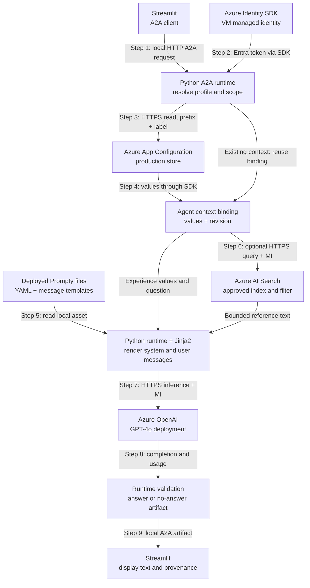
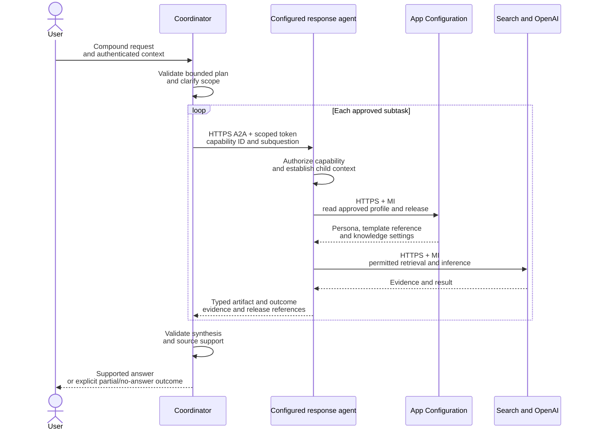
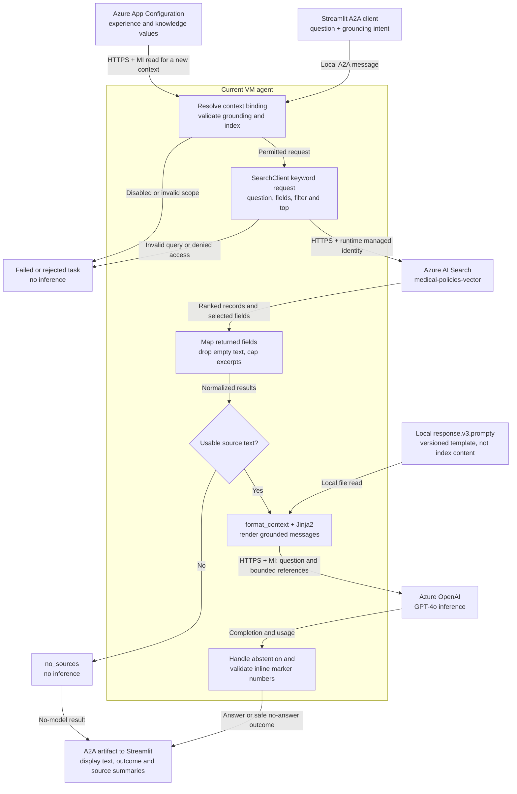
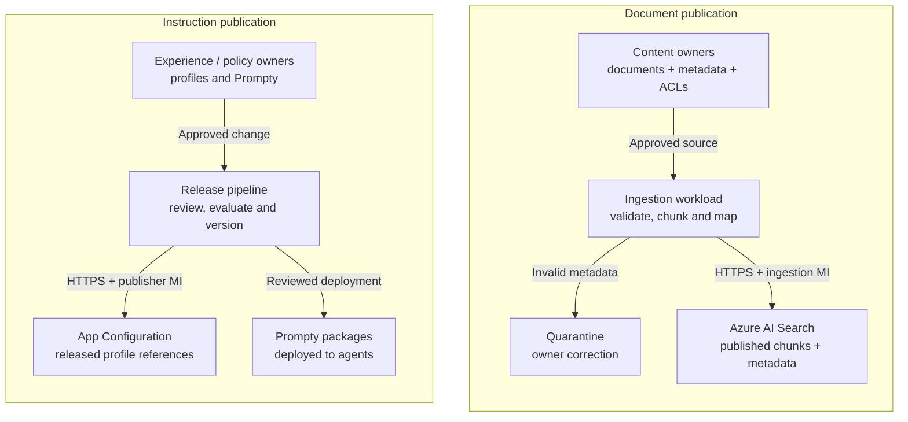
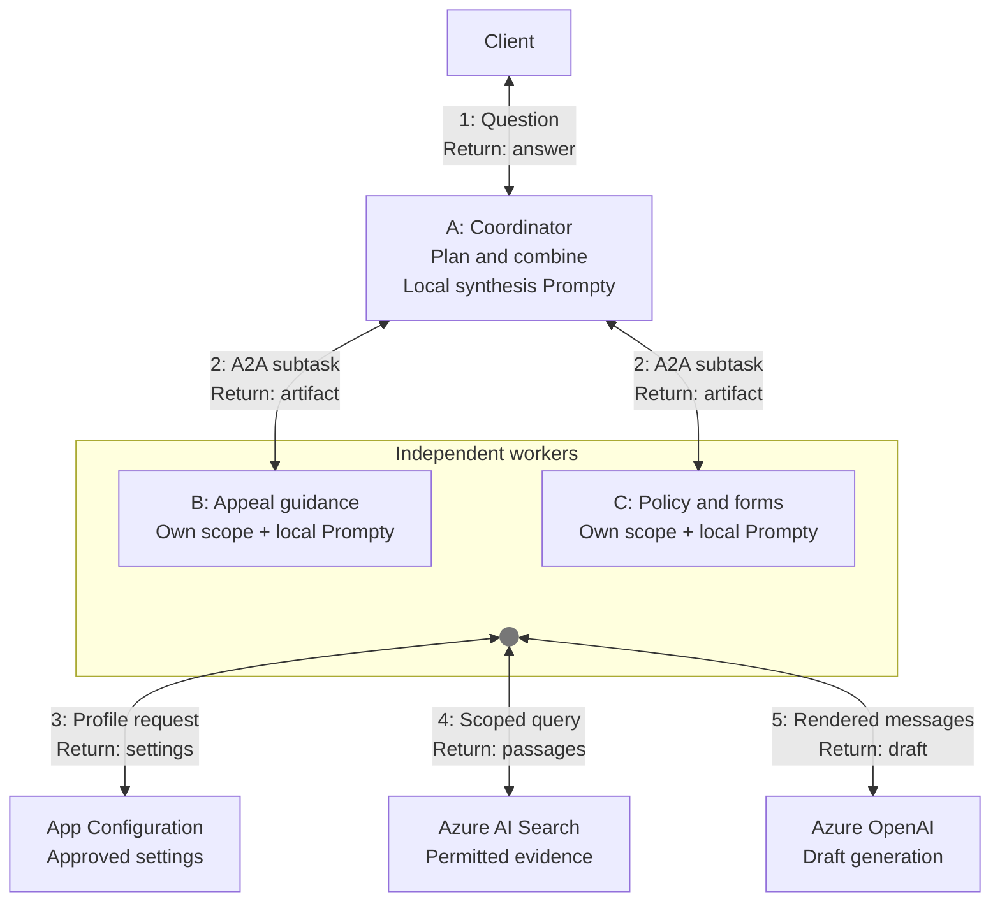

# Configurable Conversational Experience

*A technical executive perspective on configurable AI experiences, informed by the PoC. Narrative revised 2026-09-24; implementation evidence through 2026-09-23.*

**Covers:** AI-WP-001 (externalizing conversational personas), AI-WP-002 (managing tone, verbosity, and reading level through configuration), and the customer note on regionality and language barriers.

## Executive perspective

**The purpose of this paper is to show how an enterprise can change an AI assistant's voice and knowledge without making every change a software release, while retaining control over who can change it, which evidence it may use, and how its behavior is verified.**

The PoC establishes a practical separation: Azure App Configuration selects the experience and retrieval settings, versioned prompt assets express the instructions, and an A2A response service executes them behind a reusable interface. This gives experience and content owners a supported change process while engineering retains responsibility for the runtime and its security boundaries.

The recommendation is to develop that foundation into a **governed configuration and content operating model**, not simply deploy the demo to more users. Configuration makes change easier; identity, publication controls, evaluation and observability make that change suitable for production. Additional agents are justified when distinct capabilities or trust boundaries require them, not because every persona needs its own service.

The paper uses healthcare member-support guidance as its primary example: explain an appeal process, locate applicable references and identify forms. It does not propose clinical decisions, coverage determinations or appeal submission. PoC002's regional examples use separate synthetic retail content.

### What the evidence establishes

| Evidence level | What it supports | What it does not establish |
|---|---|---|
| Working PoC001 | Configuration-driven comparisons, one A2A response service, approved existing-index keyword retrieval, and user-confirmed configuration history save/readback | Production access isolation, corpus-wide answer quality, scalable operations or measured customer benefit |
| PoC002 implementation | A concrete approach to layered market configuration, localized assets and disclosures | A confirmed live deployment or measured multilingual quality |
| Proposed extensions | A design for compound requests, large-corpus retrieval and controlled experimentation | Implemented multi-agent orchestration, assessed metadata quality or production acceptance |

Each capability section answers four questions: **what is the goal, what work was done in the PoC, why was it designed that way, and what must change for production?** The closing roadmap turns those extensions into ownership and acceptance decisions. Detailed environment status, commands and historical test evidence belong in the linked runbooks, not the main argument.

---

## 1.1 Externalizing Conversational Personas from Application Code

### Goal

Allow the people responsible for the customer experience to change the assistant's voice without changing application logic. This addresses **AI-WP-001**: separate persona authorship from software delivery while preserving a reviewable version of what the customer receives.

A persona describes how the assistant presents information. It is not a security role or permission to access additional data.

### PoC work

1. Created `baseline` and `candidate` profiles in Azure App Configuration. Each holds persona, tone, verbosity, reading level, structure and a prompt-asset selection.
2. Kept reusable instructions in versioned Prompty files, rendered with Jinja2 rather than embedded in the UI. Ungrounded profiles select v1 or v2; grounded responses use v3 with the same experience values.
3. Made the response runtime resolve the selected profile when a new A2A context starts, then reuse it for subsequent tasks in that context.
4. Enabled side-by-side responses and an explicit refresh operation so a presenter can inspect configuration and its effect through one repeatable workflow.

**Result:** the response style is an external input to a stable execution path. Changing supported configuration values does not require rebuilding the application; adding runtime behavior or deploying a new prompt body remains a deployment change.

### Architecture and decisions

The design separates **configuration**, **instructions**, and **execution**. Azure App Configuration holds the values that are expected to vary. A deployed prompt asset describes how to use them. The Python response service resolves the profile, renders messages, retrieves permitted evidence when requested, and calls Azure OpenAI. The model does not fetch its own configuration or decide its permissions.

#### What is captured in a profile?

In PoC001, a profile is a set of key-values selected by an App Configuration label, not a separate Azure resource. The same key can have a `baseline` value and a `candidate` value. Two key groups describe the response:

| Group | Current configuration values | Responsibility |
|---|---|---|
| Experience | `experience:persona`, `experience:tone`, `experience:verbosity`, `experience:reading_level`, `experience:response_structure`, `experience:prompt_asset` | Who the assistant presents itself as, how it speaks, and which deployed ungrounded template it uses |
| Knowledge policy | `knowledge:enabled`, `knowledge:index`, `knowledge:filter`, `knowledge:top_k`, `knowledge:query_mode`, `knowledge:citation_style` | Whether retrieval is enabled, where and how to search, evidence count and citation instructions |
| Existing-index mapping | `knowledge:title_field`, `knowledge:content_field`, `knowledge:url_field`, `knowledge:industry_field`, `knowledge:audience_field`, `knowledge:status_field`, `knowledge:effective_date_field`, `knowledge:state_field`, `knowledge:source_field`, `knowledge:search_fields` | Map an existing Search schema into the runtime without pretending that missing sample fields exist |

The mapping group was needed because the existing index uses fields such as `Title` and `Content`, not the sample schema. Optional unavailable fields can remain unmapped. The current VM accepts only approved indexes and simple keyword search; adding a configuration value does not implement a new query strategy.

Service endpoints, model deployment/API version, managed-identity selection, feature opt-ins, allowed-index boundaries and local state settings are **deployment configuration**, outside the editable experience profile. Credentials are not stored as profile values. Request data consists of the question, the supported profile slot, grounding intent and the A2A context. Production should keep these three categories separate so an experience author cannot grant the runtime access to a new resource by changing its tone profile.

PoC001 reads one exact label. Labels neither merge automatically nor isolate permissions. The service removes the `experience:` or `knowledge:` prefix for its internal dictionaries and binds the resolved values to the context. PoC002 separately implements ordered global/market/experiment overrides. Trusted application policy, not a caller-supplied label or persona string, must select production audiences and capabilities.

#### Prompty and Jinja2: the instruction layer

A **Prompty file** is a text-based prompt asset: YAML front matter describes metadata and model-related settings, followed by the prompt body. YAML is a human-readable structured-data format. The body can contain separate `system:` and `user:` message sections and template placeholders. Keeping the asset in source control makes instruction changes reviewable and versionable alongside tests.

**Jinja2** is the Python template engine that fills those placeholders. For example, the trusted template `Use a {{tone}} tone at a {{reading_level}} reading level` becomes a concrete instruction after the runtime supplies profile values. Jinja2 also supports conditions, which the grounded template uses to select citation instructions. It does not infer the best persona, retrieve documents, or call the model.

In this PoC, [prompt.py](../pocs/001-config-driven-responses/prompt.py) reads the YAML and body, separates message roles, and renders each message with Jinja2. It does not use a hosted prompt registry or a generic Prompty execution service. [response.v1.prompty](../pocs/001-config-driven-responses/prompts/response.v1.prompty) and [response.v2.prompty](../pocs/001-config-driven-responses/prompts/response.v2.prompty) are ungrounded templates; grounded execution explicitly selects [response.v3.prompty](../pocs/001-config-driven-responses/prompts/response.v3.prompty). The model deployment comes from runtime settings, and front-matter sample values are examples, not automatic live defaults.

Templates and authored configuration are trusted instruction inputs. User questions and retrieved text remain data supplied to that template, not executable template source. This reduces accidental mixing of roles but does not itself prevent prompt injection or guarantee model adherence; those require validation and evaluation. New assets still need deployment to the serving instances even though existing profile values can be refreshed without rebuilding the app.

#### How configuration reaches Azure OpenAI

The diagram shows the **current PoC001 response path**, with repeated runtime stages drawn separately for readability. The App Configuration read happens in the agent when a new context is resolved, not inside the model. Streamlit also has administrative configuration reads/edits outside this generation path.

MI means managed identity. The Azure SDK obtains service-scoped Entra tokens using the selected VM identity; Search and OpenAI also authenticate through their SDKs. App Configuration returns values selected by prefix and label, such as `experience:*` at `candidate`, plus knowledge settings when enabled. The token is not a profile value or part of the prompt. The current local A2A link is unauthenticated loopback HTTP; production requires the separate caller-authentication controls described later.

This is the successful-generation route. A new-context read failure, disabled grounding or empty evidence can stop it before inference. The context retains resolved settings until replaced, but it does not freeze file contents, model versions or the Search corpus. That distinction drives the release and scaling work below.

#### The RBAC boundary: stores, not individual values

The governance work identified an important constraint: **App Configuration data-plane RBAC cannot grant an author access to just one key, prefix or label inside a store.** The built-in Data Reader and Data Owner roles apply at the store's scope; Data Owner includes writing and deleting values. App Configuration does not provide the per-value role-assignment conditions used for certain Storage actions. Here the correct resource term is **store**; a Blob container is a different service boundary.

If two sets of values need different direct Azure permissions, use separate stores, for example draft and production, or stores for distinct legal/ownership boundaries. Keep baseline/candidate or language labels together where they genuinely share a trust boundary. A separate store for every tone or persona would add cost and operating work without necessarily improving security.

| Identity in a separated design | Draft store | Production store | Why |
|---|---|---|---|
| Experience author | Data Owner | Data Reader if needed | Can propose changes, not publish directly |
| Publication workload | Read approved draft | Constrained write permission | Writes only after workflow checks; approval is not supplied by RBAC alone |
| Response runtime | No access | Data Reader | Consumes published settings without editing them |
| Reviewer | Data Reader | Data Reader | Inspects versions and differences |

For per-key or per-market delegation within one store, remove direct writer access and put a validated gatekeeper API or controlled pipeline in front of it. That component becomes trusted enforcement code and needs its own authentication, audit and availability controls. Merely hiding keys in the UI does not narrow Azure permissions. Access-key authentication must also be addressed if the design relies on Entra authorization.

The current Windows PoC deliberately uses one existing managed identity and explicitly permitted live editing in one production store. It does **not** implement the separated permissions in this table. The retained full-governance mode models separate stores and role identities; effective assignments still require environment verification.

### Path to production

Recommended work is a combination of configuration, platform provisioning and application engineering. The table makes that distinction explicit rather than treating production as another profile label.

| Recommended step | What must be configured or built | Completion evidence |
|---|---|---|
| 1. Define the profile contract | Inventory the values above; define required fields, allowed assets/indexes, types, defaults, bounds and ownership. Add a versioned release manifest linking profile, prompt hash, model/request settings and retrieval-policy/schema versions | Invalid or incompatible profiles fail validation; missing values do not silently select another policy |
| 2. Establish trust boundaries | Provision the required App Configuration stores and identities through IaC; assign scoped roles, authenticated author/publisher access, network policy and diagnostics. Build a gatekeeper only where finer delegation is required | Authors cannot publish directly; runtime cannot edit; denied-access tests verify the actual assignments |
| 3. Package instructions and releases | Deploy reviewed Prompty assets to every serving instance. Publish a verified configuration bundle or snapshot/reference through an approved pipeline, not uncoordinated key edits | Every instance resolves a compatible, identifiable profile/asset release; evidence records the approver and version |
| 4. Test behavior and security | Add schema/template tests, profile/knowledge contract tests, representative answer evaluation, injection and unauthorized-access cases, and outage/partial-save checks. Evaluate repeated runs, not exact wording alone | Approved thresholds for factual support, style, refusal, latency and cost; no mandatory-scope leakage |
| 5. Design rollback and withdrawal | Retain compatible configuration snapshots and asset/model references; implement pointer change plus refresh/context policy. Keep withdrawal distinct from normal rollback and do not restore revoked access or withdrawn evidence | Rehearsed rollback and emergency stop across new and active sessions, including unreachable control-plane cases |
| 6. Make replicas consistent | Move context/task state to caller-scoped durable storage or carry a validated immutable release reference. Define cache keys/refresh, eviction and staleness, deploy the same assets, and integrate load balancing/health checks | Requests routed to different replicas use the intended release; restart/failover does not silently rebind to different settings |
| 7. Prove capacity and operation | Load-test configuration reads, Search and model quotas together. Add bounded concurrency/backpressure, timeouts, retry budgets, traces, cost alerts and an operating owner | Target P95 latency/throughput and unit cost met with tested recovery, retention and support procedures |

App Configuration caches reduce control-plane calls, but each replica has its own cache unless the application coordinates them. The current in-memory `contextId` binding is lost on restart and is not shared across replicas. Sticky sessions may help a pilot but do not provide durable failover or caller isolation. Production needs a tested state/version strategy; simply adding a load balancer can otherwise change which settings a conversation sees.

For a compound prompt, the same configuration-driven response engine can remain the worker. A coordinator could split an approved read-only question and invoke that worker under separate authorized profile/scope bindings, then combine its evidenced results. Today the interface accepts only baseline/candidate and grounding intent: arbitrary personas, labels and filters are rejected, and decomposition is not implemented. The [compound-request section](#extending-a2a-to-compound-requests) compares this shared-worker extension with independently deployed specialist agents.

**Production decision:** who may author, approve and withdraw an experience? Answering that turns configurable wording into an operating model rather than a collection of editable strings.

---

## 1.2 Managing Tone, Verbosity, and Reading Level through Configuration

### Goal

Make experience changes observable and reviewable, not merely configurable. **AI-WP-002** asks whether an experience designer can adjust tone, detail and readability, compare the resulting answers, and decide whether to promote the change.

### PoC work

1. Exposed the following controls for both comparison profiles. These are illustrative values, not a copy of the live store.

| Dial | Configuration key | Example baseline value | Example candidate value |
|---|---|---|---|
| Tone | `experience:tone` | `neutral and professional` | `warm, friendly, and empathetic` |
| Verbosity | `experience:verbosity` | `brief` | `concise but complete` |
| Reading level | `experience:reading_level` | `grade 9` | `grade 6` |
| Structure | `experience:response_structure` | `a single short paragraph` | `acknowledgement, short bullets, next step` |
| Persona | `experience:persona` | `Contoso Health Plan member support agent` | `caring Contoso Health Plan member support specialist` |
| Template version | `experience:prompt_asset` | `response:v1` | `response:v2` |

2. Rendered the same member question twice and displayed response text, readability indicators, latency, token usage and provenance together.
3. Added explicit load/save controls for existing live settings on the VM. Saves use the loaded ETag to detect concurrent edits, and successful saves clear the current UI's cached results and comparison contexts.
4. Added preference capture and configuration history. The user confirmed history save/readback; no population-level satisfaction improvement was measured.

### Architecture and decisions

Configuration values become instructions inside the template, not model API parameters. A lower requested reading level is therefore a behavior to evaluate, not a deterministic output guarantee. Readability scores are diagnostic indicators; they do not establish comprehension, empathy or correctness.

The current VM saves directly to live profiles under a shared identity. `candidate` means the comparison variant, not a private draft. The retained full-governance mode instead supports draft editing and approver publication. Grouped writes are not atomic and can partially succeed; history failures are reported separately from configuration outcomes.

An **ETag** is the version identifier returned by App Configuration for a setting. The editor loads that identifier and requires it to match when writing; a concurrent edit produces a conflict rather than an unnoticed overwrite. It protects a particular key, not an entire multi-key release. A reviewer should reload after a conflict or partial save, not assume the whole candidate profile was published.

For example, changing `candidate` reading level from grade 9 to grade 6 changes a rendered instruction in a fresh context. It does not change the model deployment or its token limit. The output budget is controlled separately by the asset/runtime request contract. Testing should determine whether simplification preserved supported facts and necessary qualifications, not just whether the readability score fell.

### Path to production

1. **Define an authored profile schema.** Set supported values, lengths and combinations for persona/style/structure and allowed template references. Assign an experience owner and validate the whole proposed release, not only individual text fields.
2. **Build a repeatable evaluation set.** Include short, compound, ambiguous and unanswerable questions, supported policy constraints, reading-level expectations and unsafe instructions. Keep corpus/model versions fixed when comparing a style change, and record any intended difference in retrieval scope.
3. **Automate and review the checks.** Test template rendering and version conflicts offline; run approved model evaluations repeatedly for fact preservation, citation support, style, refusal, latency and token cost. Human review assesses empathy and comprehension. These are evaluation workflows to build, not guaranteed outputs of the profile settings.
4. **Publish and observe under control.** Store the chosen profile/asset release and evaluation evidence, require approval, and use the release/refresh mechanism from section 1.1. Monitor live quality with privacy-safe sampling and a defined owner rather than logging every question by default.
5. **Define the revert decision.** Set promotion and regression thresholds before rollout. Retain the prior compatible release, exercise rollback across replicas and sessions, and distinguish a content/security withdrawal from a routine tone adjustment.

**Production decision:** what result justifies promotion? A preferred answer in a demonstration supports design review; it is not yet evidence of improved customer service.

---

## 1.3 Adapting the Experience to Market, Language, and Jurisdiction

### Goal

Reuse the configuration model across markets without treating localization as translation alone. Language determines how an answer is expressed; market rules determine its substance; jurisdiction determines applicable policy and required notices. A fluent answer from the wrong market can still be wrong.

### PoC work

[PoC002](../pocs/002-regional-multilingual-experience/README.md) contains the following implementation, using synthetic `en-US`, `es-MX` and `de-DE` retail examples. **Its live end-to-end verification remains unconfirmed.** These steps describe work built, not measured regional results.

1. Implemented an ordered resolver: global `baseline`, market override, then optional market-candidate override. The resolved values report which layer supplied them.
2. Added localized prompt lookup, approved terminology assets and disclosure assets. Notice text is appended after generation, rather than asking the model to reproduce it.
3. Added retrieval gates using language, jurisdiction and translation status, together with a report of translations tied to older source versions.
4. Implemented optional response-language detection with warn/enforce/off behavior and a no-content handoff message.

### Architecture and decisions

Sparse overrides avoid copying every profile for every market. They also create a review obligation: a global change reaches every market that inherits it. Per-key provenance and an impact report make that consequence visible before publication.

| Responsibility | Design decision | Why it matters |
|---|---|---|
| Voice and terminology | Resolve the most specific reviewed asset, with explicit fallback | Avoid an inconsistent register or silently changed product terminology |
| Policy applicability | Use authoritative language/jurisdiction and review metadata | Translation cannot make another market's policy applicable |
| Mandatory notices | Select a versioned asset and append outside generation | Remove model paraphrasing from notice delivery; still validate rendering and asset selection |
| Content currency | Track source identity and version for translations | Certification against an older source is not evidence of current accuracy |
| Market ownership | Use reviewed workflows or repository ownership rules | App Configuration labels do not enforce per-market Azure permissions |

The language check suppresses a confident mismatch in enforce mode, but missing or failed detection currently reports unavailable without failing closed. That gap must be addressed where verification is mandatory. The sample's translation categories and disclosure text are demonstration contracts, not legal certification.

The regional profile extends the experience contract with market context and references to reviewed assets:

| Configuration | Function | Implementation consideration |
|---|---|---|
| `baseline`, market label, market-candidate label | Ordered global → market → experiment resolution | The resolver reports the winning layer for each value; test inheritance when any upstream value changes |
| `market:language`, `market:jurisdiction`, locale selection | Expected language and business/legal scope | Language and jurisdiction are separate; neither may be inferred as authorization from the customer's wording |
| `experience:formality` | Language-appropriate register | Authored language instructions give a setting such as formal its local meaning |
| `market:glossary_asset`, `market:disclosure_set` | Versioned terminology and mandatory notice references | Assets must exist on every serving instance; notice selection/rendering needs testing outside the model |
| `knowledge:filter`, `knowledge:translation_gate` | Permitted language/jurisdiction and review categories | Required fields must be present and populated in the index; a translation category is not an independent approval record |
| `market:language_adherence`, `market:escalation_path` | Handling of language mismatch and unavailable guidance | A displayed handoff direction is not an integrated support transfer unless that service is implemented |

Localized prompt selection tries market, then language, then neutral assets for the selected version. For the sample German market, a language-level asset is used. Versioning must therefore cover the fallback chain and glossary/disclosure references, not just one filename. PoC002 appends notice text after trimming outer whitespace; this prevents model paraphrasing, not every possible delivery or compliance defect.

### Path to production

1. **Define the market contract and ownership.** Agree on locale/language/jurisdiction, approved content and translation categories, escalation channel, disclosure obligations and who owns each asset. Add residency, local formatting and right-to-left requirements where applicable.
2. **Author and package the assets.** Review localized prompts, terminology and notices with language/compliance owners; configure their versioned references and fallback rules. Test missing assets and exact required notice delivery before allowing that market's profile to publish.
3. **Prepare eligible knowledge.** Map language, jurisdiction, source version and review state from authoritative metadata to every chunk. Evaluate one shared index, language fields or separate indexes against analyzer, ownership and isolation needs; different profiles alone do not require separate indexes.
4. **Complete runtime guardrails.** Configure the detector endpoint, identity, expected language and action. Where verification is mandatory, implement fail-closed behavior for unavailable/inconclusive detection rather than assuming `enforce` currently covers it. Define and test the actual support handoff path.
5. **Evaluate and release per market.** Use representative questions and native-language review, including inherited changes, wrong-market evidence, source-version drift and notice failures. Retain compatible market releases and independently tested rollback/withdrawal controls; compare readability against that market's own baseline.
6. **Operate content currency.** Schedule source-version reconciliation and re-review, track translation backlog and assign service owners. Cross-language fallback or machine translation is a separate policy/implementation decision, never an automatic escape from missing local evidence.

**Production decision:** which markets can the organization support with reviewed, current content and accountable owners? Configuration reduces duplication; it does not remove that operating obligation.

---

## A reusable response service with A2A

### Goal

Make the configured response capability available to more than one user interface without copying its configuration, retrieval or model logic. This creates a reusable service boundary before considering multiple agents.

### PoC work

1. Separated response execution from Streamlit. The UI became an A2A client of a dedicated configured-response agent.
2. Published an Agent Card describing one skill and an A2A 1.0 HTTP+JSON interface. The comparison extension accepts only `baseline`/`candidate` and grounding intent, not arbitrary prompt assets, filters or credentials.
3. Moved profile resolution, optional Search retrieval, prompt rendering and model calls behind that boundary.
4. Returned the answer or a safe no-answer outcome as a task artifact, with configuration revision, source summaries, latency and usage. Streamlit displays one task per comparison profile.

**Result:** the UI can consume the response capability without implementing its Azure or prompt logic. The PoC has one runtime agent, not two collaborating agents because two columns are displayed.

### Architecture and decisions

*Response-generation path, redrawn 2026-09-25. The VM and Azure service boundaries are separate; Prompty files are deployed locally, not an Azure service. Local A2A is loopback HTTP, not independent user authorization. UI configuration editing and history use separate Azure calls and are intentionally outside this flow.*

| Boundary | Responsibility | Reason for the separation |
|---|---|---|
| UI to response service | Send the question and allowlisted comparison choice; receive an artifact | Other compatible clients can reuse the same capability |
| Configuration to runtime | Resolve profile and retrieval policy | Callers cannot redefine the execution policy through request metadata |
| Runtime to Azure services | Retrieve evidence and invoke the model using the selected workload identity | Keep credentials and service details out of the client contract |
| Result to reviewer | Return safe provenance and explicit outcome | Make behavior inspectable without exporting raw prompts or internal configuration |

A2A defines communication, discovery and task semantics; it does not supply authorization, durable execution or orchestration automatically. The current service blocks until task completion, keeps tasks/contexts in memory and runs on loopback without inbound authentication. Its `contextId` binds configuration, not a complete conversation-memory or immutable-content guarantee.

An **Agent Card** is the service's capability description: supported skills, interface and protocol version, media types and advertised optional features. A **Message** carries a request; a **Task** records its execution state; an **Artifact** carries the output. This vocabulary makes another A2A-compatible caller possible without exposing the worker's internal prompt or Azure configuration layout. It does not make an untrusted Agent Card a trusted endpoint.

Today the extension carries `profileSlot` and `grounded`. The slot is limited to `baseline` or `candidate`; raw `persona`, `prompt_asset`, `filter`, `store` and label overrides are rejected. The task returns display text plus safe configuration/source/usage metadata, not a configuration bundle. Deployment endpoints and credentials remain inside the service.

### Path to production

1. **Publish a service contract.** Version the Agent Card, accepted request metadata and artifact schema. Specify supported outcomes, size limits, protocol compatibility and which changes require a new contract version. Add consumer/contract tests before onboarding another client.
2. **Secure each operation.** Configure HTTPS, correct token audience/scopes, approved client identities and server-side task ownership. Test task listing, reads and cancellation as well as generation; a valid workload token must not grant access to every user's tasks.
3. **Externalize operational state.** Implement caller-scoped task/context storage and expiry, and apply the replica/version strategy from section 1.1. Configure load-balancer health and routing; a second replica must not lose or reinterpret a context created by the first.
4. **Bound execution and recovery.** Configure request timeouts, concurrency, token budgets and dependency retries. Define duplicate-request/idempotency behavior so retries do not unexpectedly produce extra billable tasks. Test cancellations, late results, dependency denial and process failure.
5. **Operate the capability.** Choose managed hosting and deployment/rollback procedures, attach correlation/traces and latency/error/cost alerts, and assign support and retention ownership. Adopt streaming or push only after implementing and testing those advertised behaviors.

**Production decision:** which applications should consume this capability, under which identity and service-level contract? A stable interface enables reuse, but each new caller must fit the authorization boundary.

## Extending A2A to compound requests

### Goal

Answer a request that needs several capabilities while maintaining one coherent, supported response. For example: **"Explain the appeal process, find the applicable policy references, and show me the required forms."** Procedures, policies and forms are different evidence types; adding several persona descriptions to one prompt does not ensure that each is handled correctly.

### PoC work

PoC001 established a single response service, context-bound configuration and structured result provenance. **It did not implement decomposition, specialist delegation or synthesis across agents.** The following design extends that foundation; it is not a reported PoC result or permission to execute business actions.

### Architecture and decisions

The smallest useful extension is **a coordinator plus the existing configuration-driven response service**, not necessarily a new agent for every persona. The coordinator identifies the separate goals and requests a bounded answer to each. The response worker continues to own configuration resolution, prompt rendering, Search and inference.

#### What the current architecture can and cannot do

One current request can contain several questions, but all are answered under one resolved experience profile and knowledge scope. That is sufficient when the same instructions and eligible corpus cover every part. There is no deterministic decomposition, per-part filter selection or completeness check.

An external caller can already make several A2A calls using the supported baseline/candidate slots. It cannot send arbitrary persona text, new labels or filter expressions to the agent. A useful compound-request extension therefore requires a new **authorized routing contract**, not merely additional App Configuration keys. Baseline/candidate are comparison variants; they should not be repurposed as business-domain permissions.

The proposed contract accepts an approved semantic capability such as `appeal-procedure` and a subquestion. The worker maps that capability to a reviewed profile, knowledge policy and release version. Saying that the coordinator asks the agent to "pull a persona" means this internal resolution; raw personas, prompts and filters need not be returned or become caller-controlled.

| Example subtask | Profile and retrieval policy resolved by the worker | Constraint |
|---|---|---|
| Explain the appeal process | Member-guidance style; reviewed appeal procedures and appropriate FAQs | Requires authoritative plan/jurisdiction/date context where material |
| Identify policy references | Precise reference-summary style; applicable policy and benefit documents | Does not determine the member's coverage or medical necessity |
| Locate forms | Form-reference output; approved links associated with the verified procedure | Inherits applicability and caller permissions; can be deterministic rather than another model call |

These are **proposed mappings**, not additional profiles or tags already present in the current deployment. The corpus assessment must establish that the required metadata and evidence exist.

*Proposed composition of a reusable worker. Independent subtasks may run concurrently within a configured limit; the loop represents the repeated contract, not a requirement for serial execution. A forms subtask can depend on a verified procedure. Search and OpenAI are grouped here only for readability; section 1.1 shows their separate responsibilities.*

Create a separate child context for each different profile/scope binding, and preserve it only for follow-ups using that same binding. The existing runtime forbids changing the profile slot of a bound context. The coordinator keeps a parent operation ID and a mapping to child task/context IDs; a shared identifier does not create shared state across services. Pin compatible configuration/asset releases without freezing authorization revocation.

Keep four concepts distinct: a **persona** controls presentation, a **capability** performs a bounded function, an **agent** has a service/ownership boundary, and an **identity** determines permitted access. Several logical capability profiles can use one deployed worker. If they must not share data or credentials, separate service/hosting boundaries may be required even when the implementation code is reused.

#### Choose complexity for a demonstrated need

| Approach | Benefit | Cost or limitation | Appropriate use |
|---|---|---|---|
| One request, one configured worker/profile | Fewest calls and least orchestration; one policy/context binding | One retrieval scope may miss a distinct intent; no per-part completion guarantee | Related questions supported by the same corpus and policy |
| Coordinator, multiple calls to a shared configured worker | Reuses one rendering/retrieval implementation, configuration contract and operations footprint; profiles vary by approved capability | Requires decomposition, routing, child-context tracking and synthesis; adds latency/tokens and shares a service failure/trust boundary | Several read-only evidence types with compatible ownership and access controls |
| Coordinator with independently deployed specialists | Independent permissions, tools, release cadence, scaling and domain evaluation | More contracts, authentication hops, failure handling, traces and operating owners | Capabilities with genuinely different trust or lifecycle requirements |

The shared-worker approach centralizes fixes to prompt rendering, retrieval and provenance and avoids duplicating an agent stack for every persona. It is not guaranteed to be cheaper per answer: decomposition, multiple model calls and synthesis must be measured against the single-call baseline. Extra agents also do not repair a corpus that lacks the answer.

#### What orchestration must configure and enforce

The proposed registry needs capability IDs/owners, approved endpoints, contract versions, profile and knowledge-policy references, authentication audience/scopes, allowed dependencies, required/optional steps and maximum task/depth/concurrency/time/token budgets. Keep small selectors in App Configuration and reference reviewed larger workflow assets. An Agent Card advertises capabilities; trusted routing and deterministic service policy decide which can run.

Each returned artifact needs an explicit outcome, supported findings, missing information, source/document/version/section references and release/usage provenance. Synthesis maps child-local source numbers into one deduplicated citation list without losing claim support. An invalid contract, conflicting applicable versions or missing required evidence must block dependent guidance or produce a clear partial result, not agent voting or an invented citation.

No planner-proposed subtask can widen caller entitlement, select arbitrary filters/endpoints or switch to a privileged identity. Required safety and authorization checks remain outside the model. Optional topical refinements can be evaluated for recall only within the mandatory access and applicability boundary.

### Path to production

1. **Select a bounded compound scenario.** Define the subgoals, expected evidence, required dependencies and when a single call is sufficient. Keep clinical decisions and business actions outside this read-only scope.
2. **Implement and secure the routing contract.** Add an allowlisted capability-to-profile/scope mapping and typed artifact schema to the worker. Review its permissions and test that callers cannot submit raw config or impersonate an approver. This is application engineering as well as configuration authoring.
3. **Implement coordination using a supported orchestration runtime.** Validate decomposed plans, allocate child contexts, enforce budgets and run independent steps with bounded concurrency. Define retries/idempotency, cancellation and late-result behavior; A2A alone is not a durable scheduler.
4. **Implement evidence-preserving synthesis.** Retain source locators and versions, apply approved authority/conflict rules and distinguish complete, partial, insufficient-evidence and failed outcomes. Test malicious instructions in documents and child outputs.
5. **Compare and roll out.** Evaluate against the single-worker baseline for completeness, factual support, access leakage, latency and cost. Test worker loss, required/optional step failure and replica routing. Release a limited route behind a controlled switch, retain the simpler path, and roll back routing/profile/asset versions together where compatible.

The operating team needs correlated parent/child traces and aggregate usage, not raw sensitive prompts in logs. Add independently deployed agents only when the measured result or required trust boundary justifies their additional cost.

**Production decision:** does specialist composition deliver enough additional value to justify its coordination and operating cost? A2A makes that composition interoperable; it does not make it necessary for every request.

---

## Configuration freshness and session boundaries

### Goal

Control when a published change reaches customers without changing the assistant's behavior unpredictably during an interaction. Freshness concerns adoption speed; coherence concerns using a compatible set of settings. Urgent withdrawal is a third requirement that can override normal session continuity.

### PoC work

1. Cached UI configuration and bound the agent's resolved profile and knowledge scope to an A2A context.
2. Added an opaque revision of those values to response provenance.
3. Made refresh explicit: clear the current UI's cache, results and comparison context IDs, then resolve current values on the next request. Successful configuration saves also reset that UI state.

The explicit refresh makes cause and effect visible during a demonstration. Other sessions keep their existing bindings until refreshed; the implementation is not a distributed rollout or emergency withdrawal system.

### Architecture and decisions

Session binding prevents ordinary edits from changing a profile between tasks. It does not make the initial multi-key read atomic or freeze prompt-file contents, model deployments or Search documents. The configuration revision is therefore useful provenance, not a complete release identity.

An **App Configuration provider** is a client library that adds managed loading, caching and refresh behavior on top of service access. PoC001 instead uses the direct SDK with its own cache/context logic. Adopting a provider requires a code integration point; setting a refresh interval somewhere in the store does not by itself update a running process.

A **snapshot** is an immutable named collection of captured key-values. A **snapshot reference** is a supported configuration setting that points consumers to such a collection; a capable provider resolves it. The publisher first verifies a compatible set and then promotes its reference. Neither the snapshot nor its reference captures the deployed prompt files or Search corpus, so the release manifest must link those separately.

| Mechanism | Why use it | Important boundary |
|---|---|---|
| Manual refresh | Visible, controlled PoC comparisons | Adoption depends on the presenter; other sessions are unchanged |
| Activity-driven provider refresh | Check configuration during application activity | Requires successful refresh and an explicit session policy; all-key or selected-key monitoring is supported |
| Verified snapshot and reference | Publish an immutable configuration set and retain rollback targets | Capture the intended release first; a snapshot does not version external assets or data |
| Event-driven invalidation | Coordinate faster adoption across instances where required | Delivery, failure handling and actual withdrawal latency must be measured |

A sentinel updated after a batch can coordinate refresh, but is not a transaction across separate writes. Likewise a feature flag does not instantly replace pinned contexts or cancel work. These distinctions matter when configuration becomes a production control plane.

### Path to production

1. **Specify adoption and withdrawal objectives.** Agree how quickly new sessions should see an ordinary release and how quickly unsafe behavior must stop, including active sessions and dependencies that are unreachable.
2. **Implement the resolution contract.** Choose immutable bundle/snapshot references or another verified publication strategy, define required version/asset compatibility and bind one release per context. Prevent partially written profiles from being accepted as a release.
3. **Integrate refresh and cache policy.** Configure selectors/watch keys, interval, jitter/backoff, TTL/eviction and maximum staleness in the application/provider. Use cache keys that distinguish store/profile/release and authorization scope where relevant. Never cache credentials in profile payloads.
4. **Coordinate replicas.** Keep authoritative context bindings in a durable caller-scoped store or validate a carried immutable version reference. Ensure new instances load the same assets and release, and test rolling upgrades, concurrent publication, restart and load-balancer reassignment.
5. **Implement failure and withdrawal paths.** Serve last-known-good values only within the approved staleness policy; fail safely at startup if none are available. Add monitored event invalidation where required, with duplicate/retry handling. Define whether emergency withdrawal cancels, rejects or rebinds active work.
6. **Rehearse rollback.** Retain compatible bundles and assets; snapshot expiry after archival or revoked content/permissions can invalidate a rollback target. Measure actual adoption and withdrawal across replicas under failure, not only the configured interval.

**Production decision:** how quickly must an unsafe change stop affecting customers? Choose refresh and interruption mechanisms against that objective, rather than assuming a cache interval is a service guarantee.

---

## Governance and security

### Goal

Make configuration easier to change without making production behavior easier to change without authorization. The operating model must answer who can author, who can publish, how changes are reviewed, and what evidence remains afterward.

### PoC work

1. Retained a full-governance demonstration with separate draft/production stores and distinct viewer, designer, approver and runtime role intent. Historical demonstrations exercised Azure allow/deny behavior in that setup.
2. Adapted the current Windows deployment to the approved one-identity scope. It uses explicit managed identity, bounded live editing, allowed-index controls and local operation guards rather than simulating separate roles.
3. Added best-effort Blob events for app-mediated configuration changes, including known before/after values, versions, outcomes and operation IDs. No-op saves produce no event; logging failure does not retry or roll back a confirmed configuration change.
4. Created the private history container and enabled the UI path with user authorization. Save/readback was user-confirmed on 2026-09-23.

**Result:** the current workflow makes supported changes visible and reviewable. It does not demonstrate independent approval or per-human attribution: every trusted VM user shares the workload identity.

### Architecture and decisions

**Labels organize configuration; separate stores support separate access boundaries.** App Configuration data roles are store-wide, not per-key or per-label. A designer with write access to a draft store can change any key there. Finer delegation requires a controlled API/workflow or pipeline, not a persona name.

| Concern | Current VM choice | Production direction |
|---|---|---|
| Authoring and publication | Direct live edits under one managed identity | Authenticated authors, independent approval and constrained publication identity |
| Response execution | Same workload identity used for approved service operations | Separate read-oriented runtime from privileged deployment and operations |
| Change history | Bounded, best-effort application events in Blob Storage | Reviewed attribution, completeness, retention and immutable-record requirements where needed |
| Service diagnostics | Local logs and limited evidence; no demonstrated end-to-end tracing | Explicit provider diagnostics, correlated dependency traces, dashboards and alerts |

Application history, provider diagnostics and execution telemetry answer different questions. Blob events record the app's configuration workflow, not portal/CLI changes or response traces. App Configuration resource logs require diagnostic settings; Log Analytics is a complementary diagnostics option, not an active dependency of the current VM. Create-only writes are not immutable storage, and a service client ID is not proof of a person's identity.

Local guards constrain what this app exposes but do not reduce Azure grants available to other code using the same identity. Multiple identities selectable inside one shared trusted process also do not establish human isolation. Effective roles, authentication paths and revocation behavior must be reviewed independently of the UI.

**Managed identity** lets an Azure-hosted workload obtain Entra access tokens without storing a client secret. **RBAC** authorizes that principal on the selected Azure resource; it does not identify the human using a shared UI. The full model needs both authenticated user actions and appropriately scoped workload credentials. Network restrictions, including private endpoints when required, complement identity rather than replacing it.

Configuration-history events explain app-mediated edits. Provider diagnostics can capture operations through other access paths when enabled. Distributed traces link a request to configuration, retrieval and model dependencies. They need different schemas, retention and access policies; none should be substituted for another because it is called an audit log.

### Path to production

1. **Design and provision permissions.** Map authors, reviewers, publishers, runtime and operations to stores/resources and hosting trust boundaries. Configure Entra sign-in, scoped roles and network policy through IaC, and address access-key paths where Entra-only enforcement is required.
2. **Implement the publication workflow.** Enforce **author → evaluate → approve → publish → observe → withdraw or roll back** with an authenticated approval record and immutable release reference. Fine-grained per-key delegation needs gatekeeper/pipeline enforcement if authors would otherwise hold store-wide writes.
3. **Define recording obligations.** Decide which application, provider and request events are required, how identity and versions correlate, retention/immutability requirements and behavior when recording fails. Build durable delivery/reconciliation if best-effort gaps are unacceptable; do not retry a confirmed business write solely to retry logging.
4. **Test the real boundaries.** Verify allowed and denied operations, alternate direct access, task ownership, unauthorized document paths, credential/grant changes and sensitive-data redaction. Test logging outages with controlled fixtures rather than revoking shared customer permissions.
5. **Assign operations and review.** Configure redacted traces/dashboards/alerts, periodic access reviews and a retention/incident owner. Rehearse publication rollback and security withdrawal. Keep the [PoC exceptions](../pocs/001-config-driven-responses/README.md#architecture-decision-and-exception-register) open until accountable owners accept or remediate them.

**Production decision:** which changes can be delegated safely, and what approval and evidence must accompany them? The shared-identity demo is a starting point for that decision, not the final security model.

---

## Experimentation: A/B testing the experience with variant feature flags

### Goal

Determine whether a reviewed experience change improves customer outcomes, rather than only looking better in a side-by-side demonstration. This extends **AI-WP-005** and the customer objective of CSAT-focused experimentation.

### PoC work

1. Created baseline/candidate profiles and a common question for paired comparison.
2. Displayed response characteristics, usage and latency, and provided local preference capture.
3. Kept configuration provenance visible so a reviewer can relate a response to its selected profile.

The PoC supports qualitative design review. **Randomized customer assignment, outcome telemetry and statistical analysis are not implemented or demonstrated.**

### Architecture and decisions

The proposed extension uses App Configuration variant feature flags to select a profile reference rather than duplicate its values inside the flag. The response pipeline remains reusable; the new work is assignment, consistent exposure, outcome collection and analysis.

Use stable pseudonymous assignment and session binding. Record the experiment, allocation version, exposure and outcome together; do not hide users who crossed variants in the analysis. Keep policy, data access and safety requirements identical across variants. For regional rollouts, separate flags can support independent market ramps and withdrawal, while native-language review remains necessary.

Feature flags provide assignment, not a statistics engine or an approval workflow. Telemetry requires application/library integration, and the portal's Application Insights integration was still marked preview in the guidance reviewed for this paper. Turning a flag off also depends on refresh and session behavior, not an instantaneous cancellation guarantee.

Configure the flag's variants as approved profile/release references, allocation percentages, authorized pilot overrides and disabled fallback. The application must supply the stable assignment identifier and resolve the selected profile on the server; an incoming profile preference is not proof that the caller belongs to that cohort. Version allocation changes so the analysis distinguishes a rollout change from a changed answer.

### Path to production

1. **Predefine the experiment.** Agree primary metric, guardrails, sampling unit, expected effect, duration, exclusions and promotion/stop rules. Candidate outcomes include supported resolution without escalation, satisfaction, turns, latency and cost.
2. **Configure assignment and integrate the library.** Publish approved variant references, percentages, overrides and fallback. Implement stable pseudonymous assignment/session binding, with tests for distribution, unauthorized overrides and rollout-version changes.
3. **Implement exposure/outcome telemetry.** Correlate actual exposure and outcomes by experiment/allocation version without unnecessary personal content. Choose a statistics/reporting method; a telemetry switch alone does not measure causal improvement.
4. **Evaluate before exposure, then ramp.** Complete the baseline/candidate answer checks, launch an approved limited cohort, monitor guardrails and exercise stop/rollback behavior across caches and pinned sessions. Required safety rules remain identical for all variants.
5. **Conclude under the agreed rule.** Report uncertainty and within-market effects, not a selected favorable metric. If traffic is insufficient, use staged rollout and structured human review rather than claiming statistical significance.

**Production decision:** what customer outcome would justify broader exposure, and what regression would stop it? Configuration enables the experiment, but evidence should determine its result.

---

## Configurable knowledge and content

### Goal

Allow content owners to change the evidence an assistant uses independently of its presentation style and software release cycle. This supports **AI-WP-003 and AI-WP-013 through AI-WP-015**: govern the knowledge source, retrieval scope and answer behavior as related but separately owned concerns.

### PoC work

1. Reused the approved existing medical-policy index instead of creating or reseeding a new corpus. Mapped its `Title`, `Content`, `Status`, `State`, `PublishDate` and `BlobName` fields into the runtime's retrieval contract.
2. Exposed six retrieval controls through App Configuration: enabled state, index, filter, result count, query mode and citation style. The VM restricts selection to approved indexes and keyword mode and preserves the configured filter.
3. Supplied bounded retrieved text to the grounded prompt while retaining the selected persona and style. An approved live comparison demonstrated retrieval and two responses.
4. Added distinct no-source, insufficient-evidence and invalid-inline-citation outcomes. Empty VM retrieval skips inference; an exact `NO_SUPPORTED_ANSWER` produces a safe response instead of being treated as a citation-format error.

**Result:** content selection can be configured independently of voice. The live demonstration establishes the retrieval path, not corpus-wide relevance or the correctness of every generated claim. The existing vector field is not used by this PoC query path.

### Architecture and decisions

| Layer | Owner | What changes |
|---|---|---|
| Source content | Policy/content owner | Documents and published versions |
| Metadata | Content steward and security owner | Applicability, approval, identity and permissions |
| Retrieval configuration | Search/application owner | Approved indexes, filters, ranking strategy and evidence budget |
| Grounding and presentation | Experience/AI owner | Prompt instructions, citation contract and no-answer behavior |

The source system remains authoritative; Search is a derived representation. Changing a filter does not repair missing, outdated or wrongly classified content. Similarly, a medical-policy document that mentions a claim does not necessarily answer how to appeal a denial. That observed relevance concern motivates the metadata-first design in the next section.

Inline validation currently checks marker presence and source-number range, not whether each claim is supported. A **Retrieved sources** table proves what was retrieved, not what was correctly used. The VM's default three results and first-2,500-character excerpts bound context size but are not a scalable passage-selection strategy.

#### Current index-to-answer architecture

The following is the **implemented grounded path on the Windows comparison VM**, not the proposed multi-agent design. All processing inside the shaded boundary is one response agent. Azure AI Search queries the already populated index; the agent does not open the original Blob files, run an indexer, or construct embeddings during the request.

The diagram separates an A2A failed/rejected task from a successful task carrying `no_sources`; an authorization or query failure is not an empty successful search. SDK transport retries are separate from model generation. The VM does not retry by removing the filter or switching retrieval mode. There is no per-caller document ACL filter in this shared-identity demo.

| Stage and owning component | What is sent or computed | What is not implied |
|---|---|---|
| Context resolution in the response runtime | Reads the selected production experience/knowledge label, or reuses its pinned values; checks the opt-in, approved index and supported controls | The caller cannot supply an arbitrary index, persona, filter or credential |
| `knowledge._run` using the Search SDK | `search_text` is the question; configured `search_fields`, mapped `select` fields and `top_k` form the request; a nonblank OData filter is passed with only outer whitespace trimmed | No query decomposition, vector query, semantic reranking or original-Blob download in the VM path |
| Azure AI Search | Executes the keyword query and configured filter over existing indexed records, then returns ranked matches | A result's rank or `Status` field does not establish approval, applicability or claim support |
| `knowledge.search` and `format_context` | Map fields such as `Title`/`Content`, omit empty text, limit each excerpt to 2,500 characters and format the reference block; inline/footnote sources are numbered in result order | This is post-retrieval truncation, not section-aware chunking or reranking; no vector field is selected |
| `prompt.generate_response` and runtime validation | Load v3, render experience values, question, references and citation style with Jinja2, call the model and classify its result | Prompty is not retrieved from Search; valid citation numbers are not semantic verification |
| A2A artifact construction | Return display text/outcome, usage, revision and compact retrieved-source summaries | Raw retrieved excerpts, full profiles and rendered prompts are not returned as a general evidence package |

The mapped field names above describe this integration, not a fresh read of today's Azure settings. Existing saved filters and result counts remain authoritative. A blank filter means no document predicate is sent within the already approved index; an invalid predicate fails rather than silently broadening the search. Empty retrieval stops before inference, and an explicit insufficient-evidence result remains different from a citation-format failure.

An **Azure AI Search index** is a typed collection of searchable records, which may represent source documents or smaller chunks. Its schema determines which fields support full-text search, exact filtering, sorting and returned metadata. An **indexer** is a managed ingestion job that reads a supported source and populates the index. A **skillset** can enrich that ingestion, for example by splitting text or generating embeddings. The current VM queries an existing index; it does not run or reconfigure that ingestion pipeline.

The six knowledge settings play different roles. `enabled` gates retrieval, `index` selects an approved target, `filter` narrows eligible records using the target schema, `top_k` limits the requested count, `query_mode` selects an implemented retrieval strategy, and `citation_style` supplies output instructions. Field mappings connect returned values to the prompt/provenance contract. None of these replaces end-user authorization or changes the source's approval state.

**Keyword search** matches analyzed terms and is useful for exact names and policy identifiers. **Vector search** matches compatible embeddings, which are numerical representations of text; it needs a supported vector-query path and the same embedding space as the indexed content. **Hybrid search** combines lexical and vector candidates, while a **semantic ranker** can rerank eligible candidates for meaning. These are different pipeline stages, not interchangeable settings. PoC001's VM supports keyword queries only; a vector field or a new `query_mode` value would not implement the other stages.

The current no-answer contract distinguishes zero usable results (no inference), exact model abstention (a safe insufficient-evidence result), and invalid inline markers (withheld draft). Production evaluation must additionally detect an answer with syntactically valid citations that do not support its claims. None-mode intentionally requests no citations; footnote mode currently has no equivalent marker validator.

### Path to production

1. **Define publication eligibility.** Agree which source versions, approval states, plans/jurisdictions and users may participate. Record source owners, required metadata and no-content behavior. Authoring systems such as SharePoint must have their approved publication state and permissions honored, not every save treated as ready to answer.
2. **Configure ingestion explicitly.** Define the source connection/identity, target schema, indexer or push integration, field mappings and change/deletion policy. Add chunking/enrichment only where needed. Test a new document, metadata-only change, withdrawal, parent replacement and restore before accepting freshness claims.
3. **Implement the query contract.** Map real fields, set approved index/retrieval controls and compose mandatory authorization/applicability separately from optional relevance refinements. If adopting vector/hybrid/semantic search, implement its API and validation path, compatible embedding/vectorizer configuration, quota and fallback policy; never fall back by removing mandatory filters.
4. **Build a release evaluation.** Annotate representative questions with expected sources and required facts, including unanswerable, wrong-plan/date, contradictory and unauthorized cases. Measure retrieval coverage, claim support, locators, abstention and latency/cost, not just the presence of a citations table.
5. **Publish and monitor versions.** Use reviewed index/configuration cutovers, cache invalidation and rollback compatible with current permissions and withdrawn content. Monitor ingestion and permission lag, no-answer rates and quality regressions; do not silently broaden the corpus when results are poor.

**Production decision:** who is accountable for a document becoming answerable, remaining current, and being withdrawn? Without that responsibility, configurable retrieval accelerates both good and bad content changes.

## Retrieving the right evidence at scale

### Goal

Find the correct, permitted evidence across hundreds of thousands of source documents without assuming that tags or a larger model alone solve relevance. The governing principle is **eligibility first, relevance second, evidence validation last**.

### PoC work

The team adapted the runtime to selected fields in one existing index and demonstrated bounded keyword retrieval. The user also identified a broader corpus containing medical policies, appeals procedures, benefit guides, forms and FAQs.

**Metadata quality, complete coverage in the current query scope and large-corpus performance have not been assessed.** A source-document count is not an indexed-record count: chunking and retained versions can multiply it substantially. This section is the design for that next assessment, not a scale result from the PoC.

### Architecture and decisions

Use independent, typed metadata dimensions rather than one unstructured tags field. Each dimension answers a different question:

| Dimension | Examples | Why it matters |
|---|---|---|
| Identity and lineage | Document/policy ID, source version, chunk ID, section/page | Preserve citations, identify duplicates and manage supersession |
| Relevance | Document type, topics, title, keywords | Distinguish an appeal procedure from a medical policy or form |
| Applicability | Plan/product, jurisdiction, audience, language, effective interval | Find the correct business context and applicable version |
| Governance | Approval state, publisher, review/approval reference | Establish that content is eligible, not merely present |
| Authorization | Tenant and permitted users/groups, where required | Prevent the wrong caller receiving otherwise relevant content |

These are proposed fields, not a renaming of the live schema. The content owner must establish their meaning: `Reviewed` does not automatically mean approved, `PublishDate` need not be an effective date, and the observed `State` values mix geography with a source-category value. Missing required metadata must not silently become permission or approval.

#### Proposed publication boundary: prepare evidence and instructions

The scale pipeline has two distinct planes. **Publication** determines which document versions, metadata and prompt assets become available. **Query execution** lets authorized agents consume those approved releases. Indexing is not something a conversational agent performs because a question needs a better answer.

This is a proposed controlled publication model, not a newly deployed pipeline. Only the publishing/ingestion workloads receive their required write permissions. Approval decisions and ACLs come from accountable source owners, not generated tags. The query-time agents below have no route to publish a profile, edit a prompt file, reclassify a document or rebuild an index.

#### Proposed query boundary: A2A agents consume approved releases

For a complex appeal question, a coordinator splits the work between **appeal guidance** and **policy/form references**, then combines supported findings into one response. This overview shows five request/response exchanges; each worker makes the service calls independently.

**Read each link as request / return.** Each worker reads its profile (3), retrieves permitted evidence (4), then uses its local Prompty and Jinja2 to assemble messages for OpenAI (5). It validates the draft before returning an artifact (2); the coordinator combines and validates the final answer (1). The small dot is a drawing connector: the three service links are drawn once for both workers, not through a shared agent or gateway. **The agents carry data between calls; the Azure services do not call one another.**

The coordinator's own configuration read and optional OpenAI synthesis use the same services but are omitted from this overview. A deterministic lookup or an evidence gap can skip model generation. This is a proposed design, not an implemented coordinator or new worker contract.

The **A/B/C** boxes are logical agent boundaries. B and C can reuse the same configured-worker implementation, but each retains its own authorized binding and task/context. Separate secured services/hosting are required where credentials or data must be isolated; a box or profile label does not provide that isolation.

Azure calls use **HTTPS and the calling workload's managed identity**; A2A calls use **HTTPS and a scoped token**. Every worker independently enforces caller/capability authorization and permitted retrieval scope. Prompty assets remain local files, not agents or Search records. The services supply settings, evidence and drafts; they do not grant human authority or orchestrate the workflow.

| Owner | Does | Does not do |
|---|---|---|
| Coordinator A | Authenticate the request, clarify missing scope, select allowlisted capabilities, allocate child budgets/contexts, reconcile evidence and deliver a supported complete/partial/no-answer result | Send arbitrary persona/filter strings, grant access, publish configuration, change an index or invent facts to fill a failed subtask |
| Appeal worker B | Resolve its approved experience/knowledge release, enforce caller and worker scope, query eligible procedure evidence, load its own Prompty, and return a typed grounded result or explicit gap | Determine a member's coverage, use another worker's broader permissions, remove mandatory filters or approve source documents |
| Policy/forms worker C | Retrieve applicable policy, benefit and form references under its own approved binding; preserve source versions and locators | Access claim records, submit forms/appeals, infer eligibility, or use topic tags as authorization |
| Publication/ingestion workloads | Validate owner-supplied metadata, publish reviewed prompts/configuration, and synchronize permitted source content, versions and ACLs into Search | Accept a conversational instruction as approval to publish, broaden scope or alter a permission |
| App Configuration, Search, Prompty/Jinja2 and OpenAI | Supply configuration, query indexed records, render trusted templates and generate bounded drafts respectively | Independently orchestrate A2A tasks or establish human authority merely because an agent calls them |

The coordinator tracks a parent operation with child task/context IDs, requested capability and release references. A worker result needs an outcome, supported findings, stable document/version/section references and usage. If final synthesis needs supporting passages, the proposed artifact contract must explicitly allow only the bounded evidence the caller and coordinator may receive. Today's PoC artifacts contain source summaries, not document bodies; this richer exchange requires a new reviewed contract. Raw system prompts, credentials and unrestricted configuration remain private to the worker.

Independent subtasks can run in parallel within the parent deadline and cost budget. A required forms lookup may wait for a verified procedure. A denied, timed-out or unsupported required subtask blocks dependent advice; an optional independent gap is labeled, not silently completed by the coordinator. No usable evidence means no speculative answer. In all cases the final citation list must map back to each worker's permitted source/version, and duplicate numbers such as each worker's `[1]` must be reconciled rather than pasted together.

For the compound appeal question, route the process question toward appeal procedures, policy questions toward applicable benefit/policy documents, and form requests toward reviewed related-document links. Use topic tags as ranking or routing signals when uncertain; do not turn every inferred tag into a mandatory exclusion. Authorization, required approval and applicability constraints remain mandatory on all attempts.

Preserve exact policy names and identifiers through lexical search; evaluate hybrid/vector retrieval and semantic ranking for paraphrases against the same permitted corpus. Then rerank, deduplicate and select relevant passages within an evidence budget. More retrieved documents are not necessarily better evidence. Repeat parent permissions, approval, applicability and version metadata on every chunk, and retain stable document/version locators for citations.

| Access pattern | Required design | Relationship to the PoC |
|---|---|---|
| Shared corpus | Explicit common readership and approved scope | Current trusted VM pattern; no individual viewer authorization |
| Caller-specific corpus | Authenticated caller/tenant, authoritative entitlements and mandatory security filtering | Proposed extension; cannot be implemented by a persona or an editable user filter |

Caller-specific authorization must cover subqueries, parent/neighbor lookups, facets, caches, task artifacts and source downloads. It must also address stale ACLs and revocation. GA security-string filters depend on trusted application identity mapping; native permission integrations have separate feature/API limitations and were marked preview in the reviewed guidance. Neither allows retrieving broadly and relying on the model to hide unauthorized content.

The query builder should derive mandatory predicates from trusted policy/context and render typed, escaped values against the known schema. The planner can propose a topic or capability, not arbitrary OData or new entitlements. Distinguish a policy's effective interval from its publication date, including whether the question concerns historical applicability. Unknown required dates or approval are an eligibility gap, not an instruction to use the newest document.

The relevance pipeline also needs separate budgets: candidate retrieval count, reranked results, per-parent diversity, selected passages and final model tokens. When evaluating vectors, choose filter mode explicitly; prefiltering favors finding candidates inside selective scope, with latency/recall tradeoffs to measure. A more selective security filter cannot simply be removed to fill the result count. Raw ranking scores across indexes or subqueries are not universal confidence probabilities.

### Path to production

1. **Assess the corpus.** Inventory sources, document types, languages, chunking, metadata coverage, permissions and update/deletion behavior. Agree on meanings and owners before proposing mappings or a rebuild.
2. **Establish the metadata contract.** Use a controlled vocabulary and authoritative source fields. Machine-assisted classification can suggest topics, not approve policy or grant access. Quarantine missing mandatory data and propagate metadata updates through ingestion.
3. **Evaluate retrieval.** Compare a lexical baseline and candidate ranking methods using known relevant sources, claim support, abstention and wrong-plan/date/access tests. Any unauthorized disclosure is a failure, not a tolerable relevance error.
4. **Size and operate the pipeline.** Measure resulting chunk/index/vector volume, query concurrency, P95 latency, update/ACL lag and unit cost. Choose tier, partitions, replicas and index topology from those results, not document count alone.
5. **Release without losing lifecycle control.** Backfill newly added fields; use a parallel index when existing schema changes require rebuilding. Validate publication/cutover and rollback, including withdrawn documents and revoked access. Test parent/child deletion and restore for the actual ingestion method.

Use separate indexes/services where trust, residency, language analyzers or lifecycle justify them, not one per persona. Classical Search does not join indexes at query time; cross-index retrieval is explicit authorized orchestration. An alias can support a versioned rollout but maps to one index, and indexers target concrete names.

| Work product | Owner and work involved | Readiness evidence |
|---|---|---|
| Metadata contract and coverage report | Content/security owners define vocabulary, required/null rules, permission authority and remediation backlog | Every eligible chunk has the required provenance, approval and access fields; missing values have a known handling path |
| Ingestion and index definition | Search/platform engineers configure or implement extraction, mappings, chunking, embeddings and versioned schema through deployment automation | Reproducible ingest, correct updates/deletes/ACL propagation and measured index/vector footprint |
| Retrieval and evidence policy | Application/AI engineers implement safe query composition, ranking, context budgets, source locators and result caching | Golden-set relevance/support targets met with no wrong-scope leakage; cache and lookup paths retain authorization |
| Capacity and release plan | Operations/platform owners size query replicas, partitions/storage and embedding/model quotas against measured workload | P95 latency, throughput, throttling recovery, update lag and unit cost meet agreed targets under peak/reindex load |

The largest effort may be classifying and correcting legacy metadata rather than writing the query. Quantify that backlog before estimating a migration. Replica count, partitioning and load balancing address different constraints; scaling the A2A layer alone does not increase Search or model quota. Reserve headroom for reindexing and rolling releases, and test failure behavior rather than extrapolating from one successful query.

**Production decision:** which corpus and access model are in scope, and which owner can attest to their metadata? The [supporting field dictionary](#appendix-a-metadata-design-reference) gives a concrete starting point, not an instruction to change the existing index.

---

## From PoC to production

### Goal

Turn the working configuration-driven response into an accountable service with an explicit change lifecycle. Production is not the same demo on a larger machine: it requires demonstrated access boundaries, answer quality, recoverability and customer value.

### PoC work

The reusable foundation consists of profile contracts, versioned prompts, one A2A response interface, an existing-index retrieval adapter, comparison tools and configuration history. The work also identified decisions deliberately deferred for a presenter-operated VM: shared identity, direct live editing, in-memory contexts, limited citation validation and unmeasured corpus quality.

The next investment should close those foundational gaps before multiplying users, markets or agents. Regional and compound-request designs can then build on an authenticated, observable service rather than multiply an unverified deployment.

### Architecture and decisions

Keep the configuration-first design while separating the following responsibilities:

| Responsibility | Retain from the PoC | Additional work | Candidate platform choices |
|---|---|---|---|
| Author and publish | Profiles, prompt assets and explicit comparison | Authenticated authors, evaluation/approval gates, compatible releases and withdrawal | App Configuration plus a reviewed deployment pipeline or workflow and versioned asset storage |
| Serve and authorize | Reusable A2A contract and managed service authentication | Managed hosting, caller authorization, independent workload scope, durable state and execution limits | App Service or Container Apps, Entra ID, API Management where gateway policy is needed |
| Publish and retrieve knowledge | Query adapter and selectable retrieval scope | Owned metadata, source permissions, ingest/lifecycle controls and evaluated ranking | Azure AI Search and governed source storage, with supported enrichment only where justified |
| Evaluate and operate | Provenance, usage indicators and change history | Quality baselines, correlated traces, alerts, retention, recovery and cost accountability | Azure Monitor/Application Insights and a supported evaluation platform or test harness |

These are responsibility-led choices, not a requirement to deploy every listed product. Existing platform services may satisfy them. Check the exact feature/API, region and GA status before selection. Secrets, if any remain necessary, belong in an approved secret store, not profile values. The release contract must connect configuration, prompt, model/request and retrieval versions while preserving independent entitlement revocation and content withdrawal.

Work and effort fall into different categories:

| Work category | Concrete deliverables | Main effort drivers |
|---|---|---|
| Configuration and assets | Reviewed profile values, template/notice/glossary references, routing rules and valid release manifests | Supported capabilities, markets and owners; compatibility and review requirements |
| Platform and security | Stores, scoped identities, networking, managed compute, task/context storage, gateway/diagnostics and IaC | Existing landing-zone services, security approvals, isolation and resilience requirements |
| Application engineering | Provider/refresh integration, authorization, versioned contracts, orchestration if adopted, caching and evidence validation | Gaps between today's demo and required contracts, failure semantics and caller boundaries |
| Content and evaluation | Metadata cleanup, approved ingestion, golden sets, native-language review, quality/retrieval measurements | Legacy content quality, source permissions, document volume and review staffing |
| Operations | SLOs, load/recovery tests, dashboards/alerts, support, budget, retention and rollback rehearsals | Peak workload, dependency quotas, recovery objectives and audit obligations |

An implementation estimate should follow scope and metadata assessment. A deployment with an existing identity platform and reliable content pipeline has different work from one that must establish both; assigning a generic duration would conceal those dependencies.

### Path to production

| Recommended stage | Work to complete | Accountable owners | Evidence to proceed |
|---|---|---|---|
| 1. Define the supported service | Select the read-only use case, intended users/corpus, access model, profile contracts and success measures | Product, content and security | Approved scope, representative questions, metadata assessment and explicit quality/latency/cost thresholds |
| 2. Establish a controlled pilot | Separate author/publisher/runtime boundaries, package releases, authenticate A2A, externalize state, automate deployment and instrument dependencies | Engineering/platform with security | Negative authorization tests, reviewed IaC, traces/alerts, safe failure behavior and tested release rollback |
| 3. Validate quality and operation | Evaluate retrieval/answers under representative load, dependency failures, content updates, revocation and recovery | AI/content leads and operations | Agreed quality results, P95 latency/cost, lifecycle tests, recovery/retention evidence and support sign-off |
| 4. Expand selectively | Add markets, audience experiments or coordinator routes only where justified by value or trust requirements | Product and market/capability owners | Improvement against the simpler baseline, domain review, bounded aggregate cost and independently tested withdrawal |

For a load-balanced service, test rolling deployments and requests crossing replicas, not just steady-state throughput. App Configuration, Search, model quotas and task-state storage remain shared dependencies; adding frontend replicas can amplify pressure without increasing their capacity. Use consistent release/asset versions, health/readiness probes, backpressure and a tested durable-context strategy.

Define business targets with the accountable owners rather than inventing them in a whitepaper. The [reference architecture standard](reference-architecture-standard.md) supplies mandatory controls, and the [PoC exception register](../pocs/001-config-driven-responses/README.md#architecture-decision-and-exception-register) identifies current gaps. Neither a successful demo nor this roadmap waives those gates.

**Production decision:** authorize a bounded pilot with named owners, deliverables and evidence gates, not an unrestricted rollout or an automatic multi-agent expansion.

## Conclusion

The PoC supports a clear architectural conclusion: **an assistant's experience can be separated from application releases, but it must not be separated from governance.** Configuration selects supported behavior, versioned assets express it, and A2A makes the execution capability reusable. Search makes evidence selectable; it does not establish that the evidence is correct, applicable or permitted for every caller.

The value is faster, focused change by the right owners. The cost is continuing responsibility for publication, metadata, evaluation and operations. Production preserves the reusable foundation while making those responsibilities enforceable and measurable. A coordinator reusing the configured worker can be a proportionate next step for compound requests; independent agents and additional markets follow only where value or trust boundaries justify them.

---

## Appendix A: Metadata design reference

This appendix supports the large-corpus discussion for architects and implementers. It is not the live index schema or an approved migration. Final mappings depend on source assessment. **S** means searchable, **F** filterable, **C** facetable, **O** sortable and **R** retrievable. Only listed attributes are proposed; enable others for a demonstrated requirement, not by default.

| Proposed field | Azure type | Attributes | Authority and validation |
|---|---|---|---|
| `chunk_id` | `Edm.String` | F, R; key | Unique indexed record ID; generated projection keys may change after reprocessing |
| `document_id`, `policy_id` | `Edm.String` | F, R | Stable source identity; policy ID where applicable, not inferred from title |
| `source_version`, `content_hash` | `Edm.String` | F, R | Published source version and integrity/duplicate evidence, not an approval decision |
| `title`, `section_path`, `content` | `Edm.String` | S, R | Extracted heading and coherent passage; nonempty content required |
| `keywords` | `Collection(Edm.String)` | S, R | Curated terminology and synonyms for relevance, not access control |
| `document_type` | `Edm.String` | F, C, R | Controlled categories such as policy, appeal procedure, benefit guide, form, FAQ and disclosure |
| `topic_ids` | `Collection(Edm.String)` | F, C, R | Versioned taxonomy; uncertain inferred topics should not exclude otherwise eligible evidence |
| `plan_ids`, `product_ids` | `Collection(Edm.String)` | F, R | Authoritative document applicability, not proof of user enrollment |
| `jurisdictions` | `Collection(Edm.String)` | F, C, R | Governed legal/business scope; missing does not mean globally applicable |
| `language`, `locale` | `Edm.String` | F, C, R | Normalized content language/locale with defined source meaning |
| `audiences` | `Collection(Edm.String)` | F, C, R | Intended readers; separate from actual authorization |
| `approval_state` | `Edm.String` | F, C, R | Publisher-owned approved/draft/withdrawn state; missing means unknown |
| `effective_from`, `effective_to` | `Edm.DateTimeOffset` | F, O, R | Applicable interval; null end means no expiry only under an explicit source contract |
| `published_at`, `reviewed_at` | `Edm.DateTimeOffset` | F, O, R | Publication and review dates, distinct from effectiveness |
| `superseded_by`, `approval_record_id` | `Edm.String` | R | Publisher-owned lineage and approval reference |
| `related_document_ids` | `Collection(Edm.String)` | F, R | Reviewed form/companion links that must resolve within permitted scope |
| `tenant_id` | `Edm.String` | F | Trusted tenant partition where required; missing fails the isolation contract |
| `allowed_principal_ids`, `allowed_group_ids` | `Collection(Edm.String)` | F | Synchronized authorization metadata, not model-generated grants or public facets |
| `source_ref` | `Edm.String` | R | Stable citation reference resolved through an authorized path; no persisted SAS |
| `page_start`, `page_end`, `chunk_ordinal` | `Edm.Int32` | O, R | Validated locators when supported by the source; no invented page numbers |
| `taxonomy_version`, `ingestion_version`, `acl_version` | `Edm.String` | R | Internal provenance/invalidation inputs, not automatically exposed to users |
| `content_vector` (optional) | `Collection(Edm.Single)` | S | Compatible dimensions/vector profile; not filterable, facetable or sortable |

Use exact normalized strings for filters and collections for genuine multivalue membership; collections are not sortable. Facets support selective navigation and metadata diagnostics, not exposure of ACLs or full text. A sortable title/date is an ordering option, not automatic relevance tuning. Non-retrievable fields are not a substitute for authorization.

Azure resource tags, Blob metadata, Blob index tags, App Configuration tags and Search fields are distinct. Queryability requires an explicit supported extraction/mapping path. Store authoritative metadata with the source or a governed manifest, validate required/null rules and propagate changes to every chunk. Schema additions need backfill; changing existing field types/index attributes may require a rebuild. Document embedding model/version and preprocessing as well as dimensions; equal dimensions alone do not establish compatibility.

## Appendix B: Evidence and implementation references

Evidence is dated through **2026-09-23**. This 2026-09-24 editorial revision adds no live deployment, inference or application-test results. The current VM and historical full-governance environment are distinct scopes.

| Capability | Recorded evidence | Boundary |
|---|---|---|
| PoC001 comparison | Live generation user-confirmed; local UI and A2A agent deployed on Windows | Shared identity/foreground hosting, not authenticated production service |
| Existing-index RAG | Approved bounded keyword comparison observed on 2026-09-18 | No corpus-wide relevance, vector/hybrid or per-user access evaluation |
| Configuration history | Private container/activation observed on 2026-09-22; save/readback user-confirmed on 2026-09-23 | Best-effort app events, not human attribution or immutable audit |
| Citation/no-answer handling | Deployed on 2026-09-22; latest recorded PoC suite passed 276 offline tests | Marker syntax and exact abstention, not semantic claim verification; no suite rerun for this revision |
| Full governance | Retained code and historical separate-store/role demonstrations | Not the identity model running on the current VM |
| PoC002 regional experience | Layered profiles, localized assets, gates, disclosures and language checks implemented | Live end-to-end verification and multilingual quality remain unconfirmed |
| Compound requests, scaled retrieval and measured A/B | Proposed contracts and work described here | Not implemented or benchmarked through documentation changes |

| Supporting material | Purpose |
|---|---|
| [PoC001 README](../pocs/001-config-driven-responses/README.md) | Runtime contracts, controls, tests and separate mode instructions |
| [Windows runbook](../deployment/windows/README.md) | Current identity/settings, startup, history and existing-index operations |
| [Storage runbook](../deployment/storage/README.md) | History prerequisites, coverage and permission distinctions |
| [Validation record](../specs/003-redhat-vm-hosting/validation.md) | Dated observations, user confirmations and outstanding acceptance limits |
| [PoC002 implementation](../pocs/002-regional-multilingual-experience/README.md) and [specification](../specs/002-regional-multilingual-experience/spec.md) | Regional resolution, assets, synthetic examples and pending live verification |
| [Reference architecture standard](reference-architecture-standard.md) | Security, reproducibility, observability and promotion requirements |

## Appendix C: Primary references

Azure and A2A references were reviewed on **2026-09-23**; the Prompty and Jinja2
definitions were checked on **2026-09-24**. These sources support the guidance,
not a claim that all their features are deployed in this PoC. Recheck feature/API,
region, pricing and preview status when adopting them. In particular, the
platform options above deliberately make no unverified retirement or blanket
GA claim for an entire agent framework.

| Topic | Primary reference | Qualification applied here |
|---|---|---|
| Prompt asset format | [Prompty](https://prompty.ai/) | YAML front matter and prompt body; this PoC uses its own loader, not the broader Prompty agent runtime |
| Template rendering | [Jinja introduction](https://jinja.palletsprojects.com/en/stable/intro/) | Data supplied to a trusted template; not inference, authorization or a prompt-injection guarantee |
| A2A | [Version 1.0 specification](https://a2a-protocol.org/v1.0.0/specification/) | Task/context/artifact and transport-security semantics, not an automatic orchestration engine |
| Configuration refresh | [Python provider](https://learn.microsoft.com/en-us/azure/azure-app-configuration/reference-python-provider) | All-key and watch-key refresh; version-dependent snapshot support; not PoC001's direct SDK implementation |
| Configuration releases | [Snapshots](https://learn.microsoft.com/en-us/azure/azure-app-configuration/concept-snapshots) | Immutable captured values, archive-relative retention, no cross-service transaction |
| Store isolation and tiers | [App Configuration FAQ](https://learn.microsoft.com/en-us/azure/azure-app-configuration/faq) and [Azure ABAC](https://learn.microsoft.com/en-us/azure/role-based-access-control/conditions-overview) | Store-level permissions and current tier limits; no App Configuration label ABAC |
| Diagnostics and experiments | [Monitoring](https://learn.microsoft.com/en-us/azure/azure-app-configuration/monitor-app-configuration) and [flag telemetry](https://learn.microsoft.com/en-us/azure/azure-app-configuration/howto-telemetry) | Explicit diagnostic configuration; portal telemetry integration marked preview |
| Search schema | [Index fields and attributes](https://learn.microsoft.com/en-us/azure/search/search-what-is-an-index) | Exact filters, collection attributes and query/index isolation |
| Chunk lineage | [Index projections](https://learn.microsoft.com/en-us/azure/search/search-how-to-define-index-projections) | Repeat parent metadata on chunks; no implicit query-time joins |
| Filtered vectors | [Vector query filters](https://learn.microsoft.com/en-us/azure/search/vector-search-filters) | Recall/latency tradeoffs; preview modes distinguished from GA |
| Document access | [Document-level access overview](https://learn.microsoft.com/en-us/azure/search/search-document-level-access-overview) | GA application security filters versus preview native permission integrations |
| Schema rollout | [Update/rebuild](https://learn.microsoft.com/en-us/azure/search/search-howto-reindex) and [aliases](https://learn.microsoft.com/en-us/azure/search/search-how-to-alias) | Backfill versus rebuild, one-target aliases and propagation limits |
| Content withdrawal | [Changed/deleted blobs](https://learn.microsoft.com/en-us/azure/search/search-how-to-index-azure-blob-changed-deleted) | Deletion-policy timing, source/versioning prerequisites and ingestion-specific child cleanup |

Environment-specific commands and operating procedures remain in the runbooks linked in Appendix B.
