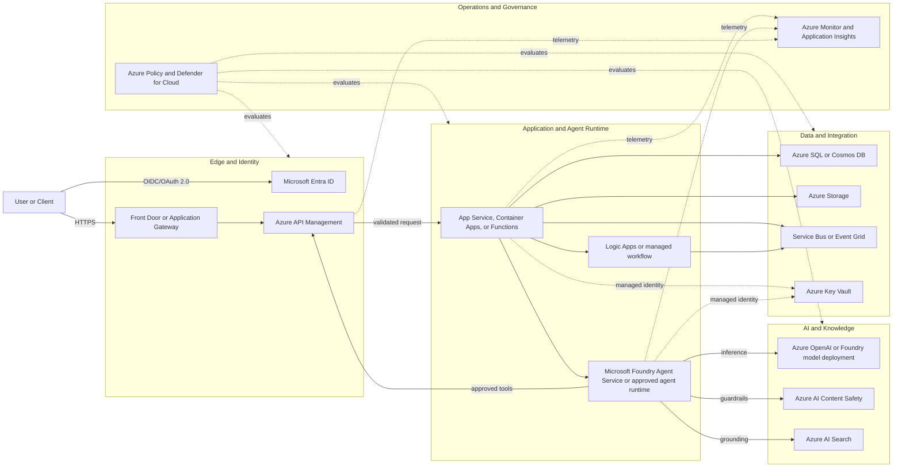
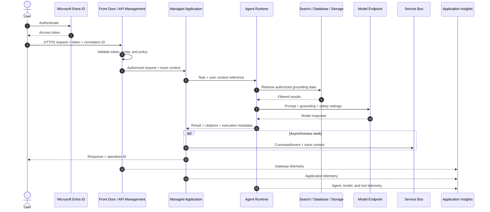
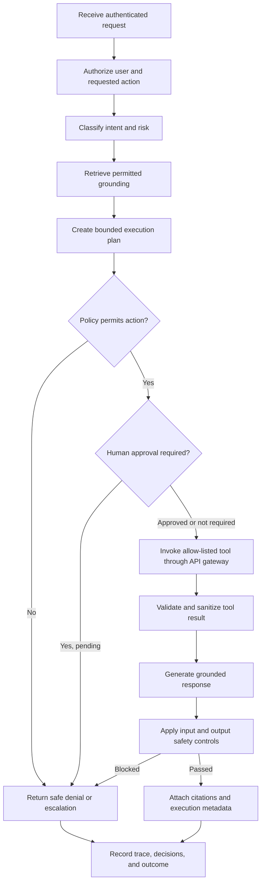

# Proof-of-Concept Reference Architecture Standard

## 1. Purpose and Scope

This standard defines the minimum architecture required for every proof-of-concept
(PoC). It is intended for consultants and architects who need to reproduce,
review, demonstrate, and evolve a solution without relying on undocumented
knowledge.

PoCs MUST:

- Apply Microsoft Azure Architecture Center and Well-Architected Framework
  patterns where practical.
- Prefer Azure managed services over self-hosted components.
- Minimize custom code by using platform capabilities, configuration, connectors,
  and approved accelerators.
- Grant identities only the permissions required for their assigned functions.
- Produce end-to-end telemetry that correlates user actions, agent activity,
  application calls, and data access.
- Express architecture and flows as version-controlled diagrams.
- Be reproducible from source-controlled infrastructure, configuration, and
  deployment instructions.

This standard defines a default architecture, not a mandatory product list.
Deviations are permitted when documented in an architecture decision record
(ADR) with rationale, risk, and an exit plan.

## 2. Architecture Principles

1. **Managed first**: Use platform-as-a-service and serverless services before
   considering containers or virtual machines.
2. **Identity as the perimeter**: Use Microsoft Entra ID, managed identities,
   workload identity federation, and role-based access control (RBAC). Do not
   embed credentials in source or configuration.
3. **Private by design**: Prefer private endpoints and restricted ingress.
   Public access requires a documented PoC need and compensating controls.
4. **Thin solution layer**: Custom components SHOULD orchestrate business
   behavior rather than recreate identity, API management, messaging,
   observability, search, safety, or data platform functions.
5. **Trace every transaction**: Propagate a correlation identifier and W3C trace
   context across synchronous calls, messages, tools, agents, and model requests.
6. **Infrastructure as code**: Environments MUST be deployable using Bicep or
   Terraform and parameterized for tenant, subscription, region, and naming.
7. **Replaceable components**: Diagrams and interfaces MUST show service
   responsibilities and boundaries so that a PoC service can be replaced during
   production evolution.

## 3. Architecture Diagram

Every PoC MUST provide a diagram based on the following logical view. Service
names, trust boundaries, protocols, identities, data stores, and external
dependencies MUST be labeled.

### Diagram Rules

- Use Mermaid as the source format unless the client requires another
  version-controllable format.
- Distinguish trust boundaries and external systems.
- Label protocols and authentication methods on boundary-crossing connections.
- Show data stores, asynchronous paths, human approvals, and model/tool calls.
- Do not include a service that is absent from the service inventory.
- Do not use unlabeled arrows or generic boxes such as "backend" when a more
  precise responsibility is known.

## 4. Service Inventory

Every PoC MUST include a completed inventory. Select only services that the
solution uses and record the exact SKU or tier.

| Capability | Preferred Azure service | Permitted alternative | Required inventory details |
|---|---|---|---|
| Workforce identity | Microsoft Entra ID | Existing client identity provider federated with Entra ID | Tenant, app registration, auth flow, roles |
| Workload identity | Managed Identity | Workload identity federation | Identity owner, assigned roles, resource scope |
| Global ingress | Azure Front Door | Application Gateway | SKU, WAF mode, origin restrictions |
| API facade | Azure API Management | Direct managed-service endpoint for a constrained internal PoC | SKU, APIs, policies, auth, throttles |
| Web/API compute | Azure App Service or Azure Container Apps | Azure Functions for event-driven workloads | Runtime, SKU, scaling limits, health endpoint |
| Workflow | Azure Logic Apps | Durable Functions when code is justified | Triggers, connectors, retry and failure behavior |
| Agent runtime | Microsoft Foundry Agent Service | Approved SDK runtime on managed compute | Agent version, instructions, tools, limits |
| Model inference | Azure OpenAI or Microsoft Foundry model deployment | Approved external model through governed gateway | Model/version, region, quota, safety settings |
| Content safeguards | Azure AI Content Safety and model filters | Documented equivalent | Categories, thresholds, block/log behavior |
| Knowledge retrieval | Azure AI Search | Native database retrieval for simple structured data | Index, schema, vectorizer, refresh process |
| Multilingual retrieval | Azure AI Search language analyzers with index aliases | Single language-agnostic index where retrieval is vector-based | Analyzer per field, alias-to-index mapping, rebuild path, indexer target |
| Language detection | Azure AI Language | Documented equivalent classification with stated accuracy | Languages in scope, confidence threshold, action taken on mismatch |
| Relational data | Azure SQL Database | Azure Database for PostgreSQL | SKU, schema owner, backup and retention |
| Document/key-value data | Azure Cosmos DB | Azure Storage Tables for simple needs | API, partition key, consistency, TTL |
| Object storage | Azure Blob Storage | None unless required by client platform | Containers, lifecycle, redundancy, access |
| Messaging | Azure Service Bus | Event Grid for event notification | Queues/topics, delivery semantics, DLQ handling |
| Secrets and keys | Azure Key Vault | Managed service configuration with no secrets | RBAC, private endpoint, rotation owner |
| Monitoring | Azure Monitor and Application Insights | Client-standard OpenTelemetry-compatible platform | Workspace, retention, sampling, alerts |
| Configuration | Azure App Configuration | Managed service application settings | Keys, labels, feature flags, access identity |
| Governance | Azure Policy and Defender for Cloud | Client-mandated equivalent controls | Initiatives, assignments, exemptions |

For each selected service, record:

- Resource name and purpose
- Subscription, resource group, region, and environment
- Owner and operational contact
- SKU/tier and estimated PoC cost
- Data classification and retention
- Inbound/outbound network access
- Authenticating identity and RBAC assignments
- Diagnostic settings and alert coverage
- Infrastructure-as-code module and deployment parameters
- Known PoC limitation and production replacement trigger

## 5. Security Model

### 5.1 Identity and Access

- Users MUST authenticate through Microsoft Entra ID using OpenID Connect or
  OAuth 2.0.
- Services MUST use managed identities where supported.
- RBAC assignments MUST be scoped to the smallest practical resource or resource
  group. Subscription-wide roles require written justification.
- Separate identities MUST be used for deployment, runtime, and operations.
- Privileged deployment access SHOULD use Entra Privileged Identity Management
  and time-bound activation.
- Agent tools MUST execute under an identity whose permissions match the tool's
  function; an agent MUST NOT inherit broad deployment or administrator access.

### 5.2 Secrets, Network, and Data Protection

- Secrets MUST be stored in Key Vault and referenced at runtime. Local
  development secrets MUST use approved developer secret storage and MUST NOT be
  committed.
- TLS 1.2 or later MUST protect data in transit. Azure-managed encryption MUST
  protect data at rest.
- Production-shaped PoCs SHOULD use private endpoints, private DNS, and disabled
  public data-plane access. Any public endpoint MUST enforce authentication,
  restrict origin access where practical, and be recorded as a risk.
- Data MUST be classified before ingestion. Restricted or regulated production
  data MUST NOT be used unless explicitly approved and protected by applicable
  controls.
- Logs MUST redact credentials, access tokens, sensitive prompts, personal data,
  and regulated content unless an approved use case requires capture.

### 5.3 Threat and AI Safety Controls

- Complete a lightweight threat model covering trust boundaries, spoofing,
  tampering, repudiation, information disclosure, denial of service, and
  privilege escalation.
- AI-enabled PoCs MUST address prompt injection, indirect prompt injection,
  unsafe output, excessive agency, data exfiltration, and untrusted tool output.
- Tool calls that create material business, financial, security, or external
  communication effects MUST require deterministic policy checks and, where
  appropriate, human approval.
- Inputs retrieved from external sources MUST be treated as untrusted data, not
  agent instructions.

## 6. Data Flow

Every PoC MUST include a numbered data-flow diagram and a matching table. The
default synchronous and asynchronous flows are:

| Step | Data | Classification | Source to destination | Protection | Retention/owner |
|---|---|---|---|---|---|
| 1 | Authentication context | Internal | User to Entra ID | TLS, tenant policy, MFA/Conditional Access | Entra policy / identity owner |
| 2 | API request | Solution-specific | Client to API Management | TLS, OAuth validation, WAF and quota policies | Application policy / product owner |
| 3 | Grounding query/results | Solution-specific | Agent to knowledge store | Managed identity, RBAC, optional private endpoint | Data policy / data owner |
| 4 | Prompt and completion | Solution-specific | Agent to model endpoint | Managed identity, content controls, redacted logging | AI policy / AI owner |
| 5 | Event or command | Solution-specific | Application to Service Bus | Managed identity, RBAC, encryption | Messaging policy / application owner |
| 6 | Telemetry | Internal, redacted | All components to monitoring | TLS, RBAC, ingestion controls | Monitoring retention / operations owner |

The implementation MUST document data residency, cross-region or cross-tenant
transfers, deletion behavior, backup expectations, and whether model providers
retain or use submitted data.

## 7. Agent Flow

AI-enabled PoCs MUST document the complete agent loop, including failure and
approval paths.

Agent implementations MUST:

- Define the agent's purpose, allowed users, instructions, model, tools, data
  sources, and maximum autonomy.
- Allow-list tools and validate every tool input against a typed schema.
- Enforce authorization outside the language model before data access or action.
- Set bounded time, token, iteration, concurrency, and cost limits.
- Capture agent, prompt-template, model, index, and tool versions in telemetry.
- Return citations or source identifiers for grounded factual answers.
- Define behavior for low confidence, unavailable tools, safety blocks, timeout,
  partial execution, and human escalation.
- Prevent model-generated content from directly becoming executable commands,
  queries, or privileged parameters without validation and policy enforcement.

## 8. Observability and Traceability

PoCs MUST use Azure Monitor and Application Insights, preferably through
OpenTelemetry instrumentation.

Minimum telemetry:

- W3C `traceparent` propagated through APIs, messages, workflows, agents, tools,
  data calls, and model requests
- Correlation/operation ID returned to the caller
- Structured application logs with environment, component, operation, outcome,
  duration, and safe error details
- Request rate, latency, error rate, dependency health, saturation, and cost
- Agent/model latency, token usage, model deployment, tool outcomes, safety
  events, retrieval quality indicators, and human approvals
- Audit records for identity, authorization decision, policy decision, data
  source, tool action, and final outcome

At least one dashboard and the following alerts MUST exist:

- Availability or health-check failure
- Elevated server or dependency error rate
- Latency threshold breach
- Authentication/authorization anomaly
- Message dead-letter growth, when messaging is used
- Model quota, content safety, or cost threshold breach, when AI is used

Telemetry MUST support tracing a single transaction end to end without exposing
secrets or unnecessarily storing prompt content.

## 9. Governance Considerations

Each PoC MUST record:

- Business owner, technical owner, data owner, security contact, and support
  boundary
- Purpose, intended users, success criteria, start date, review date, and
  automatic expiration or teardown date
- Data classification, privacy impact, retention, residency, and deletion owner
- Approved regions, resource types, SKUs, tags, budgets, and policy exemptions
- Model/provider approval, responsible AI review, evaluation results, and
  prohibited uses
- Open-source and third-party dependencies, licenses, versions, and vulnerability
  review
- Known risks, accepted risks, mitigations, and accountable approvers

Required controls:

- Standard resource tags: `Application`, `Environment`, `Owner`, `CostCenter`,
  `DataClassification`, `ManagedBy`, and `ExpirationDate`
- Resource locks only where they do not prevent automated teardown
- Budget and cost alerts at subscription or resource-group scope
- Azure Policy assignments for allowed regions, required tags, diagnostic
  settings, secure transport, and restricted public access
- Defender for Cloud recommendations reviewed before demonstration or handoff
- A documented teardown procedure that removes resources, role assignments,
  identities, secrets, test data, and DNS records

## 10. Reproducibility and Handoff

A PoC is reproducible only when a consultant who did not build it can deploy and
validate it from the repository.

The repository MUST contain:

- Bicep or Terraform for all deployable resources and role assignments
- Parameter examples containing no secrets
- Pinned application, module, provider, model, and API versions where supported
- Automated build and deployment commands
- Seed or synthetic test data and a repeatable ingestion process
- Environment prerequisites, required permissions, quota requirements, and
  regional dependencies
- Smoke tests that verify identity, primary API flow, data access, agent/tool
  behavior, and telemetry
- Cleanup commands and expected residual resources
- Architecture diagram, service inventory, ADRs, runbook, and known limitations

Manual portal configuration is prohibited unless a service cannot be automated.
Any exception MUST be documented as a numbered, verifiable step and added to the
production evolution backlog.

## 11. Production Evolution Path

PoC design MUST avoid blocking production adoption while not prematurely adding
production complexity.

| Stage | Objective | Required evolution |
|---|---|---|
| PoC | Validate feasibility and value | Managed services, least privilege, synthetic/approved data, basic IaC, tracing, budget, teardown date |
| Pilot | Validate with representative users and data | Private networking, formal threat/privacy reviews, CI/CD environments, integration tests, support model, SLO draft, backup/restore test |
| Production readiness | Meet operational and governance requirements | Landing-zone alignment, workload identity separation, policy compliance, zone redundancy where supported, capacity tests, DR design, incident runbooks, formal SLOs |
| Production scale | Sustain reliability, security, and cost | Multi-region strategy if justified, autoscaling validation, continuous evaluation, FinOps controls, vulnerability management, on-call ownership, lifecycle and deprecation processes |

Before promotion, the team MUST decide and document:

- Availability target, recovery time objective, and recovery point objective
- Capacity model, quota plan, load-test result, and scaling behavior
- Deployment strategy, environment separation, approval gates, and rollback
- Backup, restore, disaster recovery, and business continuity procedures
- Security operations, patching ownership, key/secret rotation, and incident
  response
- Data lifecycle, records management, privacy requests, and legal hold
- AI quality baselines, safety evaluations, drift monitoring, red-team testing,
  and model/index/prompt change controls
- Cost forecast, unit economics, reservations or savings plans where applicable,
  and cost anomaly response

## 12. Architecture Review Checklist

A PoC architecture is approved only when all applicable items are satisfied:

- [ ] Architecture diagram identifies services, boundaries, protocols, and
      identities.
- [ ] Service inventory matches the deployed environment and records SKUs,
      owners, access, diagnostics, cost, and production triggers.
- [ ] Microsoft reference patterns are used, or deviations have approved ADRs.
- [ ] Managed services are preferred and all custom components are justified.
- [ ] User, deployment, runtime, operations, and agent-tool privileges are
      separated and least-privileged.
- [ ] Secrets are absent from source and managed through approved identity or
      secret-management mechanisms.
- [ ] Data flow records classification, protection, residency, retention, and
      deletion.
- [ ] Agent flow records authorization, tools, guardrails, limits, approvals,
      citations, and failure paths.
- [ ] End-to-end correlation and required dashboards and alerts are operational.
- [ ] Infrastructure, configuration, test data, smoke tests, and cleanup are
      reproducible from the repository.
- [ ] Governance owners, policies, budget, expiration, risks, and responsible AI
      controls are documented.
- [ ] Production evolution requirements and promotion criteria are explicit.

## 13. Microsoft Reference Alignment

Design reviews SHOULD use the current versions of:

- Microsoft Azure Well-Architected Framework
- Azure Architecture Center and Cloud Design Patterns
- Microsoft Cloud Adoption Framework and Azure landing zone guidance
- Microsoft Zero Trust guidance
- Microsoft identity platform and managed identity guidance
- Azure Architecture Center guidance for generative AI and agentic systems
- Microsoft Responsible AI Standard and Azure AI content safety guidance
- OpenTelemetry and Azure Monitor architecture guidance

Links SHOULD be recorded in the PoC ADRs or design document with the date
reviewed because service capabilities and guidance evolve.
