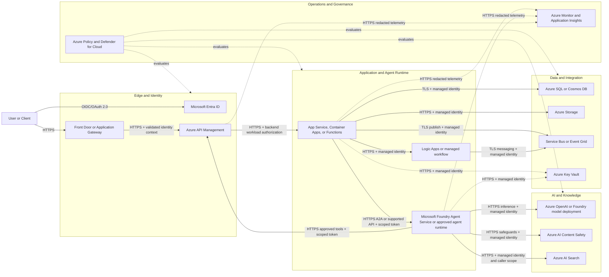
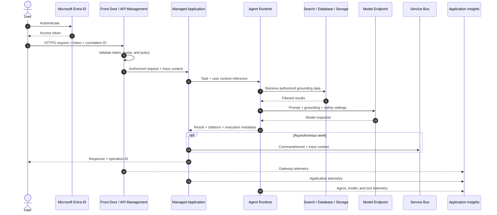
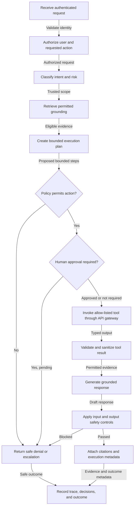

# Proof-of-Concept Reference Architecture Standard

## 1. Purpose and Scope

This standard defines the minimum architecture required for every proof-of-concept
(PoC). It is intended for consultants and architects who need to reproduce,
review, demonstrate, and evolve a solution without relying on undocumented
knowledge.

PoCs MUST:

- Apply Microsoft Azure Architecture Center and Well-Architected Framework
  patterns where practical.
- Prefer Azure managed services over self-hosted components.
- Minimize custom code by using platform capabilities, configuration, connectors,
  and approved accelerators.
- Grant identities only the permissions required for their assigned functions.
- Produce end-to-end telemetry that correlates user actions, agent activity,
  application calls, and data access.
- Express architecture and flows as version-controlled diagrams.
- Be reproducible from source-controlled infrastructure, configuration, and
  deployment instructions.

This standard defines a default architecture, not a mandatory product list.
Deviations are permitted when documented in an architecture decision record
(ADR) with rationale, risk, and an exit plan.

**Review discipline (2026-09-23):** this is a normative standard, not a statement
that every existing PoC already conforms. Each deliverable MUST distinguish
deployed/verified behavior, user-confirmed evidence, historical demonstrations,
implementation without live verification, and proposed architecture. Record
evidence dates and provenance; source code, a health response or a screenshot
alone does not prove authorization, answer quality or production readiness.

An exception record MUST identify the requirement, rationale, risk, compensating
controls, accountable owner, approval status, review/expiry date and exit criteria.
Unknown approval is an open gap, not an accepted risk. The
[PoC001 register](../pocs/001-config-driven-responses/README.md#architecture-decision-and-exception-register)
is an application of this process, not a relaxation of this standard. Preferred
services below are options; deployed and proposed inventories MUST be separate.

## 2. Architecture Principles

1. **Managed first**: Use platform-as-a-service and serverless services before
   considering containers or virtual machines.
2. **Identity as the perimeter**: Use Microsoft Entra ID, managed identities,
   workload identity federation, and role-based access control (RBAC). Do not
   embed credentials in source or configuration.
3. **Private by design**: Prefer private endpoints and restricted ingress.
   Public access requires a documented PoC need and compensating controls.
4. **Thin solution layer**: Custom components SHOULD orchestrate business
   behavior rather than recreate identity, API management, messaging,
   observability, search, safety, or data platform functions.
5. **Trace every transaction**: Propagate a correlation identifier and W3C trace
   context across synchronous calls, messages, tools, agents, and model requests.
6. **Infrastructure as code**: Environments MUST be deployable using Bicep or
   Terraform and parameterized for tenant, subscription, region, and naming.
7. **Replaceable components**: Diagrams and interfaces MUST show service
   responsibilities and boundaries so that a PoC service can be replaced during
   production evolution.

## 3. Architecture Diagram

Every PoC MUST provide a diagram based on the following logical view. Service
names, trust boundaries, protocols, identities, data stores, and external
dependencies MUST be labeled.

This is a reference palette. A PoC-specific diagram must select only its actual
services; a proposed diagram must label its proposed status and corresponding
inventory. Do not imply that every box below exists in the PoC deployment.

Legend: solid arrows are authenticated request/data paths; dotted arrows are
secrets access, telemetry or governance evaluation as labeled. Protocol and
credential details must be specialized for the actual selected services. The
diagram does not imply an authenticated human identity from a workload token.

### Diagram Rules

- Use Mermaid as the source format unless the client requires another
  version-controllable format.
- Distinguish trust boundaries and external systems.
- Label protocols and authentication methods on boundary-crossing connections.
- Show data stores, asynchronous paths, human approvals, and model/tool calls.
- Do not include a service that is absent from the service inventory.
- Do not use unlabeled arrows or generic boxes such as "backend" when a more
  precise responsibility is known.
- Multi-agent diagrams MUST identify coordinator/specialist responsibilities,
  parent/child task relationships, data/credential boundaries and failure paths.
- Retrieval diagrams MUST show source publication, metadata/permission
  propagation, chunk/index boundaries and query-time eligibility checks.

## 4. Service Inventory

Every PoC MUST include a completed inventory. Select only services that the
solution uses and record the exact SKU or tier.

| Capability | Preferred Azure service | Permitted alternative | Required inventory details |
|---|---|---|---|
| Workforce identity | Microsoft Entra ID | Existing client identity provider federated with Entra ID | Tenant, app registration, auth flow, roles |
| Workload identity | Managed Identity | Workload identity federation | Identity owner, assigned roles, resource scope |
| Global ingress | Azure Front Door | Application Gateway | SKU, WAF mode, origin restrictions |
| API facade | Azure API Management | Direct managed-service endpoint for a constrained internal PoC | SKU, APIs, policies, auth, throttles |
| Web/API compute | Azure App Service or Azure Container Apps | Azure Functions for event-driven workloads | Runtime, SKU, scaling limits, health endpoint |
| Workflow | Azure Logic Apps | Durable Functions when code is justified | Triggers, connectors, retry and failure behavior |
| Agent runtime | Microsoft Foundry Agent Service | Approved SDK runtime on managed compute | Agent version, instructions, tools, limits |
| Model inference | Azure OpenAI or Microsoft Foundry model deployment | Approved external model through governed gateway | Model/version, region, quota, safety settings |
| Content safeguards | Azure AI Content Safety and model filters | Documented equivalent | Categories, thresholds, block/log behavior |
| Knowledge retrieval | Azure AI Search | Native database retrieval for simple structured data | Index, schema, vectorizer, refresh process |
| Multilingual retrieval | Azure AI Search language analyzers with index aliases | Single language-agnostic index where retrieval is vector-based | Analyzer per field, alias-to-index mapping, rebuild path, indexer target |
| Language detection | Azure AI Language | Documented equivalent classification with stated accuracy | Languages in scope, confidence threshold, action taken on mismatch |
| Relational data | Azure SQL Database | Azure Database for PostgreSQL | SKU, schema owner, backup and retention |
| Document/key-value data | Azure Cosmos DB | Azure Storage Tables for simple needs | API, partition key, consistency, TTL |
| Object storage | Azure Blob Storage | None unless required by client platform | Containers, lifecycle, redundancy, access |
| Messaging | Azure Service Bus | Event Grid for event notification | Queues/topics, delivery semantics, DLQ handling |
| Secrets and keys | Azure Key Vault | Managed service configuration with no secrets | RBAC, private endpoint, rotation owner |
| Monitoring | Azure Monitor and Application Insights | Client-standard OpenTelemetry-compatible platform | Workspace, retention, sampling, alerts |
| Configuration | Azure App Configuration | Managed service application settings | Keys, labels, feature flags, access identity |
| Governance | Azure Policy and Defender for Cloud | Client-mandated equivalent controls | Initiatives, assignments, exemptions |

For composed agents, also inventory capability IDs and owners, approved
endpoints, Agent Card/protocol versions, typed input/output contract versions,
auth audiences/scopes, dependencies, required/optional steps and execution limits.
A capability registry can reference existing services; it is not a requirement
to create a new Azure resource or one agent per persona.

For retrieval, also inventory source-document and chunk counts, metadata/ACL
authority, schema attributes, taxonomy/ingestion versions, embedding compatibility,
publication/deletion synchronization and evaluation coverage. Record unknowns
explicitly. A vector field or index name does not establish vector-query support.

For each selected service, record:

- Resource name and purpose
- Subscription, resource group, region, and environment
- Owner and operational contact
- SKU/tier and estimated PoC cost
- Data classification and retention
- Inbound/outbound network access
- Authenticating identity and RBAC assignments
- Diagnostic settings and alert coverage
- Infrastructure-as-code module and deployment parameters
- Known PoC limitation and production replacement trigger

## 5. Security Model

### 5.1 Identity and Access

- Users MUST authenticate through Microsoft Entra ID using OpenID Connect or
  OAuth 2.0.
- Services MUST use managed identities where supported.
- RBAC assignments MUST be scoped to the smallest practical resource or resource
  group. Subscription-wide roles require written justification.
- Separate identities MUST be used for deployment, runtime, and operations.
- Privileged deployment access SHOULD use Entra Privileged Identity Management
  and time-bound activation.
- Agent tools MUST execute under an identity whose permissions match the tool's
  function; an agent MUST NOT inherit broad deployment or administrator access.
- Presentation personas, configuration labels, Agent Cards and task/context IDs
  MUST NOT be treated as authorization. A workload identity is not human identity.
- Delegated tasks MUST preserve the caller's permitted scope and the worker's
  own restrictions. Each service MUST authorize its operations independently,
  including task listing/reads, caches and source downloads; delegation MUST NOT
  combine privileges into a broader effective scope.
- Credentials MUST use reviewed transport/identity flows with the correct
  audience and scope, not prompt text or model-directed credential switching.
  Configuration pinning MUST NOT bypass entitlement revocation checks.

### 5.2 Secrets, Network, and Data Protection

- Secrets MUST be stored in Key Vault and referenced at runtime. Local
  development secrets MUST use approved developer secret storage and MUST NOT be
  committed.
- TLS 1.2 or later MUST protect data in transit. Azure-managed encryption MUST
  protect data at rest.
- Production-shaped PoCs SHOULD use private endpoints, private DNS, and disabled
  public data-plane access. Any public endpoint MUST enforce authentication,
  restrict origin access where practical, and be recorded as a risk.
- Data MUST be classified before ingestion. Restricted or regulated production
  data MUST NOT be used unless explicitly approved and protected by applicable
  controls.
- Logs MUST redact credentials, access tokens, sensitive prompts, personal data,
  and regulated content unless an approved use case requires capture.

### 5.3 Threat and AI Safety Controls

- Complete a lightweight threat model covering trust boundaries, spoofing,
  tampering, repudiation, information disclosure, denial of service, and
  privilege escalation.
- AI-enabled PoCs MUST address prompt injection, indirect prompt injection,
  unsafe output, excessive agency, data exfiltration, and untrusted tool output.
- Tool calls that create material business, financial, security, or external
  communication effects MUST require deterministic policy checks and, where
  appropriate, human approval.
- Inputs retrieved from external sources MUST be treated as untrusted data, not
  agent instructions.
- Specialist artifacts MUST also be treated as untrusted input: validate their
  contracts, evidence and allowed effects before synthesis or further dispatch.

### 5.4 Retrieval Eligibility and Metadata

- The design MUST distinguish relevance metadata from security and mandatory
  applicability rules. A model-generated topic tag MUST NOT grant access, approve
  content or infer a customer's eligibility.
- For a shared corpus, record the approved readership and content scope. For
  caller-specific access, derive tenant/principal/group constraints from an
  authenticated trusted context and enforce them outside the model on every
  query, subquery, lookup, facet, cache and document-serving path.
- Missing required permission, approval or applicability metadata MUST NOT be
  interpreted as unrestricted or approved content. Define null semantics and
  quarantine/failure behavior in the ingestion contract.
- Every searchable chunk MUST retain its applicable parent permissions,
  governance state, business scope and version lineage. Parent-only restrictions
  are insufficient when child records are queried directly.
- Mandatory filters MUST NOT be removed or widened merely to obtain results.
  Uncertain relevance tags MAY be optional ranking signals within the permitted
  scope. Validate query construction and escaping before service calls.
- The design MUST state ACL/metadata synchronization and revocation behavior,
  including stale-state handling and authorized direct-access paths. Hiding a
  field with `retrievable=false` is not a complete authorization boundary.
- Feature-level GA/preview status and API/source limitations MUST be recorded.
  Application-enforced security filters and native document-permission features
  MUST NOT be described as equivalent authentication mechanisms.

## 6. Data Flow

Every PoC MUST include a numbered data-flow diagram and a matching table. The
default synchronous and asynchronous flows are:

The table groups the message numbers in the sequence above; the asynchronous
message is optional. A PoC-specific sequence and table MUST agree after selecting
its actual services and paths.

| Messages | Data | Classification | Source to destination | Protection | Retention/owner |
|---|---|---|---|---|---|
| 1-2 | Authentication context | Internal | User and Entra ID | TLS, tenant policy, MFA/Conditional Access | Entra policy / identity owner |
| 3-6 | Authorized request and task context | Solution-specific | Client through edge/application to agent | TLS, OAuth validation, backend authorization, WAF and quotas | Application policy / product owner |
| 7-8 | Grounding query/results | Solution-specific | Agent and knowledge store | Managed identity, RBAC, caller scope, optional private endpoint | Data policy / data owner |
| 9-10 | Prompt and completion | Solution-specific | Agent and model endpoint | Managed identity, content controls, redacted logging | AI policy / AI owner |
| 11, 13 | Response, citations and operation ID | Solution-specific | Agent through application to caller | Authorized result scope, TLS and output validation | Application/data policy / product owner |
| 12 (optional) | Event or command | Solution-specific | Application to Service Bus | Managed identity, RBAC, encryption | Messaging policy / application owner |
| 14-16 | Telemetry | Internal, redacted | Components to monitoring | TLS, RBAC, ingestion controls | Monitoring retention / operations owner |

The implementation MUST document data residency, cross-region or cross-tenant
transfers, deletion behavior, backup expectations, and whether model providers
retain or use submitted data.

## 7. Agent Flow

AI-enabled PoCs MUST document the complete agent loop, including failure and
approval paths.

Agent implementations MUST:

- Define the agent's purpose, allowed users, instructions, model, tools, data
  sources, and maximum autonomy.
- Allow-list tools and validate every tool input against a typed schema.
- Enforce authorization outside the language model before data access or action.
- Set bounded time, token, iteration, concurrency, and cost limits.
- Capture agent, prompt-template, model, index, and tool versions in telemetry.
- Return citations or source identifiers for grounded factual answers.
- Define behavior for low confidence, unavailable tools, safety blocks, timeout,
  partial execution, and human escalation.
- Prevent model-generated content from directly becoming executable commands,
  queries, or privileged parameters without validation and policy enforcement.

### 7.1 Compound Requests and A2A

Composed-agent implementations MUST:

- Justify separate agents by capability, ownership, trust boundary or lifecycle;
  use a simpler internal workflow when another service adds no needed boundary.
- Use a trusted capability registry and compatible typed contracts. Agent
  discovery MUST NOT authorize arbitrary endpoints, tools or input parameters.
- Distinguish protocol functions from orchestration: A2A supports messages,
  tasks, contexts, references and artifacts; graph scheduling, durable recovery,
  budgets and application policy still need implementation.
- Validate proposed decomposition and dependencies deterministically. Bound
  total task count/depth, concurrency, deadline, tokens/cost and retries; provide
  a single-capability path and prevent recursive uncontrolled delegation.
- Correlate each specialist's task/context IDs to a parent operation. Pin
  compatible configuration/contract/asset releases for coherence without
  assuming that the same context ID creates shared state across services.
- Preserve claim-to-source links and document versions through synthesis.
  Deduplicate citations without discarding provenance. Citation-number validity
  or raw search scores MUST NOT be presented as proof of factual support.
- Define authority/version conflict handling, required versus optional steps,
  explicit partial outcomes, clarification, no evidence, authorization denial,
  timeout and cancellation. A required failure MUST block dependent guidance;
  cancellation success and idempotency MUST NOT be assumed from protocol IDs.
- Append mandatory approved notices deterministically where exact text is
  required, and keep private reasoning/credentials out of exchanged artifacts.

### 7.2 Retrieval at Scale

Retrieval implementations MUST provide a field dictionary with types,
search/filter/facet/sort/retrieval attributes, required/null semantics, source of
truth and owners. It MUST distinguish stable document identity, indexed chunk
identity, version/section locators, topical relevance, business applicability,
approval/effective dates and authorization metadata. Tags from other Azure
services MUST NOT be assumed to populate Search fields without an ingestion map.

The design MUST document candidate retrieval, ranking, deduplication, passage
selection and final context budget separately. Record why lexical, vector,
hybrid or semantic options fit the corpus; compatible embeddings and filters
must be verified, not inferred from index names. Index topology MUST be justified
by trust, language/analyzers, ownership, lifecycle and measured capacity rather
than a fixed document count or a separate index for every persona.

Evaluation MUST include relevant-source recall/ranking, passage coverage,
claim-to-source support, correct versions, abstention and authorization-negative
cases. Test wrong scope/date, unknown approval, stale ACLs, duplicates,
contradictory evidence and unanswerable queries. Any authorization or mandatory
policy leak is a failure, not an acceptable statistical error rate.

Measure chunk counts, index/vector size, query concurrency, latency, cost and
ingestion/permission lag before selecting capacity. Document metadata backfill,
schema rebuild, cutover/rollback and parent/child deletion/restore behavior.
No benchmark or evaluation may be reported complete without its dated evidence.

## 8. Observability and Traceability

PoCs MUST use Azure Monitor and Application Insights, preferably through
OpenTelemetry instrumentation.

Minimum telemetry:

- W3C `traceparent` propagated through APIs, messages, workflows, agents, tools,
  data calls, and model requests
- Correlation/operation ID returned to the caller
- Structured application logs with environment, component, operation, outcome,
  duration, and safe error details
- Request rate, latency, error rate, dependency health, saturation, and cost
- Agent/model latency, token usage, model deployment, tool outcomes, safety
  events, retrieval quality indicators, and human approvals
- Audit records for identity, authorization decision, policy decision, data
  source, tool action, and final outcome

At least one dashboard and the following alerts MUST exist:

- Availability or health-check failure
- Elevated server or dependency error rate
- Latency threshold breach
- Authentication/authorization anomaly
- Message dead-letter growth, when messaging is used
- Model quota, content safety, or cost threshold breach, when AI is used

Telemetry MUST support tracing a single transaction end to end without exposing
secrets or unnecessarily storing prompt content.

For composed requests, traces MUST correlate parent and specialist operations,
route/configuration/contract versions, dependency outcomes, cancellation/retries
and aggregate usage. Retrieval telemetry SHOULD identify safe source/version
references, policy decisions, freshness and no-answer reasons without retaining
document bodies or raw personal questions by default.

Application configuration-change history, provider resource diagnostics and
request/dependency tracing serve different purposes. A Blob change event or an
A2A task ID alone does not satisfy end-to-end tracing. A shared service actor
does not prove human attribution; create-only writes do not prove immutability.
Record each evidence stream's coverage, failure behavior, retention and owner.

## 9. Governance Considerations

Each PoC MUST record:

- Business owner, technical owner, data owner, security contact, and support
  boundary
- Purpose, intended users, success criteria, start date, review date, and
  automatic expiration or teardown date
- Data classification, privacy impact, retention, residency, and deletion owner
- Approved regions, resource types, SKUs, tags, budgets, and policy exemptions
- Model/provider approval, responsible AI review, evaluation results, and
  prohibited uses
- Open-source and third-party dependencies, licenses, versions, and vulnerability
  review
- Known risks, accepted risks, mitigations, and accountable approvers

Required controls:

- Standard resource tags: `Application`, `Environment`, `Owner`, `CostCenter`,
  `DataClassification`, `ManagedBy`, and `ExpirationDate`
- Resource locks only where they do not prevent automated teardown
- Budget and cost alerts at subscription or resource-group scope
- Azure Policy assignments for allowed regions, required tags, diagnostic
  settings, secure transport, and restricted public access
- Defender for Cloud recommendations reviewed before demonstration or handoff
- A documented teardown procedure that removes resources, role assignments,
  identities, secrets, test data, and DNS records

## 10. Reproducibility and Handoff

A PoC is reproducible only when a consultant who did not build it can deploy and
validate it from the repository.

The repository MUST contain:

- Bicep or Terraform for all deployable resources and role assignments
- Parameter examples containing no secrets
- Pinned application, module, provider, model, and API versions where supported
- Automated build and deployment commands
- Seed or synthetic test data and a repeatable ingestion process
- Environment prerequisites, required permissions, quota requirements, and
  regional dependencies
- Smoke tests that verify identity, primary API flow, data access, agent/tool
  behavior, and telemetry
- Cleanup commands and expected residual resources
- Architecture diagram, service inventory, ADRs, runbook, and known limitations

Manual portal configuration is prohibited unless a service cannot be automated.
Any exception MUST be documented as a numbered, verifiable step and added to the
production evolution backlog.

Handoff MUST include a dated evidence register identifying who performed each
check, the environment/version and its limits. Clearly distinguish mocked tests,
observed live checks and user-confirmed acceptance. Preserve historical records
with superseding status updates instead of presenting old constraints as current.
Configuration-data seeding scripts do not replace resource/role IaC, and a
successful model response does not establish the rest of the acceptance gates.

For agent composition and large-corpus designs, include versioned capability
contracts, metadata mappings, representative synthetic/sanitized evaluation
cases and failure/rollback scenarios. Proposed diagrams and example fields MUST
be labeled as such; documentary examples MUST NOT trigger provisioning or an
implicit migration of an existing customer's data or configuration.

## 11. Production Evolution Path

PoC design MUST avoid blocking production adoption while not prematurely adding
production complexity.

| Stage | Objective | Required evolution |
|---|---|---|
| PoC | Validate feasibility and value | Managed services, least privilege, synthetic/approved data, basic IaC, tracing, budget, teardown date |
| Pilot | Validate with representative users and data | Private networking, formal threat/privacy reviews, CI/CD environments, integration tests, support model, SLO draft, backup/restore test |
| Production readiness | Meet operational and governance requirements | Landing-zone alignment, workload identity separation, policy compliance, zone redundancy where supported, capacity tests, DR design, incident runbooks, formal SLOs |
| Production scale | Sustain reliability, security, and cost | Multi-region strategy if justified, autoscaling validation, continuous evaluation, FinOps controls, vulnerability management, on-call ownership, lifecycle and deprecation processes |

Before promotion, the team MUST decide and document:

- Availability target, recovery time objective, and recovery point objective
- Capacity model, quota plan, load-test result, and scaling behavior
- Deployment strategy, environment separation, approval gates, and rollback
- Backup, restore, disaster recovery, and business continuity procedures
- Security operations, patching ownership, key/secret rotation, and incident
  response
- Data lifecycle, records management, privacy requests, and legal hold
- AI quality baselines, safety evaluations, drift monitoring, red-team testing,
  and model/index/prompt change controls
- Cost forecast, unit economics, reservations or savings plans where applicable,
  and cost anomaly response

## 12. Architecture Review Checklist

A PoC architecture is approved only when all applicable items are satisfied:

- [ ] Architecture diagram identifies services, boundaries, protocols, and
      identities.
- [ ] Service inventory matches the deployed environment and records SKUs,
      owners, access, diagnostics, cost, and production triggers.
- [ ] Microsoft reference patterns are used, or deviations have approved ADRs.
- [ ] Managed services are preferred and all custom components are justified.
- [ ] User, deployment, runtime, operations, and agent-tool privileges are
      separated and least-privileged.
- [ ] Secrets are absent from source and managed through approved identity or
      secret-management mechanisms.
- [ ] Data flow records classification, protection, residency, retention, and
      deletion.
- [ ] Agent flow records authorization, tools, guardrails, limits, approvals,
      citations, and failure paths.
- [ ] Composed agents have approved capability contracts, scoped delegation,
  bounded dependencies and evidence-preserving synthesis, when applicable.
- [ ] Retrieval has owned metadata/ACL mappings, chunk lineage, mandatory-scope
  enforcement, lifecycle tests and a representative quality evaluation.
- [ ] End-to-end correlation and required dashboards and alerts are operational.
- [ ] Infrastructure, configuration, test data, smoke tests, and cleanup are
      reproducible from the repository.
- [ ] Governance owners, policies, budget, expiration, risks, and responsible AI
      controls are documented.
- [ ] Production evolution requirements and promotion criteria are explicit.
- [ ] Evidence is dated and attributed; implemented, deployed, user-confirmed,
  historical and proposed capabilities are not conflated.
- [ ] Exceptions have accountable approval, review/expiry and exit criteria;
  unknown owners or unverified controls remain open rather than waived.

## 13. Microsoft Reference Alignment

Design reviews SHOULD use the current versions of:

- Microsoft Azure Well-Architected Framework
- Azure Architecture Center and Cloud Design Patterns
- Microsoft Cloud Adoption Framework and Azure landing zone guidance
- Microsoft Zero Trust guidance
- Microsoft identity platform and managed identity guidance
- Azure Architecture Center guidance for generative AI and agentic systems
- Microsoft Responsible AI Standard and Azure AI content safety guidance
- OpenTelemetry and Azure Monitor architecture guidance

Links SHOULD be recorded in the PoC ADRs or design document with the date
reviewed because service capabilities and guidance evolve.

Additional primary references reviewed for the 2026-09-23 documentation update:

- [A2A 1.0 specification](https://a2a-protocol.org/v1.0.0/specification/):
  interoperability, discovery, task semantics and per-operation authorization.
- [Search index schema](https://learn.microsoft.com/en-us/azure/search/search-what-is-an-index)
  and [index projections](https://learn.microsoft.com/en-us/azure/search/search-how-to-define-index-projections):
  field attributes, chunk identity and inherited metadata.
- [Search document-level access](https://learn.microsoft.com/en-us/azure/search/search-document-level-access-overview):
  GA security filters versus preview native permission integrations at review time.
- [Search index changes](https://learn.microsoft.com/en-us/azure/search/search-howto-reindex):
  compatible additions, required backfill and rebuild boundaries.

The [conversational experience design](configurable-conversational-experience.md)
provides a worked read-only example. It is not proof that those proposed controls
are implemented in an existing deployment.
