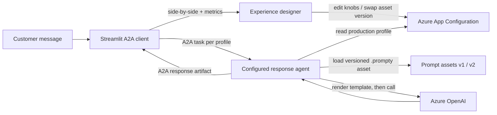

# Config-Driven Responses PoC

A minimal Azure proof of concept for the whitepaper user story:

> As an experience designer, I want tone, wording, verbosity, and response
> structure to be configurable so that customer feedback can be incorporated
> without software releases.

It maps to Scenario 1 of the PoC Scenario Catalog, "Market-Specific Tone and
Persona Optimization" (traces to AI-WP-001, AI-WP-002, AI-WP-005, AI-WP-007, and
the CSAT-focused A/B testing customer note). See
[../../specs/001-poc-scenario-catalog/spec.md](../../specs/001-poc-scenario-catalog/spec.md).

## What it demonstrates

- The assistant's tone, verbosity, reading level, persona, and response
  structure are changed through **configuration only**, with no code change and
  no redeploy.
- A **side-by-side** view compares a `baseline` (current) response with a
  `candidate` (proposed) response for the same customer message.
- Prompt wording lives in **versioned prompt assets**, so a template change can
  be rolled back by pointing a profile at the previous version.
- **Azure RBAC decides who may change it.** The app acts as one of four Microsoft
  Entra identities across a draft and a production store, so an experience
  designer can edit a proposal but only a release approver can publish it. Every
  denial in the UI is a real Azure 403.
- **What the assistant knows is configurable too.** Content lives in a governed
  Blob container, an Azure AI Search indexer keeps the index current with no
  application code, and the `knowledge:*` keys decide which of that content an
  answer may draw on.

## The runtime boundary and its three internal layers

The experience comparison now calls the response runtime through the open
**Agent2Agent (A2A) 1.0** protocol. Streamlit is the A2A client. A separate
runtime process publishes an Agent Card, accepts customer messages as A2A tasks,
and returns responses as artifacts. App Configuration values, rendered prompts,
Search filters, and Azure credentials remain private inside that remote agent.

| Layer | Technology | Role in the PoC |
|---|---|---|
| Interoperability boundary | **A2A 1.0** | Provides discovery, messages, contexts, tasks, and response artifacts without exposing agent internals. |
| Control plane | **Azure App Configuration** | Holds the experience knobs per profile (`baseline`, `candidate`). Editing a value changes behavior at the next refresh; no redeploy. |
| Templating | **Prompt Templates** | The `.prompty` bodies are Jinja2 templates whose variables (`tone`, `verbosity`, `reading_level`, `response_structure`, `persona`) are filled from configuration. |
| Governance | **Prompt Assets** | Each `.prompty` file is a named, versioned asset (`response.v1`, `response.v2`). A profile selects which version to use, which gives rollback. |



The optional comparison extension accepts only `baseline` or `candidate`; a
caller cannot supply tone, prompt assets, store names, labels, or knowledge
filters. The first task in an A2A `contextId` resolves and pins configuration.
Further tasks in that context remain coherent. **Refresh configuration from
Azure** clears the client context IDs, so the next tasks create new contexts and
observe newly published configuration.

## Prerequisites

### Windows VM / one-identity comparison

Use the [Windows comparison runbook](../../deployment/windows/README.md) for the
current Windows VM and existing GPT-4o deployment. It launches the UI and A2A
agent on localhost with one explicit managed identity, external nonsecret JSON
settings and no client-secret/developer fallback. The App Configuration store
must contain both synthetic comparison profiles before responses can be generated.

This mode disables persona switching, publishing, permission probes and audit.
Search is off unless `ELV_ENABLE_RAG` is explicitly enabled with an approved
endpoint/index allowlist. Configuration writes remain off unless the Windows runtime JSON explicitly
sets `ELV_ENABLE_CONFIG_EDITING` to `"true"`. That option adds a **Configuration**
tab for existing baseline/candidate experience values, using direct live updates
with ETag conflict checks under the same managed identity. It does not simulate
separate Azure roles or a draft approval workflow. Full governance remains the
default outside comparison mode.

Optional [existing-index RAG](../../deployment/windows/README.md#ground-responses-with-an-existing-search-index)
maps `Content`, `Title`, `Status`, `State` and source metadata through
`knowledge:*` settings. The first integration uses keyword retrieval from the
approved `medical-policies-vector` index, not its vectors. Enable **Ground with
AI Search** for sourced responses; edit the per-profile OData filter through
**Configuration > Knowledge**. Azure resource tags do not become document
filters automatically. This integration does not recreate or modify indexes.

Users currently sign into the VM and view the PoC at localhost. Shared networking
and HTTPS are deferred by the customer; the Windows runbook retains the proposed
administrator steps for future use. Persistent Windows services are not installed.

### Red Hat VM / existing Azure services

Use the shared [Red Hat hosting runbook](../../deployment/redhat/README.md).
It runs both PoCs headlessly using private systemd services, separate Python
environments and explicit managed identities. Run applications and tests on the
VM only; use a workstation browser through the approved SSH tunnel.

**Do not use the provisioning/teardown steps below against existing shared Azure
resources.** Those steps describe the original disposable development setup and
can overwrite settings or delete services. VM deployment has separate resource
readiness and identity gates; target VM verification is still pending.

### Original disposable development environment

- Azure subscription where you can create an Azure OpenAI resource.
- Azure CLI (`az`) and PowerShell (`pwsh` or Windows PowerShell).
- Python 3.10 or later.

## Setup

From this folder:

```powershell
# 1. Provision resource group, App Configuration, and Azure OpenAI; write .env.
pwsh scripts/setup.ps1

# 2. Add the governance layer: draft store, Log Analytics, four service
#    principals with different roles. Requires Entra rights to create app
#    registrations (for example the Application Developer role).
pwsh scripts/setup-governance.ps1 -ProductionStore <printed-appconfig-name>

# 3. Seed both stores (names are printed by the scripts above).
pwsh scripts/seed-config.ps1 -AppConfigName <production-store> -DraftAppConfigName <draft-store>

# 4. Optional: add the knowledge layer (storage account, Azure AI Search,
#    index, alias, and indexer), then re-run step 3 to seed the knowledge keys.
pwsh scripts/setup-knowledge.ps1 -ProductionStore <production-store>
```

`setup.ps1` assigns two Entra ID roles to you: **App Configuration Data Owner**
and **Cognitive Services OpenAI User**. Role assignments can take up to 15
minutes to propagate.

Steps 2 and 4 are optional. Without step 2 the app still runs, but every action
uses your own sign-in and the governance tab is disabled. Without step 4 the
Knowledge tab explains how to provision it and does nothing else.

`setup-knowledge.ps1` defaults to the **Free** search tier, which costs nothing
but does not support managed identity or semantic ranking. Pass
`-SearchSku Basic` for a keyless indexer connection and semantic ranking. A
subscription may hold only one Free search service.

## Run

```powershell
python -m venv .venv
.\.venv\Scripts\Activate.ps1
pip install -r requirements.txt
az login          # DefaultAzureCredential uses this sign-in; no keys are used

# Terminal 1: A2A response runtime
python a2a_server.py

# Terminal 2: Streamlit A2A client and governance UI
streamlit run app.py
```

The A2A server listens on `http://127.0.0.1:9999` by default and publishes its
Agent Card at `/.well-known/agent-card.json`. Set `A2A_AGENT_URL` to use another
endpoint. The local PoC endpoint is unauthenticated and bound to loopback;
production must put it behind HTTPS and Entra OAuth/OIDC authorization.

For GPT-4o, set `ELV_OPENAI_REQUEST_PROFILE=gpt4o`; this uses `max_tokens` without
reasoning-only controls from the prompt assets. The Windows launcher enforces
this profile. The default `asset` profile retains the existing reasoning-model
request parameters. Restart both processes after changing runtime settings.

## Try the demo

1. Enter a customer message and select **Generate side-by-side comparison**. The
   baseline and candidate responses render together with simple metrics (word
   count, reading ease, grade level, latency, tokens).
2. Change the experience with no code release, for example make the candidate
   more detailed:

   ```powershell
   az appconfig kv set --name <appconfig-name> --key experience:verbosity `
     --value "detailed, with a short example" --label candidate --auth-mode login --yes
   ```

3. Select **Refresh configuration from Azure** in the sidebar, then regenerate.
  This starts fresh A2A contexts, whose first tasks resolve the new production
  configuration. The app and agent were never rebuilt or redeployed.
4. Roll back a template change by pointing the candidate at the previous asset:

   ```powershell
   az appconfig kv set --name <appconfig-name> --key experience:prompt_asset `
     --value "response:v1" --label candidate --auth-mode login --yes
   ```

5. Use the preference buttons to record which variant is better. Choices append
   to `feedback.csv` as simple A/B evidence.

## Security notes

- VM mode uses explicit managed identities, does not load dotenv/persona-secret
  files and restricts audit requests to configured live/draft resource contexts.
  The VM and all presenters are one trusted demo boundary; the persona selector
  is not user authentication. See the [hosting security boundary](../../deployment/redhat/README.md#boundaries-read-before-installing).
- Legacy development authentication uses Entra ID through `DefaultAzureCredential`. No connection
  strings or API keys are stored in code or in `.env` (endpoints only).
- Access is least-privilege via RBAC (App Configuration and Azure OpenAI data
  roles scoped to the two resources).
- The governance demo writes service principal client secrets to
  `roles.local.json` in the original non-VM mode, which is gitignored. This is a proof-of-concept shortcut so
  one process can act as four identities. Production would use managed identity
  or sign the user in. `scripts/teardown.ps1` deletes those identities.
- Use synthetic messages only. Do not paste real customer or personal data.

## Cost and teardown

- App Configuration uses the Free tier. Azure OpenAI is billed per token; this
  PoC sends small prompts, so demonstration cost is minimal. The governance layer
  adds a second store (Developer tier has a small daily charge, because the Free
  tier permits only one store per subscription per region) and a Log Analytics
  workspace billed per GB ingested. The knowledge layer adds a storage account
  (a few documents, so effectively free) and a search service, which is free on
  the default Free tier. Confirm current pricing for your region and agreement.
- Remove everything when finished. Deleting the resource group is not enough on
  its own, because the four app registrations live in Microsoft Entra ID:

  ```powershell
  pwsh scripts/teardown.ps1
  ```

## Not included (production evolution)

This is a lightweight spike. Natural next steps toward the reference
architecture standard:

- **True audience A/B** using App Configuration variant feature flags plus
  Application Insights feature-flag telemetry, instead of a manual side-by-side.
- API Management in front of the model, Azure AI Content Safety, and end-to-end
  OpenTelemetry tracing.
- Deploy the app to Azure Container Apps or App Service with a managed identity,
  plus CI/CD and an evaluation harness.
- A governed approval and promotion workflow: RBAC blocks the unauthorised
  change, but it does not route a request for review. Pair it with App
  Configuration change events and Logic Apps.
- Privileged Identity Management for time-bound approver access, and a custom
  role if update must be separated from delete.

## Governance demo: what to try

Select an identity in the sidebar under **Acting as**, then use the
**Governance and RBAC** tab.

| Acting as | Edit the draft | Publish to production |
|---|---|---|
| Viewer / Auditor | denied (403) | denied (403) |
| Experience designer | succeeds | denied (403) |
| Release approver | succeeds | succeeds |
| Application runtime | denied, and it cannot even read the draft | denied (403) |

Select **Run permission check** to have the app attempt all four operations and
report what Azure actually allowed. Write checks rewrite an existing value
unchanged, so they prove permission without altering configuration.

## Knowledge demo: what to try

On the **Knowledge scope** tab, select **Compare retrieval scopes**. Both columns
ask the same question against the same index with the same prompt asset
(`response:v3`). The only difference is one configuration value:

| Scope | `knowledge:filter` | Result |
|---|---|---|
| Live (production) | `industry eq 'retail' and status eq 'approved'` | Answers from the approved 2026 returns policy: 30 days, 6.99 fee |
| Proposed (draft) | `industry eq 'retail' and (status eq 'approved' or status eq 'draft')` | Also admits the unapproved 2027 revision: 45 days, no fee |

Both filters pin the industry, so the status clause is the only thing that
differs and any change in the answer is attributable to approval status. The
corpus spans four industries, and keyword ranking over so few documents
otherwise puts the onboarding module above the returns policy for a returns
question.

The governance signal lives in the blob metadata, not in the document text. The
2027 revision reads like a finished policy on purpose: a document that announces
its own draft status in its prose gets treated as an instruction and the model
refuses, which hides the failure this comparison exists to show.

The proposed scope produces a fluent, confident, wrong answer. That is the point:
a wording change is obvious in a side-by-side, whereas a scope change is not, so
a knowledge change needs an evaluation set rather than a reading of the diff.

Other things worth trying:

- Edit `knowledge:filter` on the **Governance and RBAC** tab as the experience
  designer, then try to publish it. The same roles govern retrieval scope and
  wording, because both are configuration in the same store.
- Set `knowledge:filter` to `industry eq 'healthcare'` and ask a returns
  question. The assistant declines rather than inventing an answer, because the
  grounding rules in `response.v3.prompty` say so.
- Change `knowledge:top_k` or `knowledge:citation_style` and regenerate.
- Edit `knowledge/contoso-returns-policy.md`, re-run
  `scripts/setup-knowledge.ps1`, and watch the answer change with no code
  release. Flipping a document's `status` in `knowledge/manifest.json` from
  `draft` to `approved` publishes it.

### The one setting that must be right on day one

Azure AI Search detects changes automatically but **does not detect deletions**.
`setup-knowledge.ps1` therefore configures a soft-delete policy on the
`IsDeleted` blob metadata flag before the first indexer run. The policy is not
retroactive: documents deleted before it existed stay in the index permanently,
and the only remedy is to build a new index.

## Screenshots to capture for the paper

1. Sidebar **Acting as** showing a persona and the roles it holds.
2. **Run permission check** for the experience designer (three allow, one deny).
3. **Run permission check** for the application runtime (one allow, three deny).
4. Designer editing `tone` in the draft store and the success confirmation.
5. Viewer attempting the same edit, showing the red Azure 403 banner.
6. Designer selecting **Publish to production** and being denied.
7. Approver selecting **Publish to production** and succeeding.
8. Azure portal **Access control (IAM)** role assignments on each store.
9. Audit tab: **Who changed what** results showing `CallerIdentity`.
10. Audit tab: **Denied attempts (403)** results.
11. Knowledge tab: the two retrieval scopes side by side, with the unapproved
    document warning visible on the proposed side.
12. Knowledge tab: **Sources retrieved** expander showing the `status` column.
